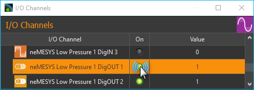
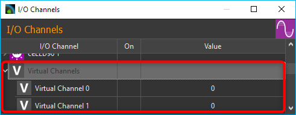
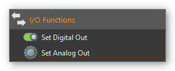

I/O Plugin
===============

I/O Plugin Overview
-------------------

The I/O plugin is used to integrate various CETONI I/O modules into
the CETONI Elements software and for displaying I/O channels of other
devices like Nemaxys positioning systems or Nemesys syringe pumps.

.. image:: Pictures/10000201000001F6000001EFFBB551A475EADF72.png

List of I/O channels
--------------------

All available I/O channels are shown in the I/O channels view.
You can distinguish the different types of I/Os (AI: analogue input, AO:
analogue output, DI: digital input, DO: digital output, Pressure:
pressure sensor) by their symbols and names (see figure above). If the
I/O list is not visible, you can display the window via the main menu of
the application :menuselection:`Window --> Show View --> I/O Channels`.

.. image:: Pictures/100002010000021B000000AB3B30B0CC6EFEE72A.png

The following columns are present:

-  **I/O Channel** - contains the name of the I/O channel and displays a
   symbol for the channel type.
-  **On** – a lit green LED indicates that a channel is switched on and
   that a digital channel is 1 (instead of 0), respectively.
-  **Actual Value** - Shows the current value of the channel - in the case
   of output channels, this is the value that is output, and in the case
   of input channels the value read from the device.

Channel types
~~~~~~~~~~~~~

The following types of channel are currently supported:

======== ===================================
|image1| analog inputs (voltage and current)
|image2| analog outputs
|image3| digital inputs
|image4| digital outputs
|image5| analog pressure sensor inputs
|image6| analog temperature sensor inputs
|image7| analog force sensor
|image8| analog flow sensor
|image9| virtual channels
======== ===================================

Grouped display
~~~~~~~~~~~~~~~

By default, the I/O channels are displayed in groups. This means that
the channels of a certain device are grouped under the device name, so
that a tree-like structure is created. I.e., you can show or hide the
display of channels for certain devices, e.g. for the Nemesys pumps. In
the following figure, for example, only the channels of the first
Nemesys pump are displayed.

.. admonition:: Important
   :class: note

   If you are still working with an older   
   device configuration, you may have to save the device   
   configuration in the Device Configurator again so that  
   the I/O channels are displayed in groups. 

|Figure 2: Grouping of I/O channels|

All I/O channels that do not
belong to a specific device or channels of devices that do not yet
support grouping are grouped together in the *Ungrouped Channels* group.

|Figure 3: Ungrouped Channels|

You can activate and deactivate the
grouping of channels at any time. Simply right-click in the list of I/O
channels and select :guilabel:`Group Channels` from the context menu (figure
below).

|image13|

If the channel grouping is deactivated, you get a flat
display of the I/O channels in list form.

|Figure 4: Display of I/O channels without grouping.|

Search I/O channels
~~~~~~~~~~~~~~~~~~~~~

If you want to quickly search for a specific channel in the list,
right-click in the first column (*I/O Channel*) and select 
:guilabel:`Search in column` from the context menu.

|image14|

A search dialog is displayed in which you can enter the
search term. A list of possible hits is displayed as you enter the
search term. If you select an entry, the corresponding channel is
displayed in the I/O list and is highlighted in color.

Change Item Scaling
~~~~~~~~~~~~~~~~~~~

In order to increase clarity or improve readability, the display of the
list entries can be switched between three sizes. To do this, choose
:guilabel:`Set Item Scaling` from the context menu and then select the required
size:

.. image:: Pictures/100002010000022B000001231C920F293849CD41.png

Set outputs
-----------

The values of output channels can be changed by the user. Output
channels include digital and analog output channels as well as virtual
channels. Digital output channels can be switched on and off by clicking
on the LED in the *On column* of the channel.

|Figure 6: Switching digital output channels on and off|

Analog channels
can also be switched on and off by clicking on the LED. If an analog
channel is switched off, the value 0 is output. If an analog channel is
switched on, the value from the *Value column* is output. If you want
to change the analog value, simply double-click with the left mouse
button in the value column of a channel, or select the value column of
the channel and then start typing on the keyboard.

|Figure 7: Changing values of analog output channels|

This also allows
you to change the values of virtual channels.

I/O Channel Configuration
-------------------------

Changing channel captions
~~~~~~~~~~~~~~~~~~~~~~~~~~~~~

You can change the caption of each channel at any time, for example, to
assign a memorable name suitable for your particular application. You
may change a caption by the following steps:

1. **Double-click** the name you want to change.
2. The name is now highlighted in yellow: Enter the new name (figure
   below).
3. Complete your entry by pressing the :kbd:`Return` key.

|Figure 8: Changing a channel name|

Activating the Configuration Dialog
~~~~~~~~~~~~~~~~~~~~~~~~~~~~~~~~~~~~~

In addition to customizing the name, for most I/O channels there are
additional parameters that may be configured, such as the scaling of
analog in- and outputs. You will find these configuration parameters in
the respective configuration dialog of each channel.

|Figure 9: Opening the channel configuration panel|

To open the
configuration panel, right-click on the respective channel name from the
I/O channel list and select the context menu item 
:guilabel:`Configure channel` (figure above).

Configuration Dialog
~~~~~~~~~~~~~~~~~~~~

In the configuration dialog you can configure all accessible parameters
of an analog in- and output channel:

.. image:: Pictures/1000020100000212000001862DB8297006D93319.png

.. rst-class:: guinums

#. The title bar shows the name of the channel you are configuring.
#. In the toolbar you can find the actions you can perform:

   +-----------+---------------------------------------------------------------+
   | |image21| | **Restore default settings** By clicking this button,         |
   |           | all parameters (channel name, decimal points, scaling,        |
   |           | *etc*.) are reset to their original values.                   |
   +-----------+---------------------------------------------------------------+
   | |image22| | **Select Scaling Preset** - opens a selection dialog          |
   |           | with predefined `Scaling Presets`_.                           |
   +-----------+---------------------------------------------------------------+
   | |image23| | **Reset Calibration**- resets the calibration of the          |
   |           | channel to the default settings (offset = 0, factor =         |
   |           | 1).                                                           |
   +-----------+---------------------------------------------------------------+

#. Here you can configure the general settings of the channel, such as
   name, decimal places or unit of measurement:

   -  *Caption* – Here you can set a new name for that channel, which is
      then displayed in the channel list.
   -  *Measuring Unit*– Enter the measurement unit in which the measured
      values are displayed. The unit must be compatible with the basic
      unit of the channel or sensor. For example, you can use the units
      **bar**, **psi**, or **Pa** for a pressure measurement channel,
      but not the units **mV**, **mA** or **kg**. The software
      automatically converts the measured values of the sensor into the
      selected unit.
   -  *Decimals* – This field is to set the number of decimal points of
      the scaled unit of measurement.

#. In the *Calibration* area, you can compensate measurement value
   deviations of channels by means of calibration.
#. For channels that support the connection of sensors (for example,
   voltage or current measuring inputs), you can display the operating
   elements for configuring the scaling of the sensor. To do this, click
   *Sensor / Actuator Configuration*.

.. tip::
   All changes will be activated only after      
   being accepted by pressing :guilabel:`OK`. To cancel all        
   changes use :guilabel:`Cancel`. 

.. admonition:: Important
   :class: note

   Clicking :guilabel:`Restore default settings`    
   will instantly reset all parameters to their original   
   setting – clicking :guilabel:`OK` is not required.

Calibration
-----------

With the two-point calibration you can correct measurement deviations of
a channel. To do this, you record the measured value of the channel at
two points :guinum:`❶` and :guinum:`❷` :guilabel:`Value` and enter the actual corrected 
value of the channel for these points :guilabel:`Calibrated value`. 
The software calculates the slope (factor) and the offset of the scaling.

If you click on the :guilabel:`Capture current channel value` :guinum:`❸` button, 
the current value of the channel is automatically entered into the :guilabel:`Value`
field.

.. image:: Pictures/100002010000024C000000FE0348D163BBF02B8A.png

.. admonition:: Important
   :class: note

   All calibration values are entered in    
   the configured unit of measurement. If you change the   
   unit of measurement or the scaling of the channel, you  
   must check the calibration and adjust it if necessary. 

Configure Sensor Scaling
------------------------

Sensor Scaling Overview
~~~~~~~~~~~~~~~~~~~~~~~~

For analogue channels that support the connection of sensors (such as
voltage or current measurement inputs), you can configure
sensor-specific scaling. This allows you to connect sensors to the
analog inputs and then scale the measured values to the value range of
the analog sensors and display them in the correct unit. To do this,
click on :guilabel:`Scaling Configuration` in the configuration dialog.

|Figure 12: Configuration scaling parameters|

Select Physical Quantity
~~~~~~~~~~~~~~~~~~~~~~~~~

In the *Physical Quantity* pane :guinum:`❶`, select the physical quantity to be
measured with the sensor. If the desired sensor type is not supported in
the :guilabel:`Type` selection box, simply select the *Custom* type for a
user-specific scaling. For a pressure sensor you simply select the
*Pressure* type.

In the :guilabel:`Unit` input field, enter the basic unit of the sensor. When
selecting a sensor type, a corresponding unit is already suggested to
you. The unit must be compatible with the selected physical quantity
(e.g., bar, psi, Pa or atm for pressure sensors).

Two-Point Scaling
~~~~~~~~~~~~~~~~~

The two-point scaling :guinum:`❷` is used to configure the conversion between the
analog measured values of the I/O channel (for example in mV or mA) and
the sensor readings of the sensor connected thereto (for example, bar or
° C). Normally you will find these values in the data sheet of the
sensor.

.. admonition:: Important
   :class: note

   Currently, the software only supports    
   linear scaling of measurement values.  

For example, if you have a pressure sensor with an analog input range
from 0.5 V to 4.5 V and a measurement range from 0 bar to 20 bar, you
can enter the following parameters. Enter the I/O channel range 500 mV
and 4500 mV in the first column (*Device value*) and the sensor range 0
and 20 bar in the second column (*Scaled value*).

.. admonition:: Important
   :class: note

   Make sure that the units used correspond 
   to the units in the data sheet of the sensor. 

Limits
~~~~~~

In the *Limits* :guinum:`❸` pane you define the measuring range of the sensor. In
many cases, this range matches the range that you entered in two-point
scaling pane. Therefore, the values for the two-point scaling are
automatically transferred to the range limits. Here, you can further
restrict or change the value range.

.. admonition:: Important
   :class: note

   Clicking :guilabel:`Restore default settings`    
   will instantly reset all parameters to their original   
   setting – clicking :guilabel:`OK` is not required. 

User-specific Scaling
~~~~~~~~~~~~~~~~~~~~~

If you are using a sensor which is not yet supported in the :guilabel:`Type`
selection box, simply select the sensor type :guilabel:`Custom` :guinum:`❶`. In this case,
the input field measuring unit :guinum:`❷` is grayed out, since automatic unit
conversion is no longer possible.

.. image:: Pictures/1000020100000293000001A7CF54CF7D61FB34F6.png

Scaling presets
---------------

Some analog input and output channels offer a choice of predefined
configurations. These include pressure sensor configurations for the
analog inputs of Nemesys syringe pump devices.

.. admonition:: Important
   :class: note

   Predefined configurations are not        
   offered by all analog channels. For those channels the  
   menu item :guilabel:`Select scaling preset` is not displayed in 
   the context menu.  

|Figure 14: Opening predefined configurations dialog|

To select a
predefined configuration proceed as follows, right-click the respective
analog channel in order to show the context menu (see figure below).
Choose :guilabel:`Select scaling preset.` A dialog containing a selection of
scaling presets appears (figure below). Select the preset you are going
to use and confirm your choice by left-clicking :guilabel:`Ok`.

|Figure 15: Selecting predefined configurations|

To restore the default
channel settings, simply click the menu item :guilabel:`Restore default settings`
in the channel context menu (see figure below).

.. image:: Pictures/1000020100000210000000E26F7EC82ABD40B5A3.png

Virtual Channels
----------------

Creating virtual channels
~~~~~~~~~~~~~~~~~~~~~~~~~

The software allows the creation of virtual I/O channels. These channels
are not assigned to a physical I/O device, but they are a kind of
memory. You can write values into virtual channels and read them out
later - just like a memory. Using these channels, you can, for example,
show calculated values from a script in the graphical
logger. You only have to create the channel, add the channel to the
logger, and then you can write values from the script into the channel
and you will see them in the graphical logger.

To create a virtual channel, click with the right mouse button in the
I/O channel list and select the context menu item 
:guilabel:`Create virtual channel`.

|Figure 17: Creating virtual channels|

A virtual channel will then be
added and you can configure the channel further - e.g. change the
channel name. If channel grouping is active, all virtual channels are
grouped together in the *Virtual Channels* group and inserted there when
they are created.

|Figure 18: Virtual channels in the list of I/O channels|

If channel
grouping is disabled, the newly created virtual channel is inserted at
the end of the list.

Access to virtual channels from a script program
~~~~~~~~~~~~~~~~~~~~~~~~~~~~~~~~~~~~~~~~~~~~~~~~~

To access virtual channels out of script programs (read and
write access), you can use the script functions from the category 
:ref:`Device Functions` (figure below).

|Figure 19: Read and write access to virtual channels|

Deleting virtual channels
~~~~~~~~~~~~~~~~~~~~~~~~~~

To delete a virtual channel, click with the right mouse button on the
channel in the I/O channel list, and then select from the context menu
the item :guilabel:`Delete virtual channel` (figure below).

|Figure 20: Deleting virtual channels|

I/O Script Functions
------------------------------------------------------------

Introduction to I/O Script Functions
~~~~~~~~~~~~~~~~~~~~~~~~~~~~~~~~~~~~

The I/O plugin contains script functions for switching digital
outputs and setting the values of analogue outputs.

|Figure 21: I/O script functions|

Set Digital Out 
~~~~~~~~~~~~~~~~

.. image:: Pictures/1000064300003505000035054FDB6D797453998C.svg
   :width: 60
   :align: left

You use this function to set/delete a digital output from a
script. Select the digital channel in the configuration area of the
function and then set the desired output value.

|

Set Analog Out 
~~~~~~~~~~~~~~

.. image:: Pictures/10000F0E00003505000035054CE4E2663723FE52.svg
   :width: 60
   :align: left

With this function, you can write a value from a script to an
analogue output channel. Select the analogue channel in the
configuration area, and then configure the analogue initial value that
is to be set during the subsequent execution of the function.

This function supports the use of variables. This means that, instead of
a numeric value, you can insert a name of a variable into the field
:guilabel:`Value`. This variable will then be set to the analog output value when
the script is run (figure below). This variable may then subsequently be
used for calculations or to carry out value-specific functions.

.. image:: Pictures/1000020100000218000000BA59FD4FDF9E3D6F7B.png

Supported Beckhoff I/O Terminals
------------------------------------------------------------

The I/O plugin supports the modular CETONI QmixIO-B module.

.. image:: Pictures/QmixIO-B_IO-Module.jpg

The following list shows all Beckhoff bus terminals that are supported by the 
software:

Digital Input Terminals
~~~~~~~~~~~~~~~~~~~~~~~~~~~~~~~~~~~~

The software should work with all 
`KL1xxx <https://www.beckhoff.com/en-en/products/i-o/bus-terminals/kl1xxx-digital-input/>`_ 
digital input terminals. The following terminals have already been tested with 
the I/O plugin.

|

.. list-table::
   :widths: 25 75
   :header-rows: 1

   * - Terminal ID
     - Description
   * - `KL1104 <https://www.beckhoff.com/en-en/products/i-o/bus-terminals/kl1xxx-digital-input/kl1104.html>`_
     - 4 channel digital input 24 V DC, 3 ms, 2-/3-wire connection
   * - `KL1124 <https://www.beckhoff.com/en-en/products/i-o/bus-terminals/kl1xxx-digital-input/kl1124.html>`_
     - 4 channel digital input 5 V DC
   * - `KL1404 <https://www.beckhoff.com/en-en/products/i-o/bus-terminals/kl1xxx-digital-input/kl1404.html>`_
     - 4 channel digital input 24 V DC
   * - `KL1408 <https://www.beckhoff.com/en-en/products/i-o/bus-terminals/kl1xxx-digital-input/kl1408.html>`_
     - 8 channel digital input 24 V DC
   * - `KL1862 <https://www.beckhoff.com/en-en/products/i-o/bus-terminals/kl1xxx-digital-input/kl1862.html>`_
     - 16 channel digital input 24 V DC, 3 ms, flat-ribbon cable connection

Digital Output Terminals
~~~~~~~~~~~~~~~~~~~~~~~~~~~~~~~~~~~~

.. image:: Pictures/dig_out.svg
   :width: 60
   :align: left

The software should work with all 
`KL2xxx <https://www.beckhoff.com/en-en/products/i-o/bus-terminals/kl2xxx-digital-output/>`_ 
digital output terminals. The following terminals have already been tested with 
the I/O plugin.

|

.. list-table::
   :widths: 25 75
   :header-rows: 1

   * - Terminal ID
     - Description
   * - `KL2012 <https://www.beckhoff.com/en-en/products/i-o/bus-terminals/kl2xxx-digital-output/kl2012.html>`_
     - 2 channel digital output, 24 V DC, 0.5 A
   * - `KL2022 <https://www.beckhoff.com/en-en/products/i-o/bus-terminals/kl2xxx-digital-output/kl2022.html>`_
     - 2 channel digital output, 24 V DC, 2 A
   * - `KL2114 <https://www.beckhoff.com/en-en/products/i-o/bus-terminals/kl2xxx-digital-output/kl2114.html>`_
     - 4 channel digital output, 24 VDC
   * - `KL2124 <https://www.beckhoff.com/en-en/products/i-o/bus-terminals/kl2xxx-digital-output/kl2124.html>`_
     - 4 channel digital output, 5 V DC
   * - `KL2404 <https://www.beckhoff.com/en-en/products/i-o/bus-terminals/kl2xxx-digital-output/kl2404.html>`_
     - 4 channel digital output, 24 V DC, 0.5 A, 2-wire connection
   * - `KL2408 <https://www.beckhoff.com/en-en/products/i-o/bus-terminals/kl2xxx-digital-output/kl2408.html>`_
     - 8 channel digital output, 24 V DC, 0.5 A, 2-wire connection
   * - `KL2442 <https://www.beckhoff.com/en-en/products/i-o/bus-terminals/kl2xxx-digital-output/kl2442.html>`_
     - 2 channel digital output, 24 V DC, 2 x 4 A/1 x 8 A
   * - `KL2612 <https://www.beckhoff.com/en-en/products/i-o/bus-terminals/kl2xxx-digital-output/kl2612.html>`_
     - 2 channel relay output, 125 V AC/30 V DC
   * - `KL2634 <https://www.beckhoff.com/en-en/products/i-o/bus-terminals/kl2xxx-digital-output/kl2634.html>`_
     - 4 channel relay output, 250 V AC/30 V DC
   * - `KL2808 <https://www.beckhoff.com/en-en/products/i-o/bus-terminals/kl2xxx-digital-output/kl2808.html>`_
     - 8 channel digital output, 24V, 0.5 A
   * - `KL2872 <https://www.beckhoff.com/en-en/products/i-o/bus-terminals/kl2xxx-digital-output/kl2872.html>`_
     - 16 channel digital output, 24V, 0.5 A, flat-ribbon cable

Analog Input Terminals
~~~~~~~~~~~~~~~~~~~~~~~~~~~~~~~~~~~~

The following analog input terminals are supported by the I/O plugin:

|
|

.. list-table::
   :widths: 25 75
   :header-rows: 1

   * - Terminal ID
     - Description
   * - `KL3021 <https://www.beckhoff.com/en-en/products/i-o/bus-terminals/kl3xxx-analog-input/kl3021.html>`_
     - 1 channel analog input 4..20mA - 0,3% 12Bit
   * - `KL3022 <https://www.beckhoff.com/en-en/products/i-o/bus-terminals/kl3xxx-analog-input/kl3022.html>`_
     - 2-channel analog input 4…20 mA, 12 bit, differential
   * - `KL3054 <https://www.beckhoff.com/en-en/products/i-o/bus-terminals/kl3xxx-analog-input/kl3054.html>`_
     - 4 channel analog input 4..20mA - 12 bit, single ended
   * - `KL3102 <https://www.beckhoff.com/en-en/products/i-o/bus-terminals/kl3xxx-analog-input/kl3102.html>`_
     - 2 channel analog input -10V..+10V
   * - `KL3152 <https://www.beckhoff.com/en-en/products/i-o/bus-terminals/kl3xxx-analog-input/kl3152.html>`_
     - 2 channel analog input 4..20mA - 0.05% 16 Bit
   * - `KL3162 <https://www.beckhoff.com/en-en/products/i-o/bus-terminals/kl3xxx-analog-input/kl3162.html>`_
     - 2 channel analog input 0..10V - 0.05% 16 Bit
   * - `KL3201 <https://www.beckhoff.com/en-en/products/i-o/bus-terminals/kl3xxx-analog-input/kl3201.html>`_
     - 1 channel PT100 RTD
   * - `KL3202 <https://www.beckhoff.com/en-en/products/i-o/bus-terminals/kl3xxx-analog-input/kl3202.html>`_
     - 2 channel PT100 RTD
   * - `KL3204 <https://www.beckhoff.com/en-en/products/i-o/bus-terminals/kl3xxx-analog-input/kl3204.html>`_
     - 4 channel PT100 RTD
   * - `KL3214 <https://www.beckhoff.com/en-en/products/i-o/bus-terminals/kl3xxx-analog-input/kl3214.html>`_
     - 4 channel PT100 RTD 3-wire connection
   * - `KL3222 <https://www.beckhoff.com/en-en/products/i-o/bus-terminals/kl3xxx-analog-input/kl3222.html>`_
     - 2 channel PT100 RTD, high-precision
   * - `KL3312 <https://www.beckhoff.com/en-en/products/i-o/bus-terminals/kl3xxx-analog-input/kl3312.html>`_
     - 2 channel thermocouple input
   * - `KL3314 <https://www.beckhoff.com/en-en/products/i-o/bus-terminals/kl3xxx-analog-input/kl3314.html>`_
     - 4 channel thermocouple input
   * - `KL3404 <https://www.beckhoff.com/en-en/products/i-o/bus-terminals/kl3xxx-analog-input/kl3404.html>`_
     - 4 channel analog input -10V..+10V, 12 bit, single-ended
   * - `KL3408 <https://www.beckhoff.com/en-en/products/i-o/bus-terminals/kl3xxx-analog-input/kl3408.html>`_
     - 8 channel analog input -10V..+10V, 12 bit, single-ended
   * - `KL3444 <https://www.beckhoff.com/en-en/products/i-o/bus-terminals/kl3xxx-analog-input/kl3444.html>`_
     - 4 channel analog input 0..20mA, 12 bit, single-ended
   * - `KL3454 <https://www.beckhoff.com/en-en/products/i-o/bus-terminals/kl3xxx-analog-input/kl3454.html>`_
     - 4 channel analog input 4..20mA, 12 bit, single-ended
   * - `KL3464 <https://www.beckhoff.com/en-en/products/i-o/bus-terminals/kl3xxx-analog-input/kl3464.html>`_
     - 4 channel analog input 0..10V, 12 bit, single-ended
   * - `KL3468 <https://www.beckhoff.com/en-en/products/i-o/bus-terminals/kl3xxx-analog-input/kl3468.html>`_
     - 8 channel analog input 0..10V, 12 bit, single-ended

Analog Output Terminals
~~~~~~~~~~~~~~~~~~~~~~~~~~~~~~~~~~~~

.. image:: Pictures/analog_out.svg
   :width: 60
   :align: left

The following analog output terminals are supported by the I/O plugin:

|
|

.. list-table::
   :widths: 25 75
   :header-rows: 1

   * - Terminal ID
     - Description
   * - `KL4002 <https://www.beckhoff.com/en-en/products/i-o/bus-terminals/kl4xxx-analog-output/kl4002.html>`_
     - 2 channel analog output 0..10, 12 bit, differential
   * - `KL4004 <https://www.beckhoff.com/en-en/products/i-o/bus-terminals/kl4xxx-analog-output/kl4004.html>`_
     - 4 channel analog output 0..10, 12 bit, differential
   * - `KL4022 <https://www.beckhoff.com/en-en/products/i-o/bus-terminals/kl4xxx-analog-output/kl4022.html>`_
     - 2 channel analog output 4..20mA, 12 bit, single-ended
   * - `KL4112 <https://www.beckhoff.com/en-en/products/i-o/bus-terminals/kl4xxx-analog-output/kl4112.html>`_
     - 2 channel analog output 0..20mA, 16 bit, single-ended
   * - `KL4132 <https://www.beckhoff.com/en-en/products/i-o/bus-terminals/kl4xxx-analog-output/kl4132.html>`_
     - 2 channel analog output -10..10V, 16 bit, differential
   * - `KL4404 <https://www.beckhoff.com/en-en/products/i-o/bus-terminals/kl4xxx-analog-output/kl4404.html>`_
     - 4 channel analog output 0..10V, 12 bit, single-ended
   * - `KL4408 <https://www.beckhoff.com/en-en/products/i-o/bus-terminals/kl4xxx-analog-output/kl4408.html>`_
     - 8 channel analog output 0..10V, 12 bit, single-ended
   * - `KL4414 <https://www.beckhoff.com/en-en/products/i-o/bus-terminals/kl4xxx-analog-output/kl4414.html>`_
     - 4 channel analog output 0..20mA, 12 bit, single-ended
   * - `KL4424 <https://www.beckhoff.com/en-en/products/i-o/bus-terminals/kl4xxx-analog-output/kl4424.html>`_
     - 4 channel analog output 4..20mA, 12 bit, single-ended
   * - `KL4434 <https://www.beckhoff.com/en-en/products/i-o/bus-terminals/kl4xxx-analog-output/kl4434.html>`_
     - 4 channel analog output -10V..+10V, 12 bit, single-ended

Special Terminals
~~~~~~~~~~~~~~~~~~~~~~~~~~~~~~~~~~~~

.. image:: Pictures/special_terminals.svg
   :width: 60
   :align: left

The following special terminals are supported by the I/O plugin:

|
|

.. list-table::
   :widths: 25 75
   :header-rows: 1

   * - Terminal ID
     - Description
   * - `KL1501 <https://www.beckhoff.com/en-gb/products/i-o/bus-terminals/kl1xxx-digital-input/kl1501.html>`_
     - 1-channel digital input, counter, 24 V DC, 100 kHz
   * - `KL3356 <https://www.beckhoff.com/en-gb/products/i-o/bus-terminals/kl3xxx-analog-input/kl3356.html>`_
     - 1-channel analog input, measuring bridge, full bridge, 16 bit

Configuration of Beckhoff Terminals
------------------------------------------

Introduction to the Terminal Configuration
~~~~~~~~~~~~~~~~~~~~~~~~~~~~~~~~~~~~~~~~~~~~~~

The I/O terminals from Beckhoff can be parameterized and configured via their
terminal registers. The individual terminals are configured, parameterized and
tested by CETONI before delivery. However, it may be necessary to adjust the
terminal configuration subsequently - e.g. to select a different sensor type,
to change the scaling or to activate / deactivate automatic calibration.

To configure the terminals, you can use the :guilabel:`Beckhoff Devices` view. 
You can display the view via the main menu with the menu item
:menuselection:`Window --> Show View --> Beckhoff Devices`.

Configuration Interface
~~~~~~~~~~~~~~~~~~~~~~~~~~~~~~~~~~~~~~~~

The configuration interface allows you to access the parameters of individual
terminals. If you have several QmixIO-B or Beckhoff modules, first select the
device containing the terminal to be configured in the :guilabel:`Device` :guinum:`❶`
selection box.

.. image:: Pictures/beckhoff_terminal_config.png

Now you can select the terminal that you want to parameterize in the 
:guilabel:`Terminal` :guinum:`❸` selection box. The order of the terminals in the
selection box corresponds to the order of the terminals on the device from left
to right starting with the bus coupler.

In the :guilabel:`Register` section :guinum:`❹`, select the terminal channel 
:guilabel:`Table / Channel` and the terminal :guilabel:`Register`. For multi-channel
terminals, e.g. 4-channel analog input terminals, you can configure each channel
separately. If an XML description file is stored for the selected terminal, you
can also select the register via a selection field with the register names :guinum:`❺`. 
If no XML description file is available, you must find the register number from
the Beckhoff PDF documentation.

Via the two buttons :guilabel:`Read` :guinum:`❻` and :guilabel:`Write`
:guinum:`❼` you can now read and write data from the selected register. 
Information on the meaning of the data can be found in the PDF documentation
from Beckhoff.

.. admonition:: Attention
   :class: caution

   Changing parameters can lead to the terminal no longer functioning as tested 
   and configured by CETONI. Before changing a parameter, you should note the
   current value in order to be able to restore it later.

Most terminals have a **Feature Register** per channel for setting certain
configuration parameters. This register is usually register **R32**. If an XML
description file is stored for the selected terminal, you will see a graphical
interface in the :guilabel:`Feature Register` area :guinum:`❽` for accessing
the individual parameters of the register. If no XML description file is 
available, you must select the register by its number in the :guilabel:`Register`
area :guinum:`❹` and then read or write the complete value. Details about the
feature register are available in the Beckhoff PDF documentation.

Create an XML Terminal Description
~~~~~~~~~~~~~~~~~~~~~~~~~~~~~~~~~~~~~~~~

If an XML description file has not yet been provided for a particular terminal,
you can use the PDF documentation for a terminal to create an XML file yourself
and add it to the software using the :guilabel:`Add Terminal XML` button:

.. image:: Pictures/beckhoff_add_terminal_xml.png

An XML terminal description can contain multiple terminals. The following file
shows the terminal description for the terminals that are already stored in the
software. You can use this as a template for creating your own XML terminal
description file:

.. code-block:: xml
   
   <?xml version="1.0" encoding="utf-8"?>
   <Terminals>
      <K1501 Descr="Up- or Down-Counter Terminal, 24 VDC, 100 kHz">
         <Registers FeatureReg="32">
            <R8 Name="Terminal type"/>
            <R9 Name="Software version number"/>
            <R32 Name="Feature register">
               <Bit8 Descr="Counter mode" Bits="3" Type="List">
                  <Item0 Bin="001">32-bit up/down counter</Item0>
                  <Item1 Bin="010">2 * 16-bit up counter</Item1>
                  <Item2 Bin="100">32-bit gated counter, Gate input low: Counter is locked</Item2>
                  <Item3 Bin="101">32-bit gated counter, Gate input high: Counter is locked</Item3>
               </Bit8>
               <Bit11 Descr="Down counter"/>
            </R32>
         </Registers>
      </K1501>
      <K3152 Descr="Analog Input, 4..20mA, 16 bit, differential, high precision" FeatureReg="32">
         <Registers FeatureReg="32">
            <R32 Name="Feature register">
               <Bit0 Descr="User scaling active"/>
               <Bit1 Descr="Manufacturer scaling active"/>
               <Bit2 Descr="Disable watchdog timer"/>
               <Bit3 Descr="Signed amount representation"/>
               <Bit4 Descr="Siemens outout format"/>
               <Bit5 Descr="Disable calibration"/>
               <Bit6 Descr="Disable differential measurement"/>
               <Bit7 Descr="Stabilization of calibration active"/>
               <Bit8 Descr="Measuring range limitation active"/>
               <Bit9 Descr="Limit value 1 active"/>
               <Bit10 Descr="Limit value 2 active"/>
               <Bit11 Descr="Disable channel"/>
            </R32>
            <R33 Name="User Offset"/>
            <R34 Name="User Gain"/>
            <R35 Name="Limit value 1"/>
            <R36 Name="Limit value 2"/>
            <R37 Name="Filter constants"/>
            <R40 Name="Calibration interval"/>
            <R44 Name="Interval for forced calibration"/>
            <R47 Name="Number of stable measured values"/>
            <R48 Name="Tolerance for measured value stability"/>
         </Registers>
      </K3152>
      <K3162 Descr="Analog Input, 0..10V, 16 bit, differential," FeatureReg="32">
         <Registers FeatureReg="32">
            <R32 Name="Feature register">
               <Bit0 Descr="User scaling active"/>
               <Bit1 Descr="Manufacturer scaling active"/>
               <Bit2 Descr="Disable watchdog timer"/>
               <Bit3 Descr="Signed amount representation"/>
               <Bit4 Descr="Siemens outout format"/>
               <Bit5 Descr="Disable calibration"/>
               <Bit6 Descr="Disable differential measurement"/>
               <Bit7 Descr="Stabilization of calibration active"/>
               <Bit8 Descr="Measuring range limitation active"/>
               <Bit9 Descr="Limit value 1 active"/>
               <Bit10 Descr="Limit value 2 active"/>
               <Bit11 Descr="Disable channel"/>
            </R32>
            <R33 Name="User Offset"/>
            <R34 Name="User Gain"/>
            <R35 Name="Limit value 1"/>
            <R36 Name="Limit value 2"/>
            <R37 Name="Filter constants"/>
            <R40 Name="Calibration interval"/>
            <R44 Name="Interval for forced calibration"/>
            <R47 Name="Number of stable measured values"/>
            <R48 Name="Tolerance for measured value stability"/>
         </Registers>
      </K3162>
      <K3312 Descr="Analog Input, temperature, thermocouple 16 bit" FeatureReg="32">
         <Registers FeatureReg="32">
            <R0 Name="Raw ADC value"/>
            <R6 Name="Diagnostic register"/>
            <R17 Name="HW compensation: Offset"/>
            <R18 Name="HW compensation: Gain"/>
            <R19 Name="Manuf. Scaling: Offset"/>
            <R20 Name="Manuf. Scaling: Gain"/>
            <R32 Name="Feature register">
               <Bit0 Descr="User scaling active"/>
               <Bit1 Descr="Manufacturer scaling active"/>
               <Bit2 Descr="Watchdog timer active"/>
               <Bit5 Descr="Activate filter constant R37"/>
               <Bit6 Descr="Deactivate measuring current for open-circuit recognition"/>
               <Bit8 Descr="Reference temperature switched off"/>
               <Bit8 Descr="Sensor Type" Bits="4" Type="List">
                  <Item0 Bin="0000">Type: L (-25°C to 900°C)</Item0>
                  <Item0 Bin="0001">Type: K (-100°C to 1370°C</Item0>
                  <Item0 Bin="0010">Type: J (-100°C to 1200°C)</Item0>
                  <Item0 Bin="0011">Type: E (-100°C to 1000°C)</Item0>
                  <Item0 Bin="0100">Type: T (-100°C to 400°C)</Item0>
                  <Item0 Bin="0101">Type: N (-100°C to 1300°C)</Item0>
                  <Item0 Bin="0110">Type: U (-25°C to 600°C)</Item0>
                  <Item0 Bin="0111">Type: B (600 °C to 1800 °C)</Item0>
                  <Item0 Bin="1000">Type: R (0 °C to 1700 °C)</Item0>
                  <Item0 Bin="1001">Type: S (0 °C to 1700 °C)</Item0>
                  <Item0 Bin="1101">1 µV 1.6µV (Range +-30 mV)</Item0>
                  <Item0 Bin="1110">2 µV 3.2µV (Range +-30 mV)</Item0>
                  <Item0 Bin="1111">4 µV 6.4µV (Range +-30 mV)</Item0>
               </Bit8>
            </R32>
            <R33 Name="User Scaling Offset"/>
            <R34 Name="User Scaling Gain"/>
            <R37 Name="Filter constant"/>
         </Registers>		
      </K3312>
      <K3314 Descr="Analog Input, temperature, thermocouple 16 bit" FeatureReg="32">
         <Registers FeatureReg="32">
            <R0 Name="Raw ADC value"/>
            <R6 Name="Diagnostic register"/>
            <R17 Name="HW compensation: Offset"/>
            <R18 Name="HW compensation: Gain"/>
            <R19 Name="Manuf. Scaling: Offset"/>
            <R20 Name="Manuf. Scaling: Gain"/>
            <R32 Name="Feature register">
               <Bit0 Descr="User scaling active"/>
               <Bit1 Descr="Manufacturer scaling active"/>
               <Bit2 Descr="Watchdog timer active"/>
               <Bit5 Descr="Activate filter constant R37"/>
               <Bit6 Descr="Deactivate measuring current for open-circuit recognition"/>
               <Bit8 Descr="Reference temperature switched off"/>
               <Bit8 Descr="Sensor Type" Bits="4" Type="List">
                  <Item0 Bin="0000">Type: L (-25°C to 900°C)</Item0>
                  <Item0 Bin="0001">Type: K (-100°C to 1370°C</Item0>
                  <Item0 Bin="0010">Type: J (-100°C to 1200°C)</Item0>
                  <Item0 Bin="0011">Type: E (-100°C to 1000°C)</Item0>
                  <Item0 Bin="0100">Type: T (-100°C to 400°C)</Item0>
                  <Item0 Bin="0101">Type: N (-100°C to 1300°C)</Item0>
                  <Item0 Bin="0110">Type: U (-25°C to 600°C)</Item0>
                  <Item0 Bin="0111">Type: B (600 °C to 1800 °C)</Item0>
                  <Item0 Bin="1000">Type: R (0 °C to 1700 °C)</Item0>
                  <Item0 Bin="1001">Type: S (0 °C to 1700 °C)</Item0>
                  <Item0 Bin="1101">1 µV 1.6µV (Range +-30 mV)</Item0>
                  <Item0 Bin="1110">2 µV 3.2µV (Range +-30 mV)</Item0>
                  <Item0 Bin="1111">4 µV 6.4µV (Range +-30 mV)</Item0>
               </Bit8>
            </R32>
            <R33 Name="User Scaling Offset"/>
            <R34 Name="User Scaling Gain"/>
            <R37 Name="Filter constant"/>
         </Registers>		
      </K3314>
      <K3356 Descr="Analog Input, measuring bridge, full bridge, 16 bit" FeatureReg="32">
         <Registers FeatureReg="32">
            <R32 Name="Feature register">
               <Bit0 Descr="User scaling active"/>
               <Bit1 Descr="Manufacturer scaling active"/>
               <Bit2 Descr="Disable watchdog timer"/>
               <Bit4 Descr="Disable cyclic calibrartion of A/D converter"/>
               <Bit5 Descr="Disable cyclic testing"/>
               <Bit6 Descr="Disable cyclic reference measurement"/>
               <Bit7 Descr="Symmetrical measurement active"/>
               <Bit8 Descr="Scale factor is active"/>
               <Bit9 Descr="Calibration stabilization active"/>
               <Bit10 Descr="User calibration is active if bit 32.0 is set."/>
               <Bit11 Descr="Unit of R36" Bits="1" Type="List">
                  <Item0 Bin="0">1 mV/V</Item0>
                  <Item1 Bin="1">0,01 mV/V</Item1>
               </Bit11>
               <Bit12 Descr="After calibration / measurement of ref. voltage output value" Bits="1" Type="List">
                  <Item0 Bin="0">immediately</Item0>
                  <Item1 Bin="1">if weight value has become stable</Item1>
               </Bit12>
            </R32>
            <R33 Name="User Scaling Offset"/>
            <R34 Name="User Scaling Gain"/>
            <R35 Name="nominal weight of the load cell"/>
            <R36 Name="nominal parameter of the load cell"/>
            <R37 Name="Filter constant of the A/D converter, and configuration bits for the filter">
               <Bit0 Descr="Fast"/>
               <Bit1 Descr="SkipFIR"/>
            </R37>
            <R38 Name="Scaling Factor"/>
            <R39 Name="Measuring interval for reference signal"/>
            <R40 Name="Calibration interval"/>
            <R41 Name="Test interval"/>
            <R42 Name="nominal test value"/>
            <R43 Name="test tolerance"/>
            <R44 Name="Forced calibration interval"/>
            <R45 Name="threshold for reference voltage test"/>
            <R46 Name="threshold for correction factor"/>
         </Registers>
      </K3356>
      <K4004 Descr="Analog Output, 0..10V," FeatureReg="32">
         <Registers FeatureReg="32">
            <R5 Name="Raw DAC value"/>
            <R9 Name="Software version number"/>
            <R32 Name="Feature register">
               <Bit0 Descr="User scaling active"/>
               <Bit1 Descr="Manufacturer scaling active"/>
               <Bit2 Descr="Watchdog timer active"/>
               <Bit3 Descr="Sign / amount representation"/>
               <Bit5 Descr="Calculation of absolute value"/>
               <Bit8 Descr="User switch-on value"/>
            </R32>
            <R33 Name="User scaling: Offset"/>
            <R34 Name="User scaling: Gain"/>
            <R35 Name="User switch-on value"/>
         </Registers>
      </K4004>
   </Terminals>

.. |image2| image:: Pictures/analog_out.svg
   :width: 40
   

   
.. |image4| image:: Pictures/dig_out.svg
   :width: 40
   
.. |image5| image:: Pictures/10004C06000034EB000034EB3B64F50CF73C7319.svg
   :width: 40
   
.. |image6| image:: Pictures/100051AD000034EB000034EB615CA53F231E2071.svg
   :width: 40
   
.. |image7| image:: Pictures/10004C5E000034EB000034EB7FFDB68DD93E5C3E.svg
   :width: 40
   
.. |image8| image:: Pictures/100047B2000034EB000034EB7BBD43FF0627D5D3.svg
   :width: 40
   

   

.. |Figure 3: Ungrouped Channels| image:: Pictures/1000020100000211000000EC8C1F3E3DFF5B05B5.png

.. |image13| image:: Pictures/10000201000000BA0000009AEFB00DBBC09E8A96.png

.. |Figure 4: Display of I/O channels without grouping.| image:: Pictures/10000201000002410000010956222D3E3459DF4B.png

.. |image14| image:: Pictures/1000000000000164000000B8F8746536D6C09088.png

.. |Figure 7: Changing values of analog output channels| image:: Pictures/10000201000001F1000000B76EDE046BAAE032A0.png

.. |Figure 8: Changing a channel name| image:: Pictures/1000020100000210000000CFEE86A61E8D9261A1.png

.. |Figure 9: Opening the channel configuration panel| image:: Pictures/1000020100000210000000E26A44508AB4B23B66.png

.. |image22| image:: Pictures/10001183000034EB000034EBDFA4938505ACE302.svg
   :width: 40
   
.. |image23| image:: Pictures/100002C1000035050000350588E8C4C80407FC4C.svg
   :width: 40
   
.. |Figure 12: Configuration scaling parameters| image:: Pictures/10000201000002B700000137795168A3F5C0861B.png

.. |Figure 14: Opening predefined configurations dialog| image:: Pictures/10000201000002010000010D504DB5DF96F402B1.png

.. |Figure 15: Selecting predefined configurations| image:: Pictures/100000000000022D0000015CEA4C9E2A9528BEA1.png

.. |Figure 17: Creating virtual channels| image:: Pictures/100002010000023A00000102ED9CC097AC4CA17D.png

.. |Figure 19: Read and write access to virtual channels| image:: Pictures/100002010000010B000000720E021D287C297538.png

