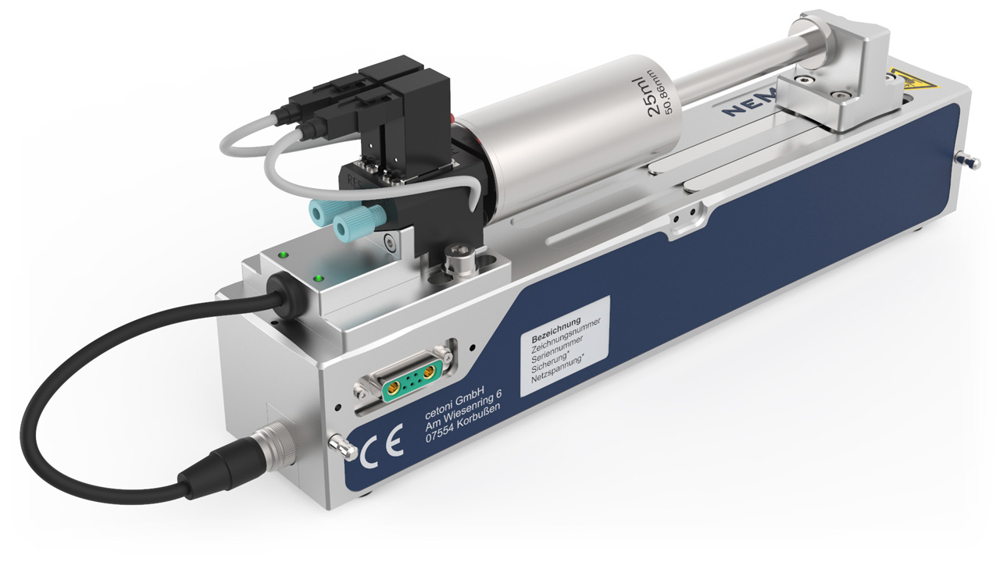

Valve Plugin
============

Introduction to Valve Plugin
--------------------------------

The valve plugin is used to control valves that are part of other devices
(e.g. valves mounted on Nemesys syringe pumps).

.. include:: qmixv_common_EN.inc.rst
