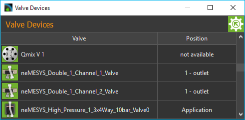
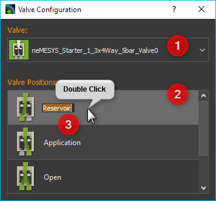
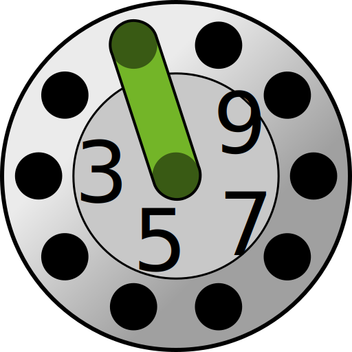

Valve Plugin
============

Introduction to Valve Plugin
--------------------------------

The valve plugin is used to control

.. image:: Pictures/valve_devices_numbered.jpg

.. rst-class:: guinums

#. CETONI QmixV valve modules
#. valve devices that are part of other devices (i.e. valves
   mounted on Nemesys syringe pumps)
#. supported valves from other manufacturers (e.g. VICI valves)

Valve Device List
--------------------

The plugin mainly consists of the valve device list,
which is displayed as a separate view in the graphical user interface.

|Figure 1: QmixV valve device list|

You
can move the window to another position in the graphic interface at any
time by dragging and dropping the title bar, or you can move it out of
the interface to become a separate window.

The valve device list shows you all the available Qmix valve devices in
tabular form. The name of the module and the actual valve position
status icon is shown in the left-hand table column, and the right-hand
column shows the name of the current position of the valve.

Editing valve names
~~~~~~~~~~~~~~~~~~~

You can change the name of a valve at any time and, for example, assign
a name suitable for your particular application. You change a name by the
following steps:

|Figure 2: change valve name|

1. Double-click the table cell containing the name you want to change.
2. Enter the new name in the Editing window which now appears (see
   Figure above)
3. Complete your changes by pressing the :kbd:`Return` key.

Switching valve position
~~~~~~~~~~~~~~~~~~~~~~~~

You can also switch the valve position in the module list. For this
purpose proceed as follows:

1. Double-click in the table cell showing the valve position.
2. Select the desired valve position in the selection box that now
   appears (see Figure below).
3. Confirm the selection by pressing :kbd:`Return` key or click on another
   table cell to close the selection box.

|Figure 3: Switch valve position|

The valve is now switched into the new valve position.

Naming valve positions
~~~~~~~~~~~~~~~~~~~~~~

You can give each valve position an individual name in the software, and
so configure the names of the valve positions to suit your application.
Perform the following steps to change the names of the valve positions.

.. rst-class:: steps

#. Make a right mouse click in the line of the table of the valve for
   which you want to rename the positions.

   |Figure 4: Open valve configuration|

#. Select the :guilabel:`Configure valve positions...` menu item in the context
   menu, that is being displayed.
#. A configuration dialog opens (Figure below), which consists of a
   valve selection box :guinum:`❶` and the list of valve positions :guinum:`❷`.

   |Figure 5: Open valve configuration|

#. Double click the line in the
   table containing the valve position you want to name.
#. An Editing window :guinum:`❸` opens in the table cell, in which you can enter
   the new name of the valve position.
#. Confirm your entry by pressing the :kbd:`Return` key.
#. You can close the configuration dialog when you have named all the
   valve positions.

From now on, the valve positions will always be shown with the new names
in all areas of the software.

Creating Valves
---------------

You can control CETONI valves via one or more digital outputs. If you
have connected your valve to the corresponding digital outputs, you must
configure it in the software.

The first step is to open the I/O channels window and manually switch
the digital outputs to check that the valve is correctly connected and
switching.

|Figure 6: List of I/O channels - Test by manual switching of the digital outputs|

Click on the LED in the column :guilabel:`On` at the
corresponding channel to switch the digital channels off and on again.
Check whether the valve is switched when switching the digital output.
If the valve is not switched, it is either connected incorrectly or you
are switching the wrong output. If the valve switches, you can continue
creating the valve in the software.

To do this, right-click in the list of valves and then select
:menuselection:`Create Valve` from the context menu.

|FFfFigure 7: Open dialog for valve creation|

The dialog for creating and configuring a valve is now displayed.

|Figure 8: Dialog for valve creation and configuration|

In the window, first select the type of valve you have connected in the field
:guilabel:`Valve Type` :guinum:`❶`. Then you must configure the digital outputs
for the valve in the *Dig-Out Channels* table. Depending on the valve type, these can be
one or more outputs. To configure an output, double-click in the table
cell :guinum:`❷` for this channel and then select the corresponding digital output
from the list. The :guilabel:`OK` button :guinum:`❸` is only activated when the
corresponding digital output channel has been configured for each
switching input of the valve. You can then complete the configuration by
clicking :guilabel:`OK`.

The newly created valve now appears in the list of valves. Valves
created with the :guilabel:`Create Valve` function get the prefix :code:`DO_` to
indicate that they are valves controlled by digital outputs.

.. tip::
   Valves created with the *Create Valve*
   function can be identified by the prefix :code:`DO_` in
   the valve list.

Deleting Valves
---------------

Valves that you have created dynamically in the software, e.g. with the
:ref:`Create Valve<Creating Valves>` function (see previous section), can be deleted from the
valve list via the context menu. To do this, right-click on the line of
the valve you want to delete and then select the :menuselection:`Delete Valve` menu
item.

.. admonition:: Important
   :class: note

   Valves created and configured with the
   *Device Configurator*, or that are part of other
   devices, cannot be deleted with :guilabel:`Delete Valve` menu
   item.

Valve Script Functions
----------------------

|Figure 10: Qmix valve script functions|

The Qmix valve plugin contains a script function for switching the Qmix valves
from a script.

Switch Valve
~~~~~~~~~~~~

You use this function to switch the valve position. In the
configuration area of this function, you can select the valve device :guinum:`❶`,
and the target position :guinum:`❷` to which the valve is to be switched. The
preview image visualizes the selected target position :guinum:`❸`.

.. image:: Pictures/10000000000001A3000000A14DDC5565A638D882.png

Both selection boxes support the use of variables. That means, in the device
selection box :guinum:`❶` you can use a variable that contains a valve device reference.
In the target position selection box :guinum:`❷` you can use a script variable
that contains a target position index.

The following example shows a script, that creates two variables :guinum:`❶`. The
:code:`$ProcessValve` variable stores the device reference to valve device
**Valve_0**. The :code:`$RefillPosition` variable stores the valve target
position for syringe refill.

.. image:: Pictures/switch_valve_variables.png

These variables are then used in the *Switch Valve* script :guinum:`❷` for the
:guilabel:`Valve` and :guilabel:`Target Position` definition.

Supported VICI Valves
---------------------

The Valve Plugin supports VICI valves that use a universal actuator with a USB or RS-232 interface.

.. image:: Pictures/VICI_Valve.jpg

The following list shows all types of VICI valves that are supported by the software:

.. list-table::
   :widths: 20 80
   :header-rows: 0

   * - |image-vici-10pos11port|
     - 10 Position dead-end selector (SD) valve (e.g. `low pressure <https://www.vici.com/vval/sd.php>`_, `high pressure <https://www.vici.com/vval/sduw.php>`_)
   * - |image-vici-6pos7port|
     - 6 Position dead-end selector (SD) valve (e.g. `low pressure <https://www.vici.com/vval/sd.php>`_, `high pressure <https://www.vici.com/vval/sduw.php>`_)
   * - |image-vici-2pos6port|
     - 6 Port injector valve (e.g. `GC injectors <https://www.vici.com/vval/vval_gc.php>`_, `HPLC injectors <https://www.vici.com/vval/vval_hplc.php>`_)

.. |Figure 2: change valve name| image:: Pictures/10000201000001EB000000CB9499C52DA337663E.png

.. |Figure 3: Switch valve position| image:: Pictures/10000201000001EB000000FD1C5E9DD6F4B5AE61.png

.. |Figure 6: List of I/O channels - Test by manual switching of the digital outputs| image:: Pictures/10000201000001AB000000D1DDFEC2AE0EE1C649.png

.. |FFfFigure 7: Open dialog for valve creation| image:: Pictures/1000020100000175000000C43F31CADA59024611.png

.. |Figure 8: Dialog for valve creation and configuration| image:: Pictures/100002010000022800000141A28095D6BFFF3542.png

.. |Figure 10: Qmix valve script functions| image:: Pictures/10000201000000F70000003E8592638162A9459E.png

.. |image-vici-6pos7port| image:: Pictures/6Pos7Port_PositionIcon0.svg
   :width: 60

.. |image-vici-2pos6port| image:: Pictures/2Pos6Port_PositionIcon1.svg
   :width: 60
