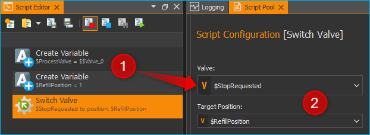
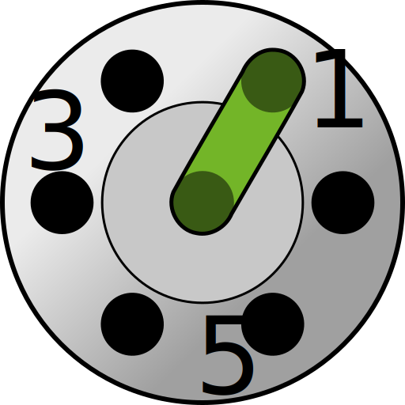

Valve Plugin
============

Introduction to Valve Plugin
--------------------------------

The valve plugin is used to control QmixV valve modules or valves that are part
of other devices (e.g. valves of Nemesys syringe pumps).

.. image:: Pictures/valve_devices_numbered.jpg

.. rst-class:: guinums

#. CETONI QmixV valve modules
#. valve devices that are part of other devices (i.e. valves
   mounted on Nemesys syringe pumps)
#. supported valves from other manufacturers (e.g. VICI valves)

.. include:: qmixv_common_EN.inc.rst

Valve Script Functions
----------------------

|Figure 10: Qmix valve script functions|

The Qmix valve plugin contains a script function for switching the Qmix valves
from a script.

Switch Valve
~~~~~~~~~~~~

.. image:: Pictures/10002F3400003505000035057520F6A9E5AEC280.svg
   :width: 60
   :align: left

You use this function to switch the valve position. In the
configuration area of this function, you can select the valve device :guinum:`❶`,
and the target position :guinum:`❷` to which the valve is to be switched. The
preview image visualizes the selected target position :guinum:`❸`.

.. image:: Pictures/10000000000001A3000000A14DDC5565A638D882.png

Both selection boxes support the use of variables. That means, in the device
selection box :guinum:`❶` you can use a variable that contains a valve device reference.
In the target position selection box :guinum:`❷` you can use a script variable
that contains a target position index.

The following example shows a script, that creates two variables :guinum:`❶`. The
:code:`$ProcessValve` variable stores the device reference to valve device
**Valve_0**. The :code:`$RefillPosition` variable stores the valve target
position for syringe refill.

These variables are then used in the *Switch Valve* script :guinum:`❷` for the
:guilabel:`Valve` and :guilabel:`Target Position` definition.

Supported VICI Valves
---------------------

The Valve Plugin supports VICI valves that use a universal actuator with a USB or RS-232 interface.

.. tip::
   If you are using a valve with the RS-232 interface you might experience problems with the communication if you connect the valve directly to a physical RS-232 port on your PC.

   Use a USB-to-serial adapter instead to connect the valve via USB to you PC!

The following list shows all types of VICI valves that are supported by the software:

.. list-table::
   :widths: 20 80
   :header-rows: 0

   * - |image-vici-10pos11port|
     - 10 Position dead-end selector (SD) valve (e.g. `low pressure <https://www.vici.com/vval/sd.php>`_, `high pressure <https://www.vici.com/vval/sduw.php>`_)
   * - |image-vici-6pos7port|
     - 6 Position dead-end selector (SD) valve (e.g. `low pressure <https://www.vici.com/vval/sd.php>`_, `high pressure <https://www.vici.com/vval/sduw.php>`_)
   * - |image-vici-2pos6port|
     - 6 Port injector valve (e.g. `GC injectors <https://www.vici.com/vval/vval_gc.php>`_, `HPLC injectors <https://www.vici.com/vval/vval_hplc.php>`_)

.. |image-vici-10pos11port| image:: Pictures/10Pos11Port_PositionIcon0.svg
   :width: 60

.. |image-vici-2pos6port| image:: Pictures/2Pos6Port_PositionIcon1.svg
   :width: 60
