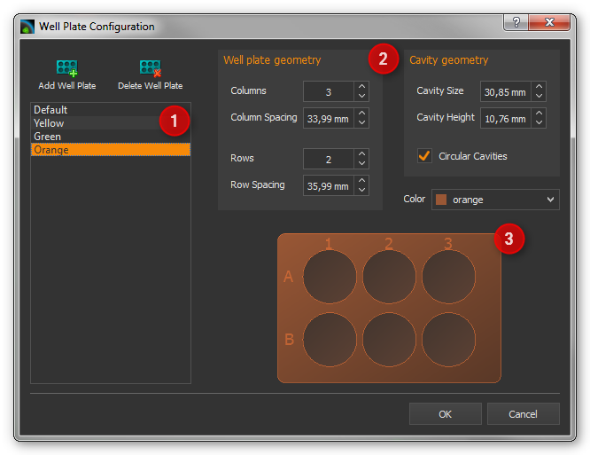
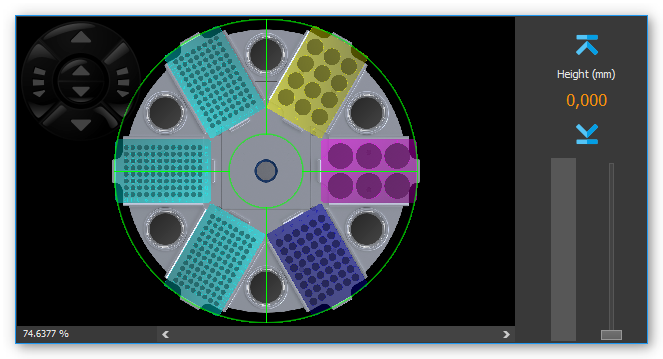
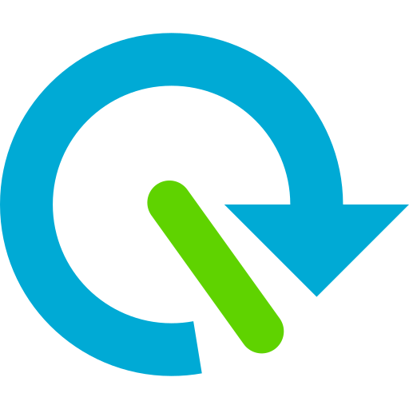
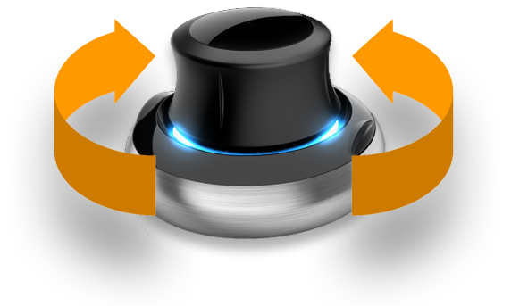
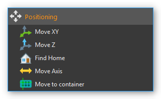
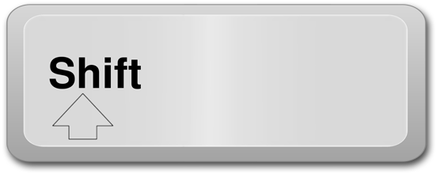
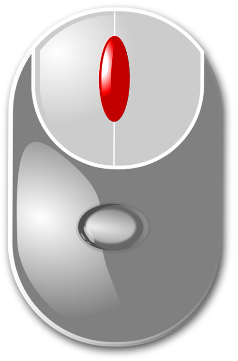

Rotaxys / Nemaxys Plugins
=========================

Introduction
------------

These plugins support the control and visualization of
various CETONI positioning systems such as Rotaxys and Nemaxys devices.
For each device a :ref:`View <views>` is created that provides all UI elements
to manually control a single device (see image below). 

.. image:: Pictures/10000201000003DC00000264E20C70B3.png

You can show a View for a specific device via the main menu item
:menuselection:`Window --> Show View --> Rotaxys` or 
:menuselection:`Window --> Show View --> Nemaxys` or via the corresponding
buttons in the application :ref:`Sidebar <application-sidebar>`.

Such a view mainly consists of the following components:

.. rst-class:: guinums

1. Toolbar
2. Positioning map for XY positioning
3. Control pad for manual control
4. Z panel for positioning of Z axis (vertical axis)
5. Sidebar
6. Status Bar

Positioning Sidebar
---------------------

.. image:: Pictures/10000201000000AF0000012F9C3F78B4.png

In the sidebar, which can be turned on and turned off, you can
find additional controls to configure and control your positioning
systems. In the sidebar there is the :guilabel:`Velocities` panel where you can
configure the velocities of all axes. All positionings in the
*Positioning Map* or in the *Z-Panel* are then carried out with the set
speeds.

Toolbar
-------

+-----------+---------------------------------------------------------+
| |image26| | Hides or shows the sidebar with additional              |
|           | configuration and control elements                      |
+-----------+---------------------------------------------------------+
| |image27| | Adjust the magnification of the positioning map so that |
|           | the complete display fits into the working area.        |
+-----------+---------------------------------------------------------+
| |image28| | Changes the magnification of the positioning map to the |
|           | actual pixel size                                       |
+-----------+---------------------------------------------------------+
| |image29| | Increases the magnification factor                      |
+-----------+---------------------------------------------------------+
| |image30| | Decreases the magnification factor                      |
+-----------+---------------------------------------------------------+
| |image31| | Switches between free positioning and well positioning  |
|           | (see section `1.5 <#anchor-2>`__ - `Positioning         |
|           | Map <#anchor-2>`__)                                     |
+-----------+---------------------------------------------------------+
| |image32| | Adds the script function *Move XY* with the current XY  |
|           | position as target position parameter to the script     |
|           | editor                                                  |
+-----------+---------------------------------------------------------+
| |image33| | Adds the script function *Move Z* with the current      |
|           | position of the Z axis as target position parameter to  |
|           | the script editor                                       |
+-----------+---------------------------------------------------------+
| |image34| | Immediately stops the movement of all axes of the       |
|           | positioning system                                      |
+-----------+---------------------------------------------------------+
| |image35| | Activates / deactivates the lift axis safety stroke. If |
|           | it is active, then the Z-axis moves to a safe height    |
|           | before each movement in the XY plane.                   |
+-----------+---------------------------------------------------------+
| |image36| | Sets the current Z-axis position as safe height. If the |
|           | safety lift feature is active, then the positioning     |
|           | system moves to this height before each movement in the |
|           | XY plane.                                               |
+-----------+---------------------------------------------------------+
| |image37| | Configure zero angle - the zero angle is never crossed  |
|           | by the axis system and it is the start and end point of |
|           | the 360 ° rotation range                                |
+-----------+---------------------------------------------------------+
| |image38| | Find Home - Executes a reference move to find the home  |
|           | position of the device                                  |
+-----------+---------------------------------------------------------+

Control Pad
-----------

Rotaxys
~~~~~~~

With the 6-way control pad, you can manually position all the axes of
the Rotaxys positioning system.

+-------------------------+-------------------------------------------+
| |image48|               | Rotate the rotary axis counter-clockwise  |
+-------------------------+-------------------------------------------+
| |image49|               | Rotate the rotary axis clockwise          |
+-------------------------+-------------------------------------------+
| |image50|               | Move the radius axis away from the centre |
|                         | of rotation (increase radius)             |
+-------------------------+-------------------------------------------+
| |image51|               | Move the radius axis toward the centre    |
|                         | of rotation (decrease radius)             |
+-------------------------+-------------------------------------------+
| |image52|               | Move the vertical axis up and down        |
+-------------------------+-------------------------------------------+

Nemaxys
~~~~~~~

With the 6-way control pad, you can manually position all the axes of
the Nemaxys positioning system.

========================= ===============================================
|image53|                 Moves X-axis to the left
|image54|                 Moves X-axis to the right
|image55|                 Moves the Y-axis toward the back of the device
|image56|                 Moves the Y-axis toward the front of the device
|image57|                 Move the vertical Z-axis up and down
========================= ===============================================

Changing the speed
~~~~~~~~~~~~~~~~~~

When a direction is selected on the control pad, the corresponding
axle is positioned at a fixed velocity. This velocity can be changed by
simultaneously pressing a key on the keyboard. First press the key on
the keyboard, and then click a direction button in the control cross.

The following keys can be used:

+---------------------+--------------------------------------------+
| |image62|           | Shift key                                  |
|                     |                                            |
|                     | Increases the velocity by a fixed factor   |
+---------------------+--------------------------------------------+
| |image63|           | Control key                                |
|                     |                                            |
|                     | Decreases the velocity be a fixed factor   |
|                     | for precise, fine positioning              |
+---------------------+--------------------------------------------+

.. admonition:: Attention
   :class: caution

   Danger of damage through collision with  
   the sample holder! For example, if there is a needle in 
   a holder, ensure that moving the rotary or linear axis  
   will not cause collisions when the tool tip is lowered.    

Positioning Map
---------------

Introduction to Positioning Map
~~~~~~~~~~~~~~~~~~~~~~~~~~~~~~~~~~~~~~~

The positioning map is a top view of the XY plane of your axis system.
It shows the travel range and and the worktable configuration of your device.

.. image:: Pictures/positioning_map.png

With the positioning map you can position your axis system in the
XY plane by clicking points on the positioning map. The magnification of
the positioning map can be changed via the context menu in fixed steps
or continuously adjusted with the mouse wheel.

==================== =================================
|image67|            Increase magnification (zoom in)
|image68|            Decrease magnification (zoom out)
==================== =================================

For navigation within the positioning map you can also use the mouse.
You can move the currently visible area with the two scroll bars on the
right and bottom of the map Alternatively, you can also enable free
mouse navigation mode. To do this, follow these steps:

.. rst-class:: steps

(1) Click the middle mouse button within the positioning map

    |image69|

(2) It is now displayed a navigation cross and the free
    navigation mode is activated

    |image70|

(3) You can now move the mouse to scroll the visible area of
    the positioning map. The further you move the mouse away from the
    on-screen navigation cross, the faster the positioning map is
    scrolled.

Positioning modes
~~~~~~~~~~~~~~~~~

The positioning map can be used in two different modes:

-  Free positioning mode
-  Container positioning mode

.. image:: Pictures/10000D0D0000387200003872DC49EFEE.svg
   :width: 60
   :align: left

Switch between the two modes with the *Positioning Map*
button in the toolbar or with the context menu of the positioning map.
The current position of the device is indicated by a green cross
on the positioning map (Figure below).

.. image:: Pictures/100000000000021B000001883AC10950.png

.. admonition:: Important
   :class: note

   In order to avoid collisions, the        
   vertical axis always moves automatically into its       
   topmost position before traveling to a position.

Free positioning mode
~~~~~~~~~~~~~~~~~~~~~~~~

.. image:: Pictures/100002010000026F00000160893A15AD.png

With free positioning, you can travel
to all positions within a permissible area. The permissible area is
indicated by a green border  :guinum:`❹` (see Figure above). When you move the mouse,
the potential target position :guinum:`❶` is indicated by a target cross
consisting of two dashed lines. When you click the left mouse button on
the target position, the positioning system travels to the selected
position. The indicator of the current position :guinum:`❷` then moves to the
target position :guinum:`❸`.

Container positioning mode
~~~~~~~~~~~~~~~~~~~~~~~~~~~~~~

In this mode, simply click in one of the existing containers such as fluid tanks
or single wells in a titerplate to position. As
soon as you have clicked the target container, the system automatically moves
to the centre of the selected container.

.. image:: Pictures/10000000000001820000011C044844B8.png

The selected target container :guinum:`❶` is coloured with the current 
highlight color.

Open context menu
~~~~~~~~~~~~~~~~~

Right-click on the positioning map to open the context menu.

.. image:: Pictures/100002010000026400000183CB728E2F.png

Z panel for Positioning the Z axis
----------------------------------

.. image:: Pictures/100002010000008400000179E985566C.png

The Z panel on the right of the positioning map shows you the current
position of the vertical axis, and gives you a number of ways of
positioning the vertical axis. These are:

.. rst-class:: guinums

1. Buttons for predefined positions (lower button and raise button)
2. Height indicator (position lift axis)
3. Slider to select the target position
4. Graphical height indicator

Z panel Buttons for predefined Positions
~~~~~~~~~~~~~~~~~~~~~~~~~~~~~~~~~~~~~~~~~~~

The two raise and lower buttons :guinum:`❶` (image above) simplify quick positioning of the
vertical axis to previously defined positions. When you click one of the
two buttons, the vertical axis travels at maximum velocity to the
position previously defined for this button. With the two buttons you
also define the travel range which can be selected with the position
slider :guinum:`❸` .

To assign the current position, right mouse click one of the two
buttons, and then select :menuselection:`Assign actual position` 
from the context menu (see Figure below).

.. image:: Pictures/10000201000001260000005F5060C7EB.png

The assigned position is saved in
the configuration data, and is still present when the software is
restarted. The configured travel range with maximum and minimum position
is indicated in the graphic height indicator by two blue markings (see
section `Height Indicator`_).

Height Indicator
~~~~~~~~~~~~~~~~

The numerical height indicator shows you the current height of the axis
in millimeters. A bar in the graphic display shows the current position
of the axis within the range of travel.

.. image:: Pictures/1000020100000077000000F2F26E6F5B.png

.. rst-class:: guinums
  
#. **Current position / height** - the colored bar shows
   the current position of the axis
#. **Software Limit Maximum** - shows the maximum position you can
   select with the slider. The section `Buttons for predefined
   Positions <#1.6.2.Buttons for predefined Positions|outline>`__
   describes how to set the limit.
#. **Software Limit Minimum** - shows the minimum position you can
   select with the slider
#. **Target selection mark** - shows the potential target position,
   which becomes the target position by mouse click. The value for this
   position is displayed in the message window next to the marker
#. **Target position** - if you click with the mouse in the height
   display, a new target position is defined and the axis moves to this
   position. The new target position can only be within the software
   limits. If you click outside the limits, the axis moves to the
   corresponding limit.
#. **Safe position for XY movement** - indicates the safe position for
   XY movements for certain axis systems (e.g. rotAXYS). This means that
   if the axis is lower than this position, the axis is moved to this
   height before any XY movement.

Status Bar
----------

You can read the current XY position and the current status of the
device in the status bar of the Rotaxys working area at all times.

.. image:: Pictures/10000201000001A40000003D95DACEE7.png

Z-Axis safety stroke
----------------------------------------------------

You can use this button in the toolbar to switch on and off
the safety stroke of the Z-Axis. If it is active, then the Z-axis moves
to a safe height before each movement in the XY plane. This prevents
collisions with sample vessels or other objects on the worktable.

|

.. image:: Pictures/10000C840000387200003872CDFFD2CA.svg
   :width: 60
   :align: left

By pressing this button, you define the current position of
the Z-axis as the clearance height. If the safety stroke is active, the
positioning system will automatically go to this height before any XY
positioning.

|

Configuring Well Plates (Rotaxys)
---------------------------------

Introduction to Well Plate Configuration
~~~~~~~~~~~~~~~~~~~~~~~~~~~~~~~~~~~~~~~~~~

.. tip::
   This feature is available only for Rotaxys devices. If you have a Nemaxys
   or Rotaxys 360 device, then skip this section.

The `Positioning Map`_ always shows the
currently configured well plate. You can configure new well plates in
the software and assign it to Rotaxys device. To do this, select the
main menu item :menuselection:`Edit --> Configure Well Plate` (see figure below).

.. image:: Pictures/1000000000000185000000A437A90768.png

The configuration
dialogue for well plates appears. This configuration dialogue is
structured as follows (see figure below):

.. rst-class:: guinums

#. list of available well plates
#. configuration parameters of current plate
#. graphical representation of the current well plate

Selecting an existing well plate
~~~~~~~~~~~~~~~~~~~~~~~~~~~~~~~~

If the list of available well plates :guinum:`❶` already contains a suitable
plate, simply select it by clicking on it and confirm the selection by
clicking the :guilabel:`OK` button in the configuration dialogue.

Creating a new well plate
~~~~~~~~~~~~~~~~~~~~~~~~~~~~~~~~~~~~~~~~~~~~~~~~~~~~~~~~~~~~~~~~~~~~~~~~~~~~~

To create a new well plate, perform the following steps:

.. rst-class:: steps

(1) First you need to configure the well plate geometry in the 
    *Wellplate geometry* panel :guinum:`❷`. You can configure the 
    number of:guilabel :guilabel:`Rows` and
    :guilabel:`Columns` and the space between rows :guilabel:`Row Spacing` and 
    columns :guilabel:`Column Spacing`. You will find the required data in 
    the data sheet of the well plate.
(2) Next, configure the geometry of the cavities in the
    *Cavity geometry* panel. Define the size of the cavities
    :guilabel:`Cavity Size` and
    their depth :guilabel:`Cavity Height`. Use the selection field
    :guilabel:`Circular Cavities` to determine whether the new plate should 
    have round or square cavities.
(3) Finally define the color of the new well plate. Choose the desired
    color in the :guilabel:`Color` selection box. If the right color is not
    available, select the entry *More...* The application shows a
    color selection dialogue (see figure below) that allows you to
    select any color.

    |image82|

(4) Now click the :guilabel:`Add Well Plate` button to add the new
    plate to the list of available well plates. In the input dialogue
    that appears (see figure below), enter a unique name for the new
    well plate and press :kbd:`Enter` or click :guilabel:`OK`.

    |image83|

(5) The new well plate will be added to the list and can be
    selected from now on.

Configuring the Rotaxys 360 Worktable
--------------------------------------

.. tip::
   This feature is available only for Rotaxys 360 devices. If you have a Nemaxys
   or Rotaxys device, then skip this section.

Load a work table configuration
~~~~~~~~~~~~~~~~~~~~~~~~~~~~~~~

For the Rotaxys 360 positioning system, the individual microtiter plates
can not yet be configured by the user, as with the Rotaxys positioning
system. However, the Rotaxys 360 positioning system supports the loading
of preconfigured work table configuration files, which describe the
entire configuration of a particular workbench.

To load a work table configuration, activate the graphical user
interface of the corresponding Rotaxys 360 device. Then select
:menuselection:`Device --> rotAXYS 360 --> Load Table Configuration`
from the main menu.

.. image:: Pictures/10000201000001F90000016C8210A438.png

Then, in the file
selection dialog that appears, select the configuration file for the
work table and load it. The graphical representation of the work table
is then immediately updated to the new configuration (see figure example
configuration).

Restore standard work table
~~~~~~~~~~~~~~~~~~~~~~~~~~~~~~~~~~~~~~~~~~~~~~~~~~~~~~~~~~~~~~~~~~~~~~~~~

To restore the default work table, select
:menuselection:`Device --> rotAXYS 360 --> Restore Default Table` from the main 
menu.

.. image:: Pictures/10000201000001D2000000ACD92863B0.png

Zero angle configuration
------------------------

The Rotaxys 360 axis system has an operation angle which is
theoretically greater than 360 degrees. In order to prevent entanglement
of the hose for fluid dosing, the turning range is limited to 360 °.

.. image:: Pictures/10000000000001F4000001F443D41FA1.png

The zero angle ist the angle that
will never be crossed by the positioning system. It is the start- and
end-point of the 360° rotation range. If this angle is situated between
two sample containers that you would like to process, the positioning
system will choose the longer route in the opposite direction, so as not
to cross the zero angle.

You can move the zero angle to a different angular position
in order to circumvent this problem. Press the button for zero angle
configuration (image left) to set a new zero angle.

========= =========
|image85| |image86|
========= =========

In the dialog which is now displayed (see illustration above), you can
freely set the zero angle in the range from 0 - 360 °.

SpaceMouse Support
------------------------------------

.. image:: Pictures/10000000000001BC000001A5A8497856.png

The `SpaceMouse <https://3dconnexion.com/us/product/spacemouse-compact/>`_
is an intuitive input device which allows you to control all axes 
(rotation, radius and vertical axis) simultaneously. To use the SpaceMouse, 
connect it to an available USB port on your PC. Latest drivers can be found
on our internet page:

http://www.cetoni.de/englisch/service/downloads_software.html

or on disk (CD or USB stick) you received when you purchased the
software. Install the driver to use the SpaceMouse.

.. image:: Pictures/1000000000000500000002D03030564E.png

Position the SpaceMouse device, so that the cable leads away from
you and that the **3D Connexion** label is readable from your position.

Positioning Rotaxys with SpaceMouse
------------------------------------

Rotaxys SpaceMouse Overview
~~~~~~~~~~~~~~~~~~~~~~~~~~~~~~~~~~~~~~~~

+---------------------+---------------------------------------------------------+
| |image94|           | Rotates the rotary axis clockwise or counter-clockwise  |
+---------------------+---------------------------------------------------------+
| |image95|           | Moves the radius axis away from or towards to the       |
|                     | centre of rotation                                      |
+---------------------+---------------------------------------------------------+
| |image96|           | Move the vertical axis up or down                       |
+---------------------+---------------------------------------------------------+

.. admonition:: Important
   :class: note

   Don't use the SpaceMouse if the     
   software moves the positioning system (e.g., during     
   active script execution), in order to not interrupt     
   movements.       

Positioning rotary axis
~~~~~~~~~~~~~~~~~~~~~~~~~~~~~~~~~~~~~~~~

In order to position the rotary axis, rotate the SpaceMouse cap
clockwise or counter-clockwise.

The speed of
the axes can be determined by the strength of the deflection of the
SpaceMouse cap. The harder you push or twist the cap, the faster
the axes are moving. By a slight deflection of the cap, you can very
finely and precisely control axis speeds.

.. tip::
   The more you deflect the SpaceMouse     
   cap, the higher are the axes speeds. 

Positioning radius axis
~~~~~~~~~~~~~~~~~~~~~~~

To move the radius-axis, slide the cap of the SpaceMouse to the
front or rear. To move the radius-axis to the outer radius, press away
the control element from you. To move the radius axis to the centre of
the rotation axis, pull the cap to your direction.

.. image:: Pictures/10000000000001BA0000016A872C4EFA.png

Vertical axis positioning
~~~~~~~~~~~~~~~~~~~~~~~~~~~

To position the Z-axis, press down the cap or pull it to the top. The
Z-axis is moved in the direction in which you move the control element
of the SpaceMouse.

.. image:: Pictures/1000000000000153000002091D224344.png

Positioning Nemaxys with SpaceMouse
----------------------------------------------

Nemaxys SpaceMouse Overview
~~~~~~~~~~~~~~~~~~~~~~~~~~~~~~~~~~~~~~~~

======================= =================================
|image103|              Move X-axis to the left or right
|image104|              Move Y-axis forwards or backwards
|image105|              Positioning vertical Z-axis
======================= =================================

.. admonition:: Important
   :class: note

   Don't use the SpaceMouse if the    
   software moves the positioning system (e.g., during    
   active script execution), in order to not interrupt    
   movements.     

Positioning X-axis
~~~~~~~~~~~~~~~~~~~~~~~~~~~~~~~~~~~~~~~~

To control the X-axis movement, slide the SpaceMouse's control in
the desired direction. Push the controller to the left, to move the
X-axis leftwards and push it to the right to move the axis rightwards.

.. image:: Pictures/100000000000021E0000012A75C2B620.png

The speed of the
axes can be determined by the strength of the deflection of the Space
Navigator cap. The harder you push or twist the cap, the faster the axes
are moving. By a slight deflection of the cap, you can very finely and
precisely control axis speeds.

.. tip::
   The more you deflect the SpaceMouse     
   cap, the higher are the axes speeds.   

Positioning Y-axis
~~~~~~~~~~~~~~~~~~~~~~~~~~~~~~~~~~~~~~~~

.. image:: Pictures/10000000000001BA0000016A872C4EFA.png

To move the Y-axis
towards the back of the device, press the controller forward. To move
the positioning system towards the front of the device, pull the
controller towards you.

.. tip::
   You can control both directions at the same  
   time if you move the controller forward or backward    
   and to the left or right at the same time.    

Vertical axis positioning
~~~~~~~~~~~~~~~~~~~~~~~~~~~~~~~~~~~~~~~~

.. image:: Pictures/1000000000000153000002091D224344.png

To position the Z-axis, press down the cap or pull it to the top. The
Z-axis is moved in the direction in which you move the control element
of the SpaceMouse.

Single Axis Control
-------------------

In addition to the control of multi-axis systems the software also
supports control of individual axis devices. This may be necessary if
your axis system has additional tool axes (like second Z-axis or
rotation axis) which are not part of the XYZ-multi-axis control.

.. image:: Pictures/10000000000001DC000000DF02C90C52.png

You can show / hide
the window for single axis control via the main menu item 
:menuselection:`Window → Single Axis Control` (figure below).

.. tip::
   The single axis control window is a tool     
   window and can be freely placed in the application     
   window and docked in all four side areas. 

The following control elements are available in the single axis control
window:

.. rst-class:: guinums

1. Drop-down list **Axis Device** for selection of axis device to
   control.
2. In the **Position** area a progress bar shows the actual position in
   the range between minimum and maximum axis position. You can move the
   axis by pressing the plus / minus buttons. The movements continues as
   long as the buttons are pressed and stops immediately if a button is
   released.

   .. image:: Pictures/10000000000001620000013436ED2B99.png

3. In the **Velocity** area you can adjust the speed of axis move.

.. tip::
   With the `Move Axis`_ script function you can control individual axes 
   from a script program.

Additional Functions
--------------------

Calibrating axis system
~~~~~~~~~~~~~~~~~~~~~~~

If the travel path of an axis is blocked (for example in the event of a
collision), the stepper motors in the device may "lose" steps, so that
the position values are no longer displayed correctly. In this case, the
axis system has to be calibrated. To start calibration, select the menu item
in the main menu :menuselection:`Device --> rotAXYS --> Find Home` 
(see Figure below). If you have a neMAXYS system, you can start the 
calibration via  :menuselection:`Device --> neMAXYS --> Find Home`.

.. image:: Pictures/10000201000001DD00000099ECA5B3B8.png

Positioning Script Functions
----------------------------

The plugin offers a number of script functions
required for integrating the cetoni positioning systems in the CETONI Elements
scripting system. The following script functions are available:

Move XY
~~~~~~~~~~

.. image:: Pictures/1000668B0000388E0000388EDE73FA6F.svg
   :width: 60
   :align: left

This function is used in a script to position an XY
axis system in the XY plane. You can select an axis system :guinum:`❶` and the
target position (X and Y positions) :guinum:`❷` in the configuration area of
this function. Alternatively, you can move the axis system manually to a
specific position (for example with the :ref:`positioning map <positioning map>`), 
and then assign the current position values to the script function with the
:guilabel:`Capture Actual Position` button (see Figure below).

.. image:: Pictures/1000000000000222000001A467F71F03.png

If you make no further
adjustments, all positionings are carried out with the maximum possible
speed. If you want to change velocities, you need to expand the
:guilabel:`Axis Velocities` control by clicking it. This control panel :guinum:`❸`
contains all control elements for entering velocity values for each single axis.

Use the :guilabel:`Run to completion` :guinum:`❹` check box to determine whether the next
function

-  will start immediately after the current positioning move started
   (*Run to completion* not checked)
-  or if the next function is called after the target position has been
   reached (*Run to completion* checked).

Move Z
~~~~~~

.. image:: Pictures/100028D60000388E0000388E7FEE4E05.svg
   :width: 60
   :align: left

This function can be used to position the
vertical axis (Z-axis) of an axis system. You can enter the axis system
:guinum:`❶` and the position parameters (Z position :guinum:`❷` and velocity :guinum:`❸`) in the
configuration area of this function. Alternatively, you can move the
Z-axis manually to a specific position (for example with the 
:ref:`Z panel <z panel for positioning the z axis>`), and then assign the 
current Z position to the script function with the 
:guilabel:`Capture Actual Position` button.

.. image:: Pictures/10000000000001F80000011DC4B4D896.png

If you make no further
adjustments, the positioning is carried out with the maximum possible
speed. If you want to change velocities, you need to expand the
:guilabel:`Velocity` control :guinum:`❸` by clicking it. Another click on 
this element hides the velocity controls again.

Use the :guilabel:`Run to completion` :guinum:`❹` check box to determine 
whether the next function

-  will start immediately after the current positioning move started
   (*Run to completion* not checked)
-  or if the next function is called after the target position has been
   reached (*Run to completion* checked).

.. tip::
   If :guilabel:`Run to completion` is not activated,  
   you can move several axes simultaneously. You can e.g. 
   start positioning the XY-system, and while the XY-axes 
   are moving, you can perform positioning with the       
   Z-axis. 

.. admonition:: Important
   :class: note

   The input fields for configuring the    
   speeds are hidden by default, and must be displayed by 
   clicking the :guilabel:`Velocity` label.  

Find Home
~~~~~~~~~

.. image:: Pictures/100004F40000388E0000388E24B4D5C8.svg
   :width: 60
   :align: left

This function allows you to start a reference move from the
script. The positioning system moves to its reference position and
initializes its distance measuring system. The :guilabel:`Run to Completion`
parameter allows you to select whether the function should be terminated
after the start of the reference move or when the reference move has
been completed.

Move Axis
~~~~~~~~~

.. image:: Pictures/1000083F0000388E0000388E79629C8E.svg
   :width: 60
   :align: left

This function can be used to position a single
axis device. Use the drop-down list :guilabel:`Axis device` :guinum:`❶` to
select the axis to be moved. You can enter the parameters (position :guinum:`❷` 
and velocity :guinum:`❸`) in the configuration area of this function. 
Alternatively, you can move the axis manually to a specific position
(for example with the :ref:`Single Axis Control Panel <Single Axis Control>`), 
and then assign the current position to the script function with the 
:guilabel:`Capture Position` button.

.. image:: Pictures/10000000000001F50000011DA0097ABC.png

If you make no further
adjustments, the positioning is carried out with the maximum possible
speed. If you want to change velocity, you need to expand the :guilabel:`Velocity`
control by clicking it. Another click on this element hides the velocity
controls again.

Use the :guilabel:`Run to completion` :guinum:`❹` check box to determine 
whether the next function

-  will start immediately after the current positioning move started
   (*Run to completion* not checked)
-  or if the next function is called after the target position has been
   reached (*Run to completion* checked).

.. admonition:: Important
   :class: note

   The input fields for configuring the    
   speeds are hidden by default, and must be displayed by 
   clicking the :guilabel:`Velocity` label.  

Move to container
~~~~~~~~~~~~~~~~~

.. image:: Pictures/10001F860000387200003872C360796C.svg
   :width: 60
   :align: left

This function is used to move an axis system in the XY
plane to the centre a specific container (beaker, fluid tank, cavity of
a well plate).

First you select the positioning device in the :guilabel:`XY Device` combo
box :guinum:`❶` (figure below). Then you select the target container in the
container selection combo box :guinum:`❷`\. If the container has several
cavities (e.g. the wells of a well plate), enter the column and row of
the cavity in the :guilabel:`row` and :guilabel:`column` input fields
:guinum:`❸`. The numbering
starts at zero. That means, for a microwell plate with 12 columns and 8
rows, you can enter values from 0 to 11 in the column input field and
values from 0 to 7 in the row input field. If the container has only one
single cavity (e.g. beaker or fluid tank) the input fields
for row and column are greyed out.

.. image:: Pictures/1000000000000235000001BE75B30F65.png

If you make no further
adjustments, all positionings are carried out with the maximum possible
speed. If you want to change velocities, you need to expand the 
:guilabel:`Axis Velocities` control by clicking it. This control panel 
:guinum:`❹` contains all control elements for entering velocity values for 
each single axis.

Use the :guilabel:`Run to completion` :guinum:`❺` check box to determine 
whether the next function

-  will start immediately after the current positioning move started
   (*Run to completion* not checked)
-  or if the next function is called after the target position has been
   reached (*Run to completion* checked).

.. tip::
   You can use script variables in the row and  
   column input fields. This allows you to process all    
   wells of a well plate in a loop using the loop counter 
   variables. 

.. |image26| image:: Pictures/10000CF90000388E0000388E1FD1A88B.svg
   :width: 40
.. |image27| image:: Pictures/10000D410000388E0000388E35A2B3B1.svg
   :width: 40
.. |image28| image:: Pictures/100009990000388E0000388E1BA93A61.svg
   :width: 40
.. |image29| image:: Pictures/100006470000388E0000388E347518E6.svg
   :width: 40
.. |image30| image:: Pictures/100005ED0000388E0000388ED759EE76.svg
   :width: 40
.. |image31| image:: Pictures/10000D0D0000387200003872DC49EFEE.svg
   :width: 40
.. |image32| image:: Pictures/10006A1200003872000038721E5AEA51.svg
   :width: 40
.. |image33| image:: Pictures/10004B2D000038720000387201D5E26F.svg
   :width: 40

.. |image36| image:: Pictures/10000C840000387200003872CDFFD2CA.svg
   :width: 40

.. |image38| image:: Pictures/100004F40000388E0000388E24B4D5C8.svg
   :width: 40

.. |image48| image:: Pictures/100000000000008E0000008ADFC67101.png
   :width: 120
.. |image49| image:: Pictures/100000000000008E0000008A4C967708.png
   :width: 120
.. |image50| image:: Pictures/100000000000008E0000008ABA97D8C2.png
   :width: 120
.. |image51| image:: Pictures/100000000000008E0000008AF56DAD39.png
   :width: 120
.. |image52| image:: Pictures/100000000000008E0000008A4BC0171B.png
   :width: 120
.. |image53| image:: Pictures/100000000000008E0000008A43243293.png
   :width: 120
.. |image54| image:: Pictures/100000000000008E0000008A8EC74FBF.png
   :width: 120
.. |image55| image:: Pictures/100000000000008E0000008A42F68D0D.png
   :width: 120
.. |image56| image:: Pictures/100000000000008E0000008A0D0CF8F6.png
   :width: 120
.. |image57| image:: Pictures/100000000000008E0000008AB3A142D4.png
   :width: 120

.. |image59| image:: Pictures/10000000000000E9000000DA41A245E6.png
   :width: 1.91cm
   :height: 1.79cm

.. |image61| image:: Pictures/10000000000000E9000000DA41A245E6.png
   :width: 1.91cm
   :height: 1.79cm

.. |image63| image:: Pictures/10000000000000E9000000DA41A245E6.png
   :width: 1.91cm
.. |image67| image:: Pictures/10000000000001EC000002E98AB54170.png
   :width: 2.5cm
.. |image68| image:: Pictures/10000000000001EC000002E9389967B0.png
   :width: 2.5cm

.. |image70| image:: Pictures/100002010000018300000083E415CE9E.png
.. |image82| image:: Pictures/1000000000000222000001B52D5E1599.png
.. |image83| image:: Pictures/10000000000000F6000000A48331D83C.png
.. |image85| image:: Pictures/100000000000015E00000176CAF82C1C.png
   :width: 6.807cm
.. |image86| image:: Pictures/10000000000001F4000001F46EE2C177.png
   :width: 6.807cm
.. |image88| image:: Pictures/10000000000000DF000000CCCD58FB2B.png
   :width: 2.09cm
   :height: 1.91cm
.. |image89| image:: Pictures/1000000000000116000000E97F22C917.png
   :width: 2.09cm
   :height: 1.75cm

.. |image91| image:: Pictures/10000000000000DF000000CCCD58FB2B.png
   :width: 2.09cm
   :height: 1.91cm
.. |image92| image:: Pictures/1000000000000116000000E97F22C917.png
   :width: 2.09cm
   :height: 1.75cm

.. |image94| image:: Pictures/10000000000000DF000000CCCD58FB2B.png
   :width: 80
.. |image95| image:: Pictures/1000000000000116000000E97F22C917.png
   :width: 80

.. |image103| image:: Pictures/10000000000000C40000008BD9BAE182.png
   :width: 80
.. |image104| image:: Pictures/1000000000000116000000E97F22C917.png
   :width: 80

.. |image137| image:: Pictures/10001F860000387200003872C360796C.svg
   :width: 2cm
   :height: 2cm
