Script System
=============

Introduction to the Script System
---------------------------------------

.. admonition:: Attention
   :class: caution

   The CETONI Elements Script system allows you to control and automate processes. 
   Check the created scripts/programs as well as parameter entries before you 
   execute them for the first time! CETONI assumes no liability for direct and/or
   indirect damage to your system or external hardware and software components
   caused by the scripts/programs you have created or by the entry of parameters
   that are not suitable or unfavorable for your specific application.

The software provides a powerful scripting system to set up automated
process sequences.

|Figure 1: Script system overview|

The script system user interface consists of two single views:

.. rst-class:: guinums

1. *Script Editor* – this :ref:`View<Views>` shows the script programmed by the
   user as a  function tree. It also features buttons for controlling script files
   and their execution.
2. *Script Pool* – contains all available script functions ordered in
   device categories.
3. *Script Configuration* – is used to configure the parameters of
   individual script functions.

Script Pool
-----------

Overview
~~~~~~~~~~~~

Activate the :guilabel:`Scripting` button in the side bar to show the *Script
Pool*.

|Figure 2: Show Script Pool|

In addition to the *Script Pool*, the
*Script Configuration* area is also shown. The *Script Pool* contains
all script functions that are available for programming scripts. The
script functions are grouped into categories. In addition to a set of
core functions, each device and each plug-in registers its own specific
script functions in a separate category.

The user can open or close the categories in the *Script Pool* at any
time. To open or close the function list of a category, simply
double-click on the category name (figure below).

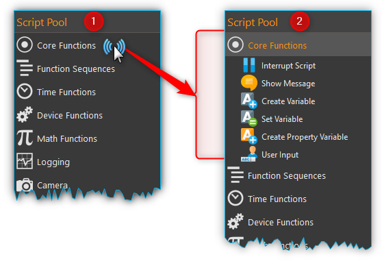

Script Pool Context Menu
~~~~~~~~~~~~~~~~~~~~~~~~~~

Open the context menu by right clicking into the script pool:

+-----------+---------------------------------------------------------+
| |editfun| | Opens the selected *User Library* function for          |
|           | editing.                                                |
+-----------+---------------------------------------------------------+
| |folder|  | Opens the *User Library* folder in file explorer        |
+-----------+---------------------------------------------------------+
| |expand|  | Expands all categories                                  |
+-----------+---------------------------------------------------------+
| |collapse|| Collapses all categories                                |
+-----------+---------------------------------------------------------+

Script Editor
---------------

.. _introduction-script-editor:

Introduction to Script Editor
~~~~~~~~~~~~~~~~~~~~~~~~~~~~~~~~~~~~

The *Script Editor* is used for the graphic programming of scripts. The
following items are numbered in the figure below:

.. rst-class:: guinums

1. *Toolbar* – is for loading, saving, and running scripts.
2. The header shows the script filename.
3. *Function tree* – shows a tree like program structure.
4. The currently executed function is highlighted in blue.
5. When you select a function by clicking, it is highlighted in the selected
   theme accent color (here orange)

|Figure 4: Script editor panel|

Each single function is displayed in
the function tree in a separate line. In this line all the important
function parameters are visible for you (see figure below):

|Figure 5: Single function in the Script Editor|

On the left side you
will find the graphic icon of the function :guinum:`❶`. Immediate right of the
icon at the top :guinum:`❷` you will find the function name. Status information
can be found to the right of the function name :guinum:`❸`. For many functions,
these status information are visible only during the execution and are
subject to change. Directly below the function name is a summary of all
important function parameters :guinum:`❹`, that you have configured in the
configuration area.

The *Script Editor* is a movable and dockable window: you may move and
dock the Editor to another position within the main software window.
To do this, drag & drop the window via the title bar to its new location
using the computer mouse. If the Editor window is not visible, you
may first have to activate it via :menuselection:`Window → Script Editor` 
in the main menu (figure below).

|Figure 6: Activating the Script Editor|

You can change the scaling in
order to increase the clarity or adjust the display of the editor to
suit your requirements. To do this, right-click in the editor to open
the context menu and select the size of the display in the submenu *Set
Item Scaling*:

|Figure 7: Change script editor scaling|

The following sizes are available:

-  **Small** – very compact display for maximum clarity in complex
   function processes, the function parameters are no longer displayed.
-  **Normal** – normal size
-  **Big** – the icons and the function names are enlarged for optimal
   readability

Toolbar
~~~~~~~

+-----------+---------------------------------------------------------+
| |image17| | Generates a new, empty script.                          |
+-----------+---------------------------------------------------------+
| |image18| | Loads an existing script file into the *Script Editor*. |
+-----------+---------------------------------------------------------+
| |image19| | Saves the currently active script.                      |
+-----------+---------------------------------------------------------+
| |image20| | Saves the currently active script into a new script     |
|           | file.                                                   |
+-----------+---------------------------------------------------------+
| |image21| | Stops the execution of the current script. By clicking  |
|           | the start button, the complete program will be          |
|           | restarted from the beginning.                           |
+-----------+---------------------------------------------------------+
| |image22| | Request Script Stop - clicking this button sets the     |
|           | :code:`$StopRequested` global script variable to true.  |
|           | The script can query this variable cyclically, e.g. in  |
|           | the main loop of the script, to react to a stop request |
|           | and terminate the script. Thus the script has the       |
|           | possibility to bring devices into a safe state (e.g. to |
|           | stop pumps, to switch valves) before the script         |
|           | execution is terminated.                                |
+-----------+---------------------------------------------------------+
| |image23| | Pauses the execution of the current script. By clicking |
|           | the start button, the execution will resume from its    |
|           | current position.                                       |
+-----------+---------------------------------------------------------+
||runscript|| Starts the execution of a script or resumes a script    |
|           | after an interruption.                                  |
+-----------+---------------------------------------------------------+
| |stepping|| Activates single step operation for debugging scripts.  |
|           | When single step operation is active, the script stops  |
|           | after the execution of each single script function.     |
+-----------+---------------------------------------------------------+
| |execstep|| Click this button to trigger execution of next script   |
|           | function in single step operation mode.                 |
+-----------+---------------------------------------------------------+
| |scroll|  | Scroll Lock - prevents the Script Editor from           |
|           | automatically scrolling to a function when the function | 
|           | is executed.                                            |
+-----------+---------------------------------------------------------+
| |expand|  | Expands all functions in the script                     |
+-----------+---------------------------------------------------------+
| |collapse|| Collapses all functions in the script so that only the  |
|           | topmost function level is visible                       |
+-----------+---------------------------------------------------------+

.. tip::
   You can also load script files easily via     
   drag & drop. Simply drag a script file from your file   
   system over the script editor and drop it there.

.. _scripteditor-contextmenu:

Context Menu of Script Editor
~~~~~~~~~~~~~~~~~~~~~~~~~~~~~~~~~~~~

If you click with the right mouse button on any function within the
*Script Editor*, a context menu appears to quickly access additional
actions (figure below).

|Figure 8: Script Editor context menu|

The following functions are
available from the context menu:

+-----------+---------------------------------------------------------+
| |editfun| | Opens the selected :ref:`Script Function Call` for      |
|           | editing (only when right clicking on a                  |
|           | Script Function Call)                                   |
+-----------+---------------------------------------------------------+
| |image52| | Moves the selected function one position up             |
+-----------+---------------------------------------------------------+
| |image53| | Moves the selected function one position down           |
+-----------+---------------------------------------------------------+
| |image54| | Copies the selected functions to the clipboard          |
+-----------+---------------------------------------------------------+
| |image55| | Inserts the functions from the clipboard before the     |
|           | selected function                                       |
+-----------+---------------------------------------------------------+
| |duplica| | Duplicates the selected function. This is a combination |
|           | of copy and paste in one single step.                   |
+-----------+---------------------------------------------------------+
| |image56| | Deletes the selected functions                          |
+-----------+---------------------------------------------------------+
| |image57| | Deletes all functions in the script                     |
+-----------+---------------------------------------------------------+
| |image58| | Replaces the selected functions with a function         |
|           | sequence and inserts the functions into this sequence.  |
|           | This allows you to quickly group functions together to  |
|           | structure your script, make it clearer and improve      |
|           | readibilty.                                             |
+-----------+---------------------------------------------------------+
| |disable| | Disables / enables the selected functions.              |
|           | This allows you to temporarily disable certain functions|
|           | and enable them again later. Disabled functions are     |
|           | skipped during program execution. This corresponds to   |
|           | the functionality of commenting out source code in      |
|           | text-based programming languages.                       |
+-----------+---------------------------------------------------------+
| |expand|  | Expands all functions in the script                     |
+-----------+---------------------------------------------------------+
| |collapse|| Collapses all functions in the script so that only the  |
|           | topmost function level is visible                       |
+-----------+---------------------------------------------------------+
| |image61| | Changes the scaling of the display of the script        |
|           | functions. This increases the clarity of complex        |
|           | scripts.                                                |
+-----------+---------------------------------------------------------+
| |image62| | Starts the script execution at the selected function.   |
|           | If variables are previously initialized in the script,  |
|           | it is possible that they are not yet initialized in     |
|           | this case.                                              |
+-----------+---------------------------------------------------------+
| |image63| | Terminates script execution immediately. All devices    |
|           | remain in their current state, are not shut down or     |
|           | stopped, and do not transition to a safe state.         |
+-----------+---------------------------------------------------------+
| |debug|   | Enables / disables the debug mode.                      |
|           | Sets the value of the global script variable            |
|           | :code:`$DebugMode`. This variable can then be used in   |
|           | the script to execute code or log additional debug      |
|           | output.                                                 |
+-----------+---------------------------------------------------------+

.. tip::
   To start script execution at a specific       
   function from within a script, click the right mouse    
   button on the function of choice and select 
   :menuselection:`Run From Here` from the context menu.

Script Configuration Panel
--------------------------

Overview of Script Configuration Panel
~~~~~~~~~~~~~~~~~~~~~~~~~~~~~~~~~~~~~~~~~~

The configuration panel contains all controls for configuring the script
function that is currently selected in the *Script Editor*.

|Figure 9: Script Configuration Area|

The configuration area consists of:

1. header with the name of the currently selected function
2. input- and control elements of the function
3. comment box to enter any commentary

The input- and control elements :guinum:`❷` are different for each script
function. But all functions provide some common controls like the
function caption :guinum:`❶` in the header and a comment box :guinum:`❸` at the bottom of
the configuration area.

Changing Function Caption
~~~~~~~~~~~~~~~~~~~~~~~~~

In the header of the configuration area you can change the caption of
the function. It allows you to use “talking” function names that make it
a lot easier for you or third parties to read and understand your
scripts later.

To change the function name, you can either click with the left mouse
button on the function name in the header or you can click on the name
with the right mouse button and select the context menu item, 
:menuselection:`Edit Function Caption` (see figure below).

|Figure : Showing Caption input dialog|

In the input dialog that now
appears, you can enter a new name for the function.

|Figure : Function Caption input dialog|

The following example shows a
short program with the default function names on the left side and the
same program with own function names on the right side:

====================== ==========================
Default function names Application-specific names
|image67|              |image68|
====================== ==========================

.. tip::
   Enhance the readability, understandability    
   and maintainability of your scripts through the use of  
   speaking, application-specific function names.  

Enter Comment
~~~~~~~~~~~~~

In the comment field you can enter a comment that will allow other users
to understand your scripts better and to follow the flow of execution
easier.

|Figure 12: Script function comment|

When you move the mouse pointer
over a function in the *Script Editor* the comment of this function will
be shown in a message box (see figure above). So you can read the
comment of a function without having to open the configuration area of
that function.

Script Input Fields
~~~~~~~~~~~~~~~~~~~~~~

In many script functions, you will see special input fields in the configuration
area, which are marked with a coloured **V**:

.. image:: Pictures/script_input_fields.png

These special input fields allow you to:

- the input of values (e.g. 0.23 or -24)
- the use of :ref:`Script Variables <script_variables>` (e.g. :code:`$TargetFlow` or :code:`$Voltage`)
- the use of :ref:`Device Properties<device-property-identifiers>` (e.g. :code:`$$Nemesys_M_1.ActualFlow`)
- the use of inline JavaScript (e.g. :code:`${ $$Nemesys_M_1.ActualFlow * 2 }`)

Insert Script Variables
^^^^^^^^^^^^^^^^^^^^^^^^^^^^

To use script variables, you only have to enter a dollar sign :code:`$` in the input
field. Then you are immediately shown a selection list of variables that are
available at the current position in the script. You can simply select a
variable from the list or continue typing the name manually:

The value of the variable is then used at runtime for the corresponding 
parameter. In the example above, the value of the variable :code:`$TargetVolume` is 
used for the script parameter **Volume** at runtime.

Insert Device Properties
^^^^^^^^^^^^^^^^^^^^^^^^^^^^

To insert :ref:`Device Properties <device-property-identifiers>`, simply right-click
in the input field and then select the menu item
:menuselection:`Insert device property...`:

Then select the device property in the dialogue that appears. The identifier 
for the device property is then inserted into the input field.

At runtime, the value of the device property is read and 
passed to the script. In the example above, the current
flow rate of pump *Cedosys 2* is used (:code:`$$Cedosys_2.ActualFlow`)
to set the flow rate of pump *Cedosys 1*.

Use inline JavaScript
^^^^^^^^^^^^^^^^^^^^^^^^^^^^

Inline JavaScript can be used in special input fields, allowing for short
calculations to be written directly within the field, beginning with
:code:`${` and ending with :code:`}`.

.. code-block:: javascript

   ${ /* inline code */ }

In the following example, the flow rate for the *Nemesys S 1* pump is
to be calculated based on the analogue input signal of channel
:code:`$$Nemesys_S_1_AnIN`. For this purpose, the analogue input signal
is to be scaled by a factor of :code:`0.1`:

.. image:: Pictures/inline_javascript_example.png

.. admonition:: Important
   :class: note

   Use Inline JavaScript only for very simple calculations,
   such as scaling. For more complex calculations or logical
   comparisons, you should use the corresponding :ref:`JavaScript <javascript_script_function>`
   function or the :ref:`Set Variable <set_variable>` function.

Insert Device Handle Variables
^^^^^^^^^^^^^^^^^^^^^^^^^^^^^^^^^^^^^^^^^^

Device handles are device identifiers that begin with two
dollar signs :code:`$$` and uniquely identify a device. A device
handle is e.g. :code:`$$Nemesys_M_1`. :ref:`Device Properties <device-property-identifiers>` always
consist of a device handle and an identifier for the
corresponding property of the device. For example,
the device property  :code:`$$Nemesys_S_1_AnIN1.ActualValue`
consists of the device handle :code:`$$Nemesys_S_1_AnIN1` and
the property :code:`ActualValue`. This means that if you know a
device property, then you also know the corresponding device handle.

Device handles are not usually used in normal input fields.
However, many device-specific script functions have a selection
field for selecting the device for which a command is to be executed.
If this selection field is marked with a coloured **V**, then you can
also pass variables there that contain a device handle.

.. image:: Pictures/enter_device_handle_variable.png

In the example above, the variable :code:`$PumpDevice`, which contains the
device handle for the pump for which a dosing process is to be started,
is passed to the :guilabel:`Dosing Module` selection control.

Programming
-----------

Adding Functions
~~~~~~~~~~~~~~~~

Functions are activated via drag & drop from the *Script Pool* to the
*Script Editor*. To do this, proceed as follows:

1. In the Script Pool, left-click on the function that you want to
   insert :guinum:`❶` and hold down the mouse button.
2. Move the pointer to the desired position within the *Script
   Editor* window.
3. As soon as you release the mouse button :guinum:`❷`, the selected function
   will be inserted into the Script Editor.

|Figure 13: Inserting a function into a script via drag-&-drop|

The function is inserted according to where the mouse pointer is positioned
when you release the mouse button. The following scenarios are possible
(figure below):

|image72|

1. If you release the mouse button atop an existing function,
   the new function will be inserted immediately before that existing
   function.
2. If the mouse button is released atop a function sequence (for
   example, a loop), the new function will be inserted at the end of
   that sequence.
3. If the mouse button is released on an empty area at the end of the
   function tree, the function is added at the end.

Selecting Functions
~~~~~~~~~~~~~~~~~~~

To move, copy or delete functions, you must first select them. You can
either select a single function by clicking on it, or you can select a
continuous sequence of functions at the same hierarchy level.

|Figure 14: Script Editor contiguous selection|

When you select an item
in the usual way with the left mouse button, the selection is cleared
and the new item is selected :guinum:`❶`. However, if you press the :kbd:`Shift` key
while clicking on an item :guinum:`❷`, all items between the current item and the
clicked item are selected or unselected, depending on the state of the
clicked item.

Moving Functions
~~~~~~~~~~~~~~~~

Analogous to inserting a new function from the *Script Pool*, you can
move the functions to new positions within the function tree via
drag & drop. Again, the same insertion rules apply as above.

|Figure 15: Moving functions within a function tree|

There is
alternative way for moving functions up and down the list: First, make a
right mouse click on the function that is to be moved. This will open a
context menu from which you may then select *Move up* or *Move down*,
respectively (figure above). Alternatively, you can use the keyboard
with the :kbd:`Ctrl` + :kbd:`↑` or :kbd:`Ctrl` + :kbd:`↓` shortcuts.

This latter method may only be used to move functions up or down within
the current sequence. If you want to move a function to a completely
different position within the function tree, this can only be done via
drag-&-drop.

.. admonition:: Important
   :class: note

   *Move up* and *Move down* only moves the 
   current function. Even if several functions are         
   selected, only the current function is moved. If you    
   want to move the entire selection, you can do this by   
   dragging and dropping.  

Deleting Functions
~~~~~~~~~~~~~~~~~~

There are two ways to delete functions:

1. Select the functions you want to delete and then click the context
   menu entry *Delete*.
2. Select the functions you want to delete and then press the :kbd:`Delete`
   key of your keyboard.

Copying Functions
~~~~~~~~~~~~~~~~~

Similarly, functions can be copied either by using the context menu via
the mouse or using key combinations via the keyboard. If you work with
the context menu, simply select *Copy* and then *Paste* from the menu
(figure below); with the keyboard, use the :kbd:`Ctrl` + :kbd:`C` shortcut to copy and
:kbd:`Ctrl` + :kbd:`V` to paste.

|Figure : Copying a function|

This is how you copy a function to a new position:

1. Select the functions you want to move.
2. Copy the functions via *Copy* of the context menu or via the
   keyboard and :kbd:`Ctrl` + :kbd:`C`.
3. Select the function before which you want to insert the copied
   function by left-clicking it.
4. Paste the copied functions via *Paste* of the context menu or via the
   keyboard and :kbd:`Ctrl` + :kbd:`V`.

To insert the same functions at multiple points of the function tree
simply repeat steps 3 and 4 (above).

.. tip::
   To quickly duplicate functions, you can also use the :menuselection:`Duplicate` 
   menu item or the :kbd:`Ctrl` + :kbd:`D` shortcut. 

Grouping Functions
~~~~~~~~~~~~~~~~~~

To improve the clarity and readability of your script, you can quickly
and easily group sequences of functions into function sequences. To do
this, simply select a contiguous set of functions, and then click
*Convert Selection To Function Sequence* in the context menu.

|Figure : Grouping Functions|

The selected functions are now replaced
by a function sequence containing the selected functions.

|image76|

Disable / Enable Functions
~~~~~~~~~~~~~~~~~~~~~~~~~~~~~~~~~~~~~~

In classical text-based programming languages there is the feature to 
temporarily disable source code by commenting it out. The Script system offers 
a comparable functionality. To disable functions, select the functions in the 
script editor and then choose :menuselection:`Enable / Disable Selected Functions` 
from the  context menu. Alternatively, you can also use the shortcut 
:kbd:`Ctrl` + :kbd:`/`.

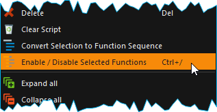

When you disable functions, they are inserted into a :guilabel:`Disabled Functions` 
sequence. During script execution, the content of this sequence is simply skipped.

.. image:: Pictures/disabled_functions.png

To re-enable disabled functions, select a single :guilabel:`Disabled Functions`
sequence, then use the same menu item / keyboard shortcut as for disabling.   

Editing Function Parameters
~~~~~~~~~~~~~~~~~~~~~~~~~~~

As soon as you select a function from the function tree, the operating
elements appear in the *Script Configuration* area that allow you to
configure the selected function. Edit the function parameters as
required.

Showing Function Tooltip
~~~~~~~~~~~~~~~~~~~~~~~~

If you move the mouse cursor over a function, a tooltip window is
displayed for this function after a short time (see figure below). In
this window, you will get all information about this function at a
glance: function name :guinum:`❶`, user comment or function description :guinum:`❷` and
function parameters :guinum:`❸`.

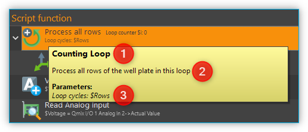

.. _script_variables:

Variables
---------

.. _variables-introduction:

Introduction to variables
~~~~~~~~~~~~~~~~~~~~~~~~~~~~~~~~~~~~

The script system of supports the use of variables. Within script
programs, variables serve as containers for calculated and device
values. Their values are generated during program execution from, for
example, loop counts or sensor data. Each variable is defined by a name.
Script functions that support the use of variables may then use the
values stored in these containers, e.g., to trigger value-dependent
events.

Setting Variables
~~~~~~~~~~~~~~~~~

Before variables may be used by a script, such variables need to be
defined. There are two possibilities to setup variables:

1. Explicit: Variables are defined explicitly by the user, e.g., via
   the function :ref:`create-variable`.
2. Implicit: Implicit variables are created via functions that offer
   variables by default, such as the counter of the 
   :ref:`counting-loop` function.

.. _naming-variables:

Naming Variables
~~~~~~~~~~~~~~~~

There are some important requirements to keep in mind when naming
variables: Every variable is called within a program script via an
essentially freely definable name. This name serves to uniquely
identify that variable; different names signify different variables. The
:code:`$`-prefix clearly identifies a name and its use as a variable. The
scripting system is case sensitive: :code:`$Var` is different variable than
:code:`$var`.

Additionally, the following rules apply when naming variables:

-  Variable names have to start with the Dollar symbol ($) and must not
   themselves contain a $-symbol.
-  Only alphanumeric characters are allowed (a-Z, 0-9).
-  Special characters (such as, $, &, /, -, …) are not allowed.
-  Variable names must not start with a number.

.. tip::
   You can display the contents of variables     
   using the :ref:`show-message` function, e.g. 
   to check the results of calculations.  

Visibility Range of Variables (Scope)
~~~~~~~~~~~~~~~~~~~~~~~~~~~~~~~~~~~~~

The visibility range (scope) of a variable is that part of the program
within which that variable is visible, i.e., available. Scripts
are trees with an essentially unlimited number of branches and levels; a
variable, i.e., the value it returns, is only visible, i.e.,
available to be used, at that level at which it has been defined plus
all its sub-levels.

The following example illustrates the scope of variables:

In the following example program the variable :code:`$a` is visible in the red
marked area - i. e. usable by script functions (figure below):

.. image:: Pictures/10000201000001CB00000183136E0FD0BB1DB56C.png

Variable :code:`$b`, on the other hand, is only visible within a specific
function sequence (figure below).

The counter variable :code:`$i` of the counting loop is only visible in those
functions that are in the counting loop:

|image80|

The scope of variable :code:`$c` , which has been setup within
the counting loop, is only available within that counting loop, too, as
no other sublevel has been added at this point:

|image81|

It is important to note that, if two variables have the same
name, the variable that has been defined later (i.e., at a lower level)
will shadow the variable defined earlier (i.e., at a higher level).
In the example above, if :code:`$c` would have been named again as :code:`$b`,
the later-defined value (i.e., 2) would replace the earlier-defined value
(i.e., 1).

.. admonition:: Important
   :class: note

   If a lower-level variable has the same   
   name as a higher-level variable, the lower-level        
   variable will supersede the higher-level variable. That 
   is, functions at the lower level cannot access the      
   value of the higher-level variable of the same name and 
   will use „newer“ value instead.

Using Variables
~~~~~~~~~~~~~~~

Variables can be used with all functions that support them. Calling a
variable to, e.g., set or calculate a value, requires the use of the
dollar symbol ($) as a prefix: To use (call write to) the variable *a*,
the required syntax is: :code:`$a`.

.. admonition:: Important
   :class: note

   Variables get assigned a valid value     
   only after they have been assigned a value via being    
   run through a relevant function (e.g., Create           
   Variable). If you are using the action *Run From       
   Here* to start a script, variables may not have been   
   assigned a valid value yet if the respective assignment 
   function follows later in the sequence or has been      
   skipped. 

Functions that support the use of variables have the relevant input
boxes highlighted by a yellow :guilabel:`V` (see figure below). Here you
can insert the name of a variable instead of a numeric value that is to
be used subsequently within the relevant section of the program script.

.. figure:: Pictures/100002010000020E000001041A67F3D4FCEC9662.png
   :alt: Figure 19: A yellow „V“ signifies a function that supports

.. tip::
   Nearly all input fields that support         
   variables allow for direct access of device process     
   data via device property identifiers                  
   (see `Device Property Identifiers`_).  

Auto-Completion of Variable Names
~~~~~~~~~~~~~~~~~~~~~~~~~~~~~~~~~

Input boxes that support the use of variables, feature auto-completion
to aid the selection and input of valid variable names: Upon inserting
the $-symbol, a list will appear that contains all variable names
defined so far (see figure below).

|Figure 20: Auto-completion of variable names|

Every additional
character that you enter will cause a filtering of that list according
to the character sequence inserted thus far. You may use either the
:kbd:`↑` or :kbd:`↓` of your keyboard or the mouse to select a name
from that pre-filtered list. Accept the selection by pressing the
:kbd:`Enter` key.

.. _device-property-identifiers:

Device Property Identifiers
---------------------------

Nearly all input fields that support variables (see
`Using Variables`_)
allow for direct access of device process data via device property
identifiers. Just click with the right mouse button in the input field
and select the menu item *Insert device property* (see figure below).

|Figure 21: Inserting device properties into input fields|

A dialog for
selecting the process data is displayed (see figure below).

|Figure 22: Selection dialog for device process data|

In this dialog
you can select which type of device you want to access in the selection
box :guilabel:`Filter` :guinum:`❶`. Select a specific device in the selection box 
:guilabel:`Device` :guinum:`❷` which contains the filtered list of devices. Finally 
select the process data to be accessed in the :guilabel:`Property` :guinum:`❸` field.

|Figure 23: Using process data identifiers in input fields|

The selected process data identifier will be entered into the input field.
Similar to variable names, the process data identifiers have a
particular form:

:code:`$$DeviceName.DeviceProperty`

Each identifier starts with two dollar signs. A point separates the
device name from the device property name. The entire process data
identifier must not contain spaces or other special characters.

.. admonition:: Important
   :class: note

   The device name and the name of the     
   process data have a normalized form. All spaces are     
   removed and replaced by underscores. The device name is 
   the unique name of each device and may be different     
   from the device caption that can configured by the      
   user.  

When the script function is executed, the process data is read from the
device and used as function parameter for the script function.

.. _programming-your-own-script-functions:

Programming your own script functions
-------------------------------------

Create a script function
~~~~~~~~~~~~~~~~~~~~~~~~

In addition to the script functions available in the script pool, you
have the option of programming your own script functions to use them
later in your scripts. To implement an own script function, proceed as
follows:

**Step 1 – Create a new script**

Click on the button :guilabel:`Create New Script` :guinum:`❶` to create an empty script.
Then click on the :guilabel:`Save Script` button :guinum:`❷` to give the script function a
name and then save it with this name. The name of the script function is
then displayed in the script editor header :guinum:`❸`. In this example we use the
name *AddValues* because we want to implement a simple function that
adds two values.

.. image:: Pictures/10000201000001E300000081C08337AF408A77E5.png

**Step 2 – Define function parameters**

You can define function parameters and return values for your function.
Function parameters are values that are passed to the function when it
is called. Return values are values (e.g. results of calculations) that
are returned by the function to the calling script. Up to 10 function
parameters and up to 10 return values can be defined for each function.

To define parameters and return values, click with the mouse on a free
area in the script editor or on the script editor's header :guinum:`❶` (figure
below), where the name of the function is displayed.

|image94|

The script pool now shows the configuration window for the
script. Here you can add function parameters :guinum:`❷` or return values :guinum:`❸` by
clicking on the :guilabel:`Add` buttons.

For this example, click twice on the :guilabel:`Add` button :guinum:`❷` to add two function
parameters. Then click on the first parameter name (figure below) and
give it a more meaningful name: *Summand1*:

.. image:: Pictures/10000201000001AD000000BA59BF59476BCC908C.png

Then enter the default value 0 :guinum:`❷` for the parameter. Now click on the
second parameter name and rename it to *Summand2*.

**Step 3 – Define return values**

Now click once on the :guilabel:`Add` button in the *Return Values* :guinum:`❶` area 
(figure below) to add a return value. Then click on the first return value name
and rename it to: *Sum*.

.. image:: Pictures/10000201000001510000007CC6466F2943E0596A.png

Now save the script function to store your changes. The configuration
area of the script function should now look like this:

.. image:: Pictures/100002010000024C0000019005AB068207394D76.png

**Step 4 – Implement function logic**

All function parameters and return values are available within the
script as variables that can be read and written. I.e. the script can
now read the transferred values from the two variables :code:`$Summand1` and
:code:`$Summand2` and save the result of the calculation in the variable
:code:`$Sum` and thus transfer it back to the calling script.

To perform the addition, insert a *Set Variable* script function into
the script and set the type of the variable to *JavaScript Expression*.

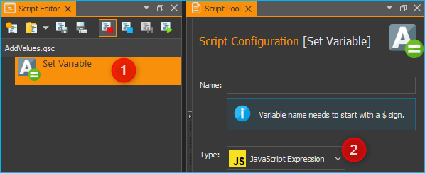

In the :guilabel:`Name` field, enter the name :guinum:`❶` (see figure below) of the variable
which should store the value – in this case, the variable :code:`$Sum`. 
In the input field for the JavaScript code :guinum:`❷` you can now enter the addition of
the two variables :code:`$Summand1` and :code:`$Summand2`.

.. image:: Pictures/10000201000001A60000010A9B2821B16D5BA0B3.png

**Step 5 – Give the function a meaningful name**

Click into the function name label :guinum:`❶` and give the function a meaningful, 
unique, short and descriptive name. This name will be shown in the script editor as
the function name later. Here we use the Name **Add Values** :guinum:`❷`:

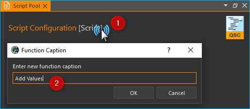

**Step 6 – Add an optional comment**

Click into the :guilabel:`Comment` field and add a n optional comment that helps
the user of your function to understand its parameters, return value and its
usage:

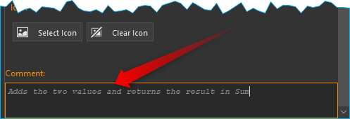

**Step 6 – Assign an optional custom icon**

If you use your functions in the script, the standard icon will be the icon of
the **Script Function Call**:

.. image:: Pictures/10002495000034EB000034EB5801BA1011E76C10.svg
   :width: 60

If you would like to improve your function with a custom SVG icon, then click
the :guilabel:`Select Icon` button.  The software shows an icon selection dialog 
with a library of all icons loaded in the software. You can select an icon, 
by double-clicking it :guinum:`❸`. 

You have two
options, two filter the icon library. The first option is to select a certain
plug-in from the list :guinum:`❶`, if you are interested only in icons from 
this plugin. The second option is, to enter a filter expression into the 
filter text box :guinum:`❷`. You can combine both filter options:

.. image:: Pictures/filtered_icon_library.png

If you do not find an icon in the library, you can load a custom SVG icon by
clicking the :guilabel:`Load Custom SVG Icon` button below the icon list. Here 
in this example we use this option to choose a custom sum icon. As soon as you
have selected the icon, the icon of the function in the script editor :guinum:`❶` 
and in the configuration panel :guinum:`❷` is updated:

.. image:: Pictures/script_function_icons.png

.. tip::
   If you would like to restore the default icon, click the :guilabel:`Clear Icon`
   button in the script function configuration panel.

**Step 7 – Save the function**

If you have finished all your modifications, the you should save the final 
function again.

**Step 8 – Test your function**

Finally you can test your new script function.
Click on the :guilabel:`Run Script` button :guinum:`❶` (figure below) - no error should
occur and the result of the addition should be displayed in the script
editor in the *Set Variable* function :guinum:`❷`.

.. image:: Pictures/10000201000002670000013365D1FE2B80D7A609.png

If errors occur, correct them and save the script function again.

Use your own script functions
~~~~~~~~~~~~~~~~~~~~~~~~~~~~~

Click on the button :guilabel:`Create New Script` :guinum:`❶` to create an empty script.
Then click on the :guilabel:`Save Script` button :guinum:`❷` to give the script function a
name and then save it with this name. The name of the script function is
then displayed in the script editor header :guinum:`❸`. In this example we use the
name *CustomScriptFunctionTest*.

.. image:: Pictures/custom_script_function_test01.png

Add a *Create Variable* function to the script as the first function and
configure the function as follows.

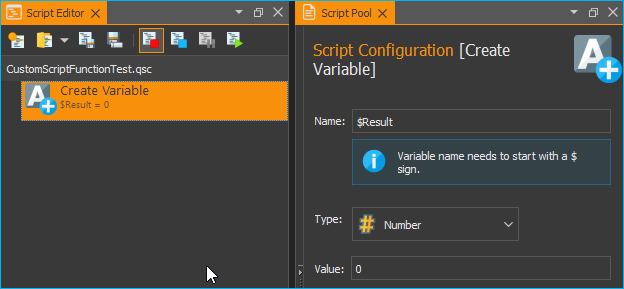

Now insert a *Script Function Call* from the *Core Functions* category
into the script as the second function.

.. image:: Pictures/10002495000034EB000034EB5801BA1011E76C10.svg
   :width: 60

A file selection dialogue pops up where you can select the external
script function to be called by the script. Select the example function
:file:`AddValues.qsc` that we created in the previous section. The
function is inserted. The script editor :guinum:`❶` and the configuration
panel :guinum:`❷` both show the custom icon. For the
function parameters *Summand1* and *Summand2* :guinum:`❸`, enter two values as a
test, e.g. 4 and 3. You can also use script variables in these fields.
Enter the variable :code:`$Result` in the return parameter *Sum*. In other
words, the return value of *Sum* is stored in the variable :code:`$Result`.
The function should now be configured as follows:

Now add a *ShowMessage* function as the last function to output the
value of the :code:`$Result` variable. Enter the following in the 
:guilabel:`Message` field:

.. image:: Pictures/10000201000001D300000094BED5B208580C66A3.png

Your script should now look like this:

.. image:: Pictures/100002010000017D000000CE262C3B7A1191FE4E.png

Now run the script. The :ref:`show-message` function should show you the
result of the call to :file:`AddValues.qsc` in a window and in the event log.

.. tip::
   By using your own script functions, you can structure your script and
   break it down into reusable and easily maintainable individual
   components.

Edit script function
~~~~~~~~~~~~~~~~~~~~~~~~~~~~~

To edit a script function later, you just need to open it in the script editor.
You can do this directly from the Script Editor by right-clicking on a custom 
function and selecting the context menu item :menuselection:`Edit Selected Function`.

.. image:: Pictures/script_editor_edit_script_functions.png

.. admonition:: Important
   :class: note

   Opening a script function for editing will replace the current open script
   in the Script Editor with the script to be edited.

Script User Library
-------------------

The `Script Pool`_ contains an initially empty *User Library* category.
This category enables a project specific grouping of custom script functions 
in a kind of user library. This allows quick access to frequently used functions
and quick  addition of user-specific functions to the script editor via
drag & drop.

.. image:: Pictures/user_library.png

The *User Library* category shows the content of the :file:`UserLibrary` folder
inside of the current project :file:`Scripts` folder. To browse the content
of the this folder in the file explorer, just right click into the *User Library*
category and select the menu item :menuselection:`Browse User Library Folder`.

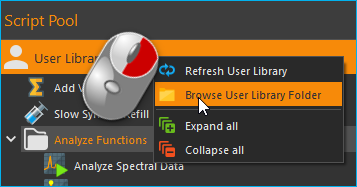

To add functions to the *User Library* category, you just need to save them
into the :file:`UserLibrary` folder or any sub folder inside of the
:file:`UserLibrary` folder or you use your file explorer to copy the functions 
into the :file:`UserLibrary` folder. When you have added new functions
to the *User Library*, you need to refresh the user library. To do this,
right click into the *User Library* category and select the menu item
:menuselection:`Refresh User Library`.

.. admonition:: Important
   :class: note

   To display newly added functions in the *User Library* you need to refresh
   the library via context menu item :menuselection:`Refresh User Library`.

The *User Library* category also 
takes into account subdirectories in the :file:`UserLibrary` folder. 
That means, subdirectories will be shown as folders in the *User Library* category.

.. image:: Pictures/user_library_folders.png

By default each folder is shown with a folder symbol :guinum:`❶` but you can
provide a custom icon for each folder. Just copy an :file:`SVG` icon with
the same name into a folder, to set it as folder icon. In the example above
the *User Library* contains the folder :file:`Robot Functions`. This folder
contains the file :file:`Robot Functions.svg`. If the software detects an
SVG icon in a folder with the same name like the folder, it will set it as
folder icon :guinum:`❷` in the Script Pool.

To open a user function from the *User Library* for editing in the `Script Editor`_ 
right-click on the function and select the context menu item
:menuselection:`Edit Selected Function`.

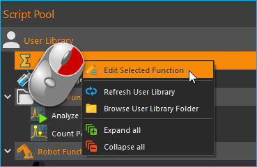

Script Autostart
----------------

The script system can be configured to automatically load and start a
script after successfully connecting to the device hardware. The dialog
with the corresponding settings can be opened via the menu item 
:menuselection:`Edit → Settings` in the main menu of the application.

|Figure 24: Script autostart configuration|

You can now configure the
script autostart in the Settings dialog of the application. First select
the settings category *Scripting* :guinum:`❶`. Now you can activate the script
autostart :guinum:`❷` in the right area. You can select the script file to be
loaded and executed via the :guilabel:`Autostart Scriptfile` :guinum:`❸` input field. If
this field is empty, the script is executed which is loaded when the
application is started, i.e. the script which was open when the
application was last used. Finish the configuration by clicking :guilabel:`OK` :guinum:`❹`.

If you want the software to start up automatically and execute a script
after your computer has booted, then proceed as follows:

.. rst-class:: steps

1. Insert :program:`QmixElements.exe` into the *Windows Autostart* to start the
   software automatically after booting the computer.
2. Open the dialog with the global settings via the main menu of the
   application (:menuselection:`Edit → Settings`).
3. Select the *General* settings category and activate the 
   :guilabel:`auto connect` option. This will cause the software to automatically
   connect to the device hardware after start-up.
4. Then select the *Scripting* setting category to configure the script
   autostart

Script Error Handling
---------------------

No matter how great we are at programming, sometimes our scripts have errors. 
They may occur due to our mistakes, unexpected user input, when parameters are
out of range, errors in communication with devices or a thousand other reasons.

If an error occurs in the script, the standard reaction is as follows:

- the script execution is interrupted :guinum:`❶` 
- the script stops at the function that caused the error :guinum:`❷`
- an error message is displayed in the *Event Log* and the warning that the
  script execution was interrupted :guinum:`❸`
- since the script is interrupted, parallel sequences are also not executed any longer
- the script can only be continued by clicking the :guilabel:`Start` button :guinum:`❹`

.. image:: Pictures/default_error_handling.png

This type of error handling may be unacceptable, for example, in the case of
automatic control via the I/Os of a PLC or also due to the requirements of a
certain user application process - e.g. if parallel sequences should continue
to run, a PLC should be able to react to errors or reset errors or if manual
intervention by the user is not possible.

.. image:: Pictures/try_except.svg
   :width: 60
   :align: left

But there's a :ref:`Try...Catch<try_catch>` function that allows us to "catch" 
errors so the script can, instead of interrupting, do something more reasonable
such as handling the error or bringing devices into a safe state.
If an error is caught in a :ref:`Try...Catch<try_catch>` block, only the function
sequence in which the error occurred is affected - the script continues to run
and parallel sequences are still executed.

All details on error handling using Try...Catch can be found in the
:ref:`documentation for the Try...Catch<try_catch>` block.

Debugging Scripts
-----------------------

When you develop a script program, there are several ways, 
to find and debug errors. In the following sections we present
some features that help you debug scripts.

Single Step Operation
~~~~~~~~~~~~~~~~~~~~~~~~~~

single-stepping allows you to have more control of viewing individual actions of 
the program. With single-stepping, you can execute a single function at a time, 
causing the program to pause after the function completes. To use the single 
step mode, proceed as follows:

.. rst-class:: steps
.. rst-class:: inlineimg

#. |stepping| Activate the single stepping mode by pressing the 
   *Enable / Disable Single Stepping* button.

   .. image:: Pictures/single_stepping_buttons.png   

#. |execstep| Use the *Execute Single Step* button to trigger the execution of 
   the next step. Press this button as often as you want to execute further 
   single steps.
#. |stepping| Deactivate the single stepping mode by pressing again the 
   *Enable / Disable Single Stepping* button.
#. |runscript| Continue normal script execution by pressing the
   *Run Script* button.

.. rst-class:: inlineimg

This allows you to go through your program step by step and observe the process 
at your leisure. You can activate or deactivate the single-step mode at any 
time - even while your program is already running.

.. _debug-mode:

Activate / deactivate debug mode
~~~~~~~~~~~~~~~~~~~~~~~~~~~~~~~~~~~~~~~~

The debug mode can be activated and deactivated via the 
:ref:`context menu of the script editor <scripteditor-contextmenu>`. This sets 
the value of the global script variable :code:`$DebugMode` to :code:`true` or 
:code:`false`. I.e. you can then execute code or output additional debug
messages depending on this variable in the script. For example, you can use
the :ref:`Log Message <log_message_function>` function to log messages that 
are only output when debug mode is active.

Insert Breakpoints
~~~~~~~~~~~~~~~~~~~~~~~~~~

.. image:: ../scriptingsystem_part2_EN/Pictures/interrupt_script.svg
   :width: 60
   :align: left

You can interrupt your script at certain points by inserting an 
:ref:`Interrupt Script` function. This allows you to interrupt the program 
flow at specific points to examine the state of variables. If you insert the 
interrupt function in a :ref:`Conditional Sequence`, you can interrupt the 
program conditionally when certain events occur or variables have certain values.

In the following example, the program flow is interrupted when the value of the
variable :code:`EmployeeName` has the value :code:`John`.

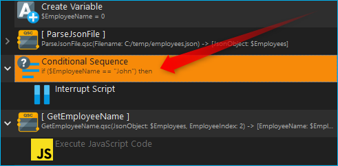

Printing Debug Messages
~~~~~~~~~~~~~~~~~~~~~~~~~~

The runtime behavior of the program is changed by single-step operation or the 
insertion of breakpoints. I.e. the sequence is slowed down or interrupted. If 
you use debug messages to display the program flow, the value of variables or 
the value of device properties, the runtime behavior is hardly affected.

To output a debug message, you just need to insert a :ref:`Log Message` 
function at  the point in the program where you want to write a message to the 
event log. In the following picture, for example, the value of the :code:`$Flow`
variable is output to the event log in each loop cycle:

.. image:: Pictures/debug_show_message.png

The event log then displays each recorded message with a timestamp. This allows 
you to analyze the output values in a temporal context:

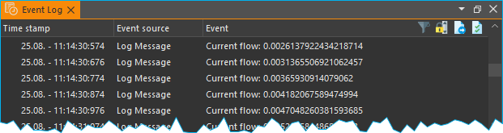

Disable Functions
~~~~~~~~~~~~~~~~~~~~~~~~~~~

.. image:: Pictures/enable_disable_functions2.svg
   :width: 60
   :align: left

To test certain program sections in isolation, to block the execution of 
functions during debugging, or to test alternative implementations, it may be 
necessary to temporarily disable functions. Disabled functions are skipped 
during program execution. This corresponds to the functionality of commenting 
out source code in text-based programming languages.

For details on how to disable functions, refer to the section
:ref:`Disable / Enable Functions`.

.. |Figure 1: Script system overview| image:: Pictures/10000201000003C9000001AAB18C614061F55B68.png

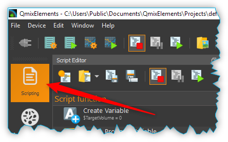

.. |Figure 4: Script editor panel| image:: Pictures/100002010000025A00000168CC93E6B2FBB4D916.png

.. |Figure 5: Single function in the Script Editor| image:: Pictures/1000020100000272000000627C834EF46698FB03.png

 
.. |Figure 7: Change script editor scaling| image:: Pictures/10000201000001BD000000E95ED186BD70837E01.png
   

.. |image18| image:: Pictures/10000F850000350500003505755524BB44FF2E56.svg
   :width: 40

.. |image19| image:: Pictures/1000111B000038720000387231FCD7A597623EB3.svg
   :width: 40

.. |image20| image:: Pictures/1000173B0000387200003872AFCF364C5ED9850F.svg
   :width: 40

.. |image22| image:: Pictures/10000C46000034EB000034EBC0807B1C81FD15E0.svg
   :width: 40

.. |image23| image:: Pictures/10000E11000034EB000034EB5683B6AF8D85CDA6.svg
   :width: 40

.. |Figure 8: Script Editor context menu| image:: Pictures/100002010000014400000150DF1BE1DD8FC0A460.png

.. |image52| image:: Pictures/1000097D000035050000350538CD8A3BED7FE2BC.svg
   :width: 40

.. |image53| image:: Pictures/100009440000350500003505BD31755A160012FF.svg
   :width: 40

.. |image54| image:: Pictures/1000089D000034EB000034EB2EF1F414485F4814.svg
   :width: 40

.. |image58| image:: Pictures/10000944000038720000387225245FA0499799FC.svg
   :width: 40

.. |image60| image:: Pictures/10000C0F000034EB000034EB8B608CD687D95EFA.svg
   :width: 40

.. |image61| image:: Pictures/100003FA00003505000035058DF099368DC3B55E.svg
   :width: 40

.. |image63| image:: Pictures/100008F80000350500003505C177441D68208C36.svg
   :width: 40

.. |Figure 9: Script Configuration Area| image:: Pictures/100002010000021A0000012F07608C2B70720CC7.png

.. |Figure : Showing Caption input dialog| image:: Pictures/10000201000001BC0000008C307209237D1183C6.png

.. |Figure : Function Caption input dialog| image:: Pictures/10000201000001B00000009EE87E1DC8113145D3.png

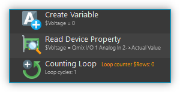

.. |image68| image:: Pictures/100002010000012C0000009B3D05CC276B4F0D6F.png

.. |Figure 12: Script function comment| image:: Pictures/1000020100000204000000DEFE8A94073FF71C98.png

.. |Figure 13: Inserting a function into a script via drag-&-drop| image:: Pictures/1000020100000257000000FE60273A82A9E46F3B.png
 
.. |image72| image:: Pictures/10000201000001340000012B261E2BD3D1D76AC8.png

.. |Figure 14: Script Editor contiguous selection| image:: Pictures/10000201000001F0000000EFC1A07C20DF2E2141.png

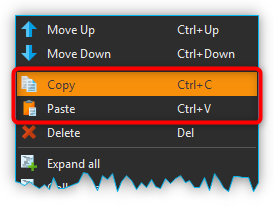
 
.. |Figure : Grouping Functions| image:: Pictures/1000020100000162000000A933F710A74CD5FF30.png
 
.. |image76| image:: Pictures/10000201000002AD000000B45887FBE2E338C1B1.png

.. |image80| image:: Pictures/10000201000001CB000001831A3AF6CDB6960307.png

.. |image81| image:: Pictures/10000201000001CB00000183CA6D8F113E4CEE33.png

.. |Figure 20: Auto-completion of variable names| image:: Pictures/10000201000001C20000014FBE3E569F0981A6AD.png

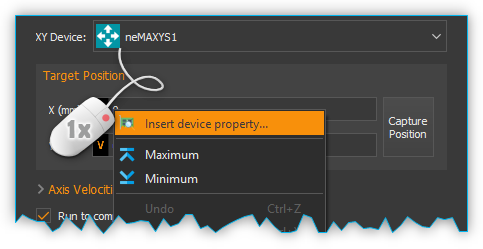

.. |Figure 22: Selection dialog for device process data| image:: Pictures/10000201000001C6000000F0B5F49C8D9D01ECE2.png

.. |Figure 23: Using process data identifiers in input fields| image:: Pictures/10000000000001F4000000A145D5D5774F56F660.png

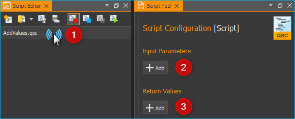

.. |Figure 24: Script autostart configuration| image:: Pictures/100002010000022600000126F6C3DD9DEA793D3B.png

.. |editfun| image:: Pictures/edit_function.svg
   :width: 40

.. |folder| image:: Pictures/folder.svg
   :width: 40

.. |disable| image:: Pictures/enable_disable_functions2.svg
   :width: 40

.. |scroll| image:: Pictures/scroll_lock.svg
   :width: 40

