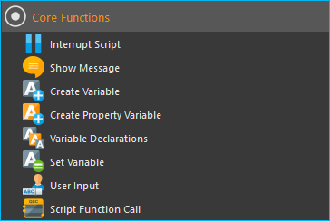
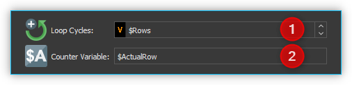
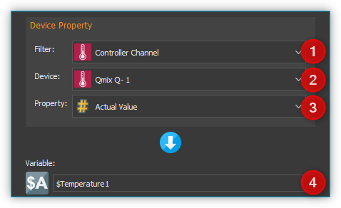
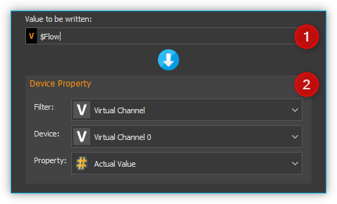
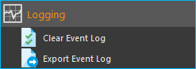

Generic Script Functions
========================

The *Script System* comes with a set of generic, or core, functions that
control the program flow. These functions are always available
irrespective of the activated plug-ins. You will find these functions in
the categories :guilabel:`Core Functions` , :guilabel:`Function Sequences`, 
and :guilabel:`Time Functions` (figure below).

.. figure:: Pictures/100002010000016C000002591AF7FEE5FA0D46F1.png

Core Functions
--------------

Core Functions Overview
~~~~~~~~~~~~~~~~~~~~~~~~

The category Core Functions contains functions that control program flow
and the use of variables.

|Figure 1.1.2: List of core functions|

Interrupt Script
~~~~~~~~~~~~~~~~

.. image:: Pictures/100003260000350500003505F1A465AE7BF98CC3.svg
   :width: 60
   :align: left

This function allows you to pause script execution. The user
may then continue the script at a later time.

|

.. _show-message:

Show Message
~~~~~~~~~~~~

.. image:: Pictures/10000490000034EB000034EB215655F378C8DAF2.svg
   :width: 60
   :align: left

The Show Message function allows you to display a message
to the user and optionally interrupt script execution. It is well suited
for applications that require an intervention by the user at certain
times during the execution of a script.

When you run this script function, the message can be displayed both in
a message window...

|Figure 1.1.3: Message window|

… and in the *Event Log* view of the application:

|Figure 1.1.4: Event log|

In the *Event Log*, all messages are
listed in chronological order. The optional Message Box always displays
the last message.

Show Message Function Configuration
^^^^^^^^^^^^^^^^^^^^^^^^^^^^^^^^^^^

When configuring the message function, you can configure the following
options:

|Figure 1.1.5: Message configuration panel|

.. rst-class:: guinums

1. Enter your message text into the :guilabel:`Message` field.
2. Select the type of message you want to display in the 
   :guilabel:`Message Type` group. Depending on the message type, the relevant icon appears
   in the event log and in the message window and the message is
   highlighted with a type-specific color in the event log.
3. In the *Output* pane you can set whether the message should be
   displayed in a separate message window (:guilabel:`Show Message Box`) and
   whether the message should appear in the *Event Log*
   (:guilabel:`Write to Event Log`).
4. Select whether the message should interrupt script execution. If
   there is a check mark in this field, the complete script execution is
   interrupted until the user continues the program execution. If you
   display a message window with a :guilabel:`Show Message Box`, you should not
   select this option and use option :guinum:`❺` instead.
5. Here you can select whether the script execution will be continued
   after clicking :guilabel:`OK` in the message box window.

Depending on the options selected, this function works like this:

.. list-table::
   :widths: 10, 10, 10, 10, 60

   *  - Show Message Box
      - Write to Event Log
      - Inter-rupt Script Exe-cution
      - Continue Script if User Clicks OK
      - Result
   *  -  
      -  :fa:`check`
      -  
      -  
      -  A message is written to the event log and then the next function is 
         executed.
   *  -  
      -  :fa:`check`
      -  :fa:`check`
      -  
      -  A message is written to the event log and script execution is          
         interrupted. The execution can be continued by clicking the 
         :guilabel:`Run Scrip` button in the script toolbar.
   *  -  :fa:`check`
      -  :fa:`check`
      -  
      -  
      -  A message is written to the event log, a message box is displayed   
         and then the next function is executed.   
   *  -  :fa:`check`
      -  
      -  
      -  :fa:`check`
      -  A message box is displayed. When the user clicks OK, the     
         next script  function is executed.    
   *  -  :fa:`check`
      -  :fa:`check`
      -  
      -  
      -  A message  window is displayed and script execution is          
         interrupted. Execution can be continued by clicking the 
         :guilabel:`Run Script` button in the script toolbar.   

Displaying variables content or process data
^^^^^^^^^^^^^^^^^^^^^^^^^^^^^^^^^^^^^^^^^^^^^^

In the :guilabel:`Message` field of the function, you can also use variables
(like :code:`$Volume`) or :ref:`Device property Identifiers <device-property-identifiers>`
(like :code:`$$neMESYS1.SyringeFillLevel`).
These serve as place holders and are replaced at script runtime by the
contents of the variables or the process data of a certain device. As
soon as you enter a dollar sign $ in the message input field, a list
of available variables is displayed, from which you can select a
variable (see figure below).

|Figure 1.1.6: Using variables in Show Message function|

E.g. you can enter the following text in the message input field:

.. centered::
   *The contents of variable A is $A.*

If the variable :code:`$A` contains the value 25.3 at runtime, then the
function will display the following message:

.. centered::
   *The contents of variable A is 25.3.*

.. tip::
   You can display the contents of variables      
   using the Show Message function, e.g. to check the       
   results of calculations.  

.. tip::
   Click with the right mouse button in the input 
   field and then select the context menu item **Insert     
   device property** to insert a process data identifier of 
   device process data you would like to print out, when    
   Show Message function is executed.  

.. _create-variable:

Create Variable
~~~~~~~~~~~~~~~~~~~~~

With *Create Variable* you can define a new variable and
assign a name, a type hint, and a value to that variable (see figure below):

|Figure 1.1.7: Configuration of a variable|

.. rst-class:: guinums

1. **Name** – set a unique
   name for your variable. For details concerning the naming of
   variables, please refer to section :ref:`naming-variables`.
2. **Type** – choose the kind of variable you want to set.
3. **Value** – give the variable a value or, if the variable is of the
   type *JavaScript Expression*, enter the JavaScript code to calculate
   the variable.

.. tip::
   To prevent an incorrect variable name, the    
   :guilabel:`Name` field accepts only names that start with a     
   $ symbol.      

Types of Variables
^^^^^^^^^^^^^^^^^^^^

The variables in the script system are not typed and can hold a wide
variety of values. For example, a numeric value can be assigned to a
variable when it is created and a text can be stored in the same
variable later. The :guilabel:`Type Hint` field in the configuration area is
simply a hint as to which type is to be stored and is used to display a
corresponding input field depending on the type. All
types, *Boolean*, *Number* or *Text* can also be entered via a
JavaScript expression. The following table is an overview of a selection
of data that can be stored into variables:

.. table::
   :widths: 10, 10, 30, 40
   
   +-----------+---------------+-------------------+-------------------+
   | Type Hint | Data / Values | Examples          |                   |
   +===========+===============+===================+===================+
   | |image31| | Boolean       | Boolean values    | true, false       |
   +-----------+---------------+-------------------+-------------------+
   | |image32| | Number        | Numeric values    | 24, 10, -13.23,   |
   |           |               |                   | -128, 0.001       |
   +-----------+---------------+-------------------+-------------------+
   | |image33| | Text          | Strings, words or | Value1, Enter a   |
   |           |               | text              | value             |
   +-----------+---------------+-------------------+-------------------+
   | |image34| | JavaScript    | Device References | $$Nemesys_M_1     |
   |           |               | (e.g. for passing | or                |
   |           |               | devices to        | $$Nemesys         |
   |           |               | functions)        | _M_1_ForceSensor  |
   +-----------+---------------+-------------------+-------------------+
   | |image34| | JavaScript    | Array of numbers  | [3, 7, 8.5, 12,   |
   |           |               |                   | 23.5]             |
   +-----------+---------------+-------------------+-------------------+
   | |image34| | JavaScript    | Array of strings  | [User1, User2,    |
   |           |               |                   | User3, User4]     |
   +-----------+---------------+-------------------+-------------------+
   | |image34| | JavaScript    | Array of device   | [$$Nemesys_M_1,   |
   |           |               | references        | $$Nemesys_M_2]    |
   +-----------+---------------+-------------------+-------------------+
   | |image34| | JavaScript    | Calculation       | 25 +              |
   |           |               | result            | $TargetPositionX  |
   +-----------+---------------+-------------------+-------------------+
   | |image34| | JavaScript    | Read device       | $$Nemesy          |
   |           |               | properties /      | s_M_1.DosedVolume |
   |           |               | process data      |                   |
   +-----------+---------------+-------------------+-------------------+

Calculating using Variables
^^^^^^^^^^^^^^^^^^^^^^^^^^^^^

If you set the variable type to *JavaScript Expression*, you can define an
expression in the field :guilabel:`Value` that is to be calculated during run
time. This expression may include other variables to use their
respective values. Script variables can be accessed via the variable
name, which starts with a dollar $ sign.

|Figure 1.1.8: Defining calculation variables|

.. tip::
   The auto-complete feature will support you    
   during entering a new expression by listing all         
   previously defined variables. 

You can also directly read the properties / process data of a device
within a JavasScript expression and include it in a calculation. In the
following example, the variable :code:`$Flow` :guinum:`❶` is calculated as a twentieth
of the device property :code:`$$Nemesys_M_1.MaxFlow` :guinum:`❷`. Device properties
can be easily added using the context menu entry *Insert device property* :guinum:`❸`.

.. image:: Pictures/10000201000001E7000000D09DED5F410BD67FC9.png

.. tip::
   Click with the right mouse button in the      
   input field and then select the context menu item       
   *Insert device property* to directly access device    
   process data values in the calculation.  

Using the context menu you can also insert device references into the
JavaScript code. This makes it possible to store device references
(e.g. :code:`$$Nemesys_M_1`) or arrays with device references
(e.g. :code:`[$$Nemesys_M_1, $$Nemesys_M_2, $$Nemesys_M_3]`) 
in variables. In the following example, a reference of the :code:`$$QmixP1_Pressure1` 
pressure sensor is stored in the :code:`$PressureSensor` variable.

|image46|

The identifiers for device references start with two dollar
signs like :ref:`Device Properties <device-property-identifiers>`, but consist 
only of the device name without any additional device property.

Operators
^^^^^^^^^^^

The following tables summarize available operators and their syntax:

+-------------------------------------------+--------------------+
| Arithmetic Operators                      | Example            |
+====+======================================+====================+
| \+ | Addition                             | :code:`$a + $b`    |
+----+--------------------------------------+--------------------+
| \- | Subtraction                          | :code:`$a - 1`     |
+----+--------------------------------------+--------------------+
| \* | Multiplication                       | :code:`5 * $b`     |
+----+--------------------------------------+--------------------+
| /  | Division                             | :code:`$a / 10`    |
+----+--------------------------------------+--------------------+
| %  | Division and returning the remainder | :code:`$a % 5`     |
+----+--------------------------------------+--------------------+

+-------------------------------------------+------------------------+
| Logical Operators                         | Example                |
+=====+=====================================+========================+
| \=\=| Checks for                          | :code:`1 == 2`         |
|     | equivalence                         |                        |
+-----+-------------------------------------+------------------------+
| !=  | Checks for                          | :code:`5 != 6`         |
|     | difference                          |                        |
+-----+-------------------------------------+------------------------+
| >   | Checks for                          | :code:`7 > 2`          |
|     | Larger Than                         |                        |
+-----+-------------------------------------+------------------------+
| <   | Checks for                          | :code:`3 < $a`         |
|     | Smaller Than                        |                        |
+-----+-------------------------------------+------------------------+
| ≥   | Checks for                          | :code:`$b ≥ 3`         |
|     | Larger or                           |                        |
|     | Equivalent                          |                        |
+-----+-------------------------------------+------------------------+
| ≤   | Checks for                          | :code:`$a ≤ $b`        |
|     | Smaller or                          |                        |
|     | Equivalent                          |                        |
+-----+-------------------------------------+------------------------+
| &&  | Links two values                    | :code:`true && false`  |
|     | with the logical                    |                        |
|     | AND                                 |                        |
+-----+-------------------------------------+------------------------+
| \|\|| Links two values                    | :code:`$a || (b < 5)`  |
|     | with the logical                    |                        |
|     | OR                                  |                        |
+-----+-------------------------------------+------------------------+
| !   | Links a value                       | :code:`!true == false` |
|     | with the logical                    |                        |
|     | NOT                                 |                        |
+-----+-------------------------------------+------------------------+

+-------------------------------------------+--------------------+
| String Operators                          | Example            |
+====+======================================+====================+
| \+ | Assembles two strings or texts       | :code:`text + $a`  |
+----+--------------------------------------+--------------------+

Operator Precedence
^^^^^^^^^^^^^^^^^^^^^

Operator precedence determines the order in which operators are evaluated. 
Operators with higher precedence are evaluated first.

========== =========
Precedence Operators
========== =========
1          \|\|
2          &&
3          == !=
4          < ≤ > ≥
5          \+ \-
6          \\ / %
7          !
8          ()
========== =========

Parentheses allow you to influence the precedence in which the
various operators are executed according to your needs. Refer to the 
`JavaScript specification <https://docs.w3cub.com/javascript/operators/operator_precedence>`_ for more details about operator precedence.

Examples
^^^^^^^^

The following examples show how to use variables for calculations:

Example 1
'''''''''

Adding two variables *a* and *b* and storing the result as a third
variable *c*:

=========== =========
Name:       *$c*
JavaScript: :code:`$a + $b`
=========== =========

Example 2
'''''''''

Multiplication of the variable *Speed* with 5 and storing the result as
the same variable:

=========== =============
Name:       *$Speed*
JavaScript: :code:`$Speed * 5`
=========== =============

Example 3
'''''''''

Connecting the two Boolean variables *SwitchedOn* and *CheckOk* with the
logical AND and save the result as the variable *TurnOn*:

=========== =========================
Name:       *$TurnOn*
JavaScript: :code:`$SwitchedOn && $CheckOk`
=========== =========================

Example 4
'''''''''

You want to assign the current flow rate of the pump *Nemesys_M_1* to
the variable *$Flow*.

=========== ==========================
Name:       *$Flow*
JavaScript: :code:`$$Nemesys_M_1.ActualFlow`
=========== ==========================

Example 5
'''''''''

You want to create an array with 4 flow rates and assign it to the
*$TargetFlows* variable.

=========== =========================
Name:       *$TargetFlows*
JavaScript: :code:`[0.12, 0.05, 0.2, 0.21]`
=========== =========================

Example 6
'''''''''

The *$TargetFlows* variable contains an array of 4 numeric values. You
want to assign the third value in the array to the
*$NextFlow* variable. The index for the array access is numbered
starting from 0. I.e. to access the third element the index is 2.

=========== =================
Name:       *$NextFlow*
JavaScript: :code:`$TargetFlows[2]`
=========== =================

Example 7
'''''''''

You want to store an array with the two current values of the pressure
sensors *QmixP_1_Pressure1* and *QmixP_1_Pressure2* in the variable
*$Pressures*.

=========== ====================================================================
Name:       *$Pressures*
JavaScript: :code:`[$$QmixP_1_Pressure1.ActualValue, $$QmixP_1_Pressure2.ActualValue]`
=========== ====================================================================

Example 8
'''''''''

You want to store a device reference of the *Nemesys_M_1* pump in the
variable *$Process Pump* to be able to pass it to a function later.

=========== ===============
Name:       *$ProcessPump*
JavaScript: :code:`$$Nemesys_M_1`
=========== ===============

Set Variable
~~~~~~~~~~~~~~

.. image:: Pictures/1000132400003872000038722A8DDCED1A890F1C.svg
   :width: 60
   :align: left

With *Set Variable* you can assign a new value to an already
existing variable. The configuration of the variable is equivalent to
the function `Create Variable`_.

.. figure:: Pictures/10000201000001AB00000115B0297DFCE8D1556F.png
   :alt: Figure : Entering a variable name using the auto-complete

.. tip::
   When entering a name, the auto-complete       
   feature will provide you with a selection of all        
   previously defined variable names. 

.. admonition:: Important
   :class: note

   To be able to set the value of a         
   variable using the **Set Variable** function, the       
   variable has to be defined beforehand, e.g., by using   
   the function `Create Variable`_.

Create Property Variable
~~~~~~~~~~~~~~~~~~~~~~~~

.. image:: Pictures/10001162000038720000387269894D0D5041B1EE.svg
   :width: 60
   :align: left

Use this function to create a special variable that is
associated with a certain property of a certain device. Via this
variable you can directly access the assigned device property from
within a script, without any additional function calls.

If you e.g. want to read an analog input value using normal variables,
you first need to create a variable via `Create Variable`_ function and then use
the `Read Device Property`_  function to store the analog
input value into this variable. Only then you can use this variable for
further calculations and tests in script functions. Whenever you need a
new analog input value, you must call the `Read Device Property`_ function again.

|Figure : Create Property Variable configuration panel|

With property
variables that access to device properties (e.g. analog input value) is
considerably simplified. If you create a property variable, you use the
configuration panel to connect a device property permanently with a
variable. Whenever you read the value of this variable from within a
script function, automatically the current value of the connected device
property is read.

You can set the name of the variable in the input box :guilabel:`Variable` :guinum:`❶`
(figure above). Select the device you want to access from the drop-down
list :guilabel:`Device` :guinum:`❸`, which lists all devices that are part of the current
configuration. To simplify the search for a device, you can filter the
device list by selecting an appropriate filter (device type) from the
:guilabel:`Filter` drop-down field :guinum:`❷`.

After the device has been selected, use the last drop-down list
:guilabel:`Property` :guinum:`❹` to select the device property, the process data value that
you want to access.

In summary, this function can be described as follows:

.. centered:: 
   "Assign the device property :guinum:`❹` of the device :guinum:`❸` to the variable :guinum:`❶` and
   return the device property value if a read access on the variable takes
   place."

.. admonition:: Important
   :class: note

   Property variables can not be used to   
   store values during calculations— use normal variables  
   for calculations and value storage. 

Variable Declaration Sequence
~~~~~~~~~~~~~~~~~~~~~~~~~~~~~

.. image:: Pictures/100015BD00003872000038722A0A6332DCBD75A0.svg
   :width: 60
   :align: left

With the variable Declaration Sequence you can combine
variables that you declare with `Create Variable`_ or `Create Property
Variable`_ functions. This helps you to improve the clarity of your
script. Instead of many individual variables, only the variable
declaration sequence is visible and only when this sequence is expanded,
the user sees the declared variables.

All variables are visible at the level in which the declaration sequence
is located. This means that the variables within the sequence are
declared as if they were at the level of the declaration sequence.

|Figure : Example sequence with variables|

With the sequence you can
also group variables that logically belong together, making it easier
for the user to find specific variables.

User Input
~~~~~~~~~~

.. image:: Pictures/10001DE9000038720000387289754B44B2610975.svg
   :width: 60
   :align: left

This function allows the reading of a single input value
(number or text) into an existing variable. In the configuration area of
the *User Input* function (see figure below), you can configure the
following parameters:

|Figure : Configuration User Input function|

.. rst-class:: guinums

1. **Label Text** – Here you
   specify a text that will be displayed to the user during the
   execution of the function above the input field as a label and
   explanatory text.
2. **Variable**– In this field you specify the variable to store the
   value entered by the user.
3. **Type** – You can specify the input type, number or text, here.
   Depending on the selected input type the user input dialog accepts
   only certain values.
4. **Test Input Dialog** – Clicking this button allows you to test the
   input dialog to check how the user will see the input dialog later
   during execution of the script function (see figure below).

.. image:: Pictures/10000201000000E80000009E6FFCCC92FBEB562A.png

Script Function Call
~~~~~~~~~~~~~~~~~~~~

.. image:: Pictures/10002495000034EB000034EB5801BA1011E76C10.svg
   :width: 60
   :align: left

Script Function Calls allow you to integrate your own scripts
as functions. I.e. just as you create functions as reusable modules in
other programming languages, you can also call your own functions in the
script system in the form of external scripts.

.. image:: Pictures/10000201000001E1000001A9C4192918D20FBB5B.png

External script functions can have 0 – 10 input parameters :guinum:`❶` and 0 – 10
return values :guinum:`❷`. This allows you to pass values to the script (e.g.
numeric values or variables) and read return values from the script and
store them in script variables. :guilabel:`Script File` :guinum:`❸` shows you the path to
the external script file that is executed when the script is invoked.

In the section :ref:`programming-your-own-script-functions` you
will find detailed instructions on how to create your own script
functions.

Execute JavaScript Code
~~~~~~~~~~~~~~~~~~~~~~~~~~~~~~~~~~~~~

.. image:: Pictures/javascript_logo.svg
   :align: left
   :width: 60px

This function allows you to execute JavaScript code in the script
system of the application. When you insert the function into your
script, you will see the initial JavaScript code in the configuration
area.

.. image:: Pictures/javascript_script_function_config.png

When the script is executed, it is loaded by the JavaScript engine and then
the :code:`main()` function is called. I.e. this function is the main
function of the script and the logic should be implemented there.

.. tip::
   Read the section :ref:`Using JavaScript` for a detailed
   introduction into the use of JavaScript for Script programming and how to use
   this function.

Function Sequences
--------------------

.. _function-sequence-overview:

Introduction to Function Sequences
~~~~~~~~~~~~~~~~~~~~~~~~~~~~~~~~~~~~~~~~

|Figure : List of function sequences|

The Function Sequences category
contains various types of function sequences. Function sequences are
script functions that may contain a number of different functions. When
Function Sequence is called, all script functions contained within
this sequence are executed.

.. _counting-loop:

Counting Loop
~~~~~~~~~~~~~

.. image:: Pictures/100013490000388C0000388C4A5D96BDCF59F705.svg
   :width: 60
   :align: left

The Counting Loop function allows for multiple sequential
executions of the same function(s) within that loop. The number of times
the loop is to be run is defined in the configuration area 
:guilabel:`Loop Cycles`.

In addition, you may set a name for the count variable 
:guilabel:`Counter Variable` of that loop. Within that loop, functions that 
support the use of variables may then use this variable to execute specific 
tasks or to perform additional calculations.

The number of loops may be defined explicitly, by setting a number, or
implicitly, via a variable that returns a number (figure below, :guinum:`❶`).

|image62|

Additionally, you can assign a custom name to the Counter Variable of
the present loop function (figure above, :guinum:`❷`). Within this loop, other
functions may access the current loop count via this variable and use it
for further calculations. This may be used, e.g., to control
incremental moves of positioning systems.

.. admonition:: Important
   :class: note

   The counting variable of a counting loop 
   always starts with the value 0 (zero). This is, a loop  
   count set to 10 contains the values 0 to 9 for the      
   successive loops. 

.. admonition:: Important
   :class: note

   You should always insert a `Delay`_ in a loop to        
   prevent the loop from blocking the application          
   interface by consuming 100% processor power. A small    
   delay of 10 ms – 100 ms is sufficient. 

You can use the count variable :guilabel:`Counter Variable` to end the loop
prematurely (abort). If you set the value of the count variable to a
value >= the number of :guilabel:`Loop Cycles` within the loop using the
`Set Variable`_ function, the loop is terminated at the next loop run.

.. tip::
   You can end the counting loop prematurely by  
   changing the counting variable. 

Conditional Loop
~~~~~~~~~~~~~~~~~~

.. image:: Pictures/100016C80000388C0000388C2CFA711217EA5B06.svg
   :width: 60
   :align: left

This conditional loop function is used for multiple execution
of functions within the loop as long as the loop condition set at its
beginning is met. The termination condition in the loop header is
checked before each iteration of the loop. The loop execution is stopped
or skipped if the termination condition is false.

Spelled out, the *Conditional Loop* function reads as follows:

.. centered:: 
   "Repeat the loop and execute the function(s) contained within that loop
   as long as the loop condition holds true.""

There are two ways to set the parameters for loop checking: a simple mode 
and as a JavaScript expression.

Configuration - Simple Mode
^^^^^^^^^^^^^^^^^^^^^^^^^^^

In the configuration panel, you may choose the simple mode to
comfortably set the loop conditions directly via the Graphic User
Interface – simply uncheck *JavaScript Expression* :guinum:`❶`. The following
parameters may be set:

.. rst-class:: guinums

#. **JavaScript Expression** – this button is to toggle between the
   simple mode and `JavaScript Expression mode <Configuration - JavaScript Expression>`_
   (see section below).
#. **Name** – Enter the name of the variable whose value is to be compared or checked in 
   the condition. The variable is on the left side of the comparison condition
   and must start with a dollar sign :code:`$` (such as :code:`$FlowRate`).
#. **Type** – allows you to give a type hint to the variable and thus toggle 
   the controls in the Condition section.
#. **Comparison operator** – with the combo box you can conveniently select 
   the comparison operator.
#. **Comparison condition** – the value or a variable that the variable
   from :guinum:`❷` is to be compared with.

Sample Configuration: Simple Mode
'''''''''''''''''''''''''''''''''

The loop condition to be checked against is whether a the variable
:code:`$Position` is smaller than or the same as **25000,31**.

========================= ================ ==================== =====================
Variable Name :guinum:`❷` Type :guinum:`❸` Operator :guinum:`❹` Condition :guinum:`❺`
========================= ================ ==================== =====================
*$Position*               *Number*         *≤*                  *25.000,31*
========================= ================ ==================== =====================

The script editor shows the complete mathematical expression:

|Figure 1.1.15: Example for a Conditional Loop|

The resulting
expression effects that the loop will be rerun as long as the value of
the variable :code:`$Position` is smaller than or the same as **25000,31**.

Configuration - JavaScript Expression
^^^^^^^^^^^^^^^^^^^^^^^^^^^^^^^^^^^^^^^^

Whereas the simple mode provides the user with a graphical interface,
the JavaScript mode allows to directly insert an JavaScript expression
with variable names and mathematical and logical expression.

|Figure : Configuration panel for conditional loops – advanced mode|

In advanced mode, a JavaScript editor is displayed with syntax highlighting
and line numbers. Here you can set the loop condition using JavaScript
expressions. As shown in the example above, you can insert rather
complex mathematical expressions or multiple variables to set
conditions. JavaScript functions like :code:`Math.round()` can also be used.

.. admonition:: Important
   :class: note

   You should always insert a `Delay`_ function in a loop to        
   prevent the loop from blocking the application          
   interface by consuming 100% processor power. A small    
   delay of 10ms – 100ms is sufficient. 

Function Sequence
~~~~~~~~~~~~~~~~~

.. image:: Pictures/10000944000038720000387225245FA0499799FC.svg
   :width: 60
   :align: left

The *Function Sequence* is used to group functions. This makes navigation in the
function tree easier, since the function sequence can be collapsed if necessary.
Furthermore, the sequence also eases the copying of function sequences that
consist of several functions. If, for example, you want to copy several
functions that are executed one after the other, then simply move them into
an empty function sequence. Then you can conveniently move or copy the entire
sequence and thus reuse it in different places in the program.

|Figure 1.1.17: Function sequence configuration|

Naming a Function Sequence
^^^^^^^^^^^^^^^^^^^^^^^^^^^^^^^^

A function sequence may be given a name; that name will then be shown
in the function tree. This simplifies navigation in particular with
larger numbers of function sequences. To do this, simply enter the name
by double-clicking the :guilabel:`Caption Field` (Figure above :guinum:`❶`).

Add function parameters and return values
^^^^^^^^^^^^^^^^^^^^^^^^^^^^^^^^^^^^^^^^^^^

You can access variables defined outside the function sequence from
within the function sequence. Alternatively, you can also define
function parameters and return values. *Function parameters* are values
that are passed to the function when it is called. *Return values* are
values (e.g. results of calculations) that are returned by the function
to the calling script. Up to 10 function parameters and up to 10 return
values can be defined for each function sequence. The functions in the
sequence then only access the function parameters and not the external
variables. This improves encapsulation and makes the function more
independent of external variables and thus easier to maintain.

You can add function parameters :guinum:`❷` or return values :guinum:`❸` by clicking the
:guilabel:`Add` buttons. Assign meaningful parameter names by clicking the
parameter names above the input fields (figure below):

|image77|

Loading a Function Sequence
^^^^^^^^^^^^^^^^^^^^^^^^^^^^^^^^

The *Function Sequence* also allows the loading of pre-stored scripts:
You may load a script, which you have created and saved previously, into
your current function sequence. To do this, just click on the
:guilabel:`Load from script file` button (figure above, :guinum:`❹`) and select the
desired file. The scripts are loaded into the current script. I.e. you can
make changes to the loaded function sequence without affecting the external
script.

Convert Selection to Function Sequence
^^^^^^^^^^^^^^^^^^^^^^^^^^^^^^^^^^^^^^^^

To improve the clarity and readability of your script, you can quickly
and easily group sequences of functions into function sequences. To do
this, simply select a contiguous set of functions, and then click
*Convert Selection To Function Sequence* in the context menu.

|Figure : Grouping Functions|

The selected functions are now replaced by a function sequence containing 
the selected functions.

|image78|

Conditional Sequence
~~~~~~~~~~~~~~~~~~~~~~

.. image:: Pictures/100010E0000038720000387245E0E2D44AF732BF.svg
   :width: 60
   :align: left

The conditional sequence contains a set of script functions that will be 
executed only if the check condition in the conditional sequence header is true. 
If the check condition is not true at the time of script execution, then the 
conditional sequence is simply skipped. In text form, the function execution 
can be described as follows:

.. centered::
   "If the check condition is true, then execute the functions within the sequence."

The configuration of the conditional sequence is identical to the configuration 
of the `Conditional Loop`_.

Parallel Sequence
~~~~~~~~~~~~~~~~~

.. image:: Pictures/10000F0500003872000038726C61F7339CE41618.svg
   :width: 60
   :align: left

This script function enables the parallel execution of functions or function 
sequences. The configuration of this script function is identical to the 
configuration of a normal function sequence. In contrast, however, to a standard
function sequence, the individual functions are not executed
sequentially but in parallel. In other words, when executing this
function, all direct child functions start simultaneously.

If you want to execute complex workflows in parallel, you should combine
them in a function sequence. The following figure shows you a parallel
sequence in which the three individual processes (function sequences)
run in parallel:

|Figure 1.1.19: Example of a parallel sequence|

The parallel sequence
finishes only after all parallel child functions have been completed.
Thus, the function is suitable for execution of parallel processes in
which it is important to wait for the end of the process that takes the
longest before proceeding to the next step.

.. tip::
   Parallel sequences increase complexity and    
   are difficult to debug, which means that it can be      
   difficult to find errors in parallel sequences.

Break
~~~~~

.. image:: Pictures/10000CF40000387200003872240B44CEBEA58C98.svg
   :width: 60
   :align: left

This function causes the enclosing function sequence to
terminate. This works with all function sequences from the `Function
Sequences`_ category and with the script itself.

With the :guilabel:`Termination Depth` parameter you can control up to which
level the enclosing function sequences are terminated. With the default
value 0, only the sequence containing the break function is terminated.
If the value is 1, the sequence that is one level higher is also
terminated, and so on.

If, for example, you want to terminate a `Function Sequence`_ :guinum:`❶` when a
certain condition occurs, insert a `Conditional Sequence`_ :guinum:`❷` into the
function sequence to check the termination condition and a break
function :guinum:`❸` with the termination depth 1 into this conditional sequence.
The break function :guinum:`❸` will then terminate the conditional sequence :guinum:`❷`
and the function sequence :guinum:`❶` above it if the condition is true.

.. image:: Pictures/1000020100000175000000A03698480BFF00A770.png

Time Functions
--------------

Time Functions Overview
~~~~~~~~~~~~~~~~~~~~~~~~~~~~~~~~~~

|Figure : List of timing functions|

This category contains functions to
enable a time-controlled program flow. The execution of scripts may be
suspended for a certain amount of time or can be interrupted to wait for
certain timer events.

Delay
~~~~~

.. image:: Pictures/100007700000350500003505BC110D46A028D1D8.svg
   :width: 60
   :align: left

The *Delay* function interrupts program execution for a
configurable length of time. You can set the delay time (hours, minutes,
seconds, or milliseconds) in the configuration area (see figure below).

|Figure : Configuration of Delay function|

All input fields support the use of variables. You can freely and flexibly 
assign any values to the input fields and you can freely mix variables and 
values with each other.

Sample Configuration
^^^^^^^^^^^^^^^^^^^^^^

If you e.g. would like to set a delay of 10 minutes and 15 seconds, you
can do so by very different assignments of the input fields:

===== ======= ======= ============
Hours Minutes Seconds Milliseconds
===== ======= ======= ============
0     10      15      0
0     0       615     0
0     0       0       615000
0     10      0       15000
===== ======= ======= ============

Wait Until
~~~~~~~~~~

.. image:: Pictures/1000087800003505000035058C9536180430C275.svg
   :width: 60
   :align: left

You can delay program execution until a precisely defined
date and time with the *Wait until* function. Program execution is not
resumed until the configured date and time has been reached.

.. admonition:: Important
   :class: note

   Please note that the Wait until function 
   can only be correctly executed once. If the script is   
   executed again, and the time point thus lies in the     
   past, this function will simply be ignored. In other    
   words, date and time of a Wait until function must be   
   re-configured before restarting a script so that an     
   effective delay can again be executed. 

Start Timer
~~~~~~~~~~~

This function starts a millisecond timer which can be waited
for with the `Wait for Timer`_ function (see below) or whose current
millisecond value can be read with the `Read Timer`_ function. For
configuration, assign a unique name for the timer :guilabel:`Timer Name`.

If this function is called with the name of a timer that has already
been started, this timer is restarted with the configured time span.

.. tip::
   If you want to measure the execution time for 
   a particular process or sequence of functions in your   
   script, simply start a timer before the sequence and    
   read the milliseconds after the sequence with the `Read 
   Timer`_ function. 

Wait for Timer
~~~~~~~~~~~~~~

This function interrupts the further program execution until
the *Timer Running Time* configured in this function has elapsed for the
selected timer. A timer with the configured timer name must have been
started before via the function `Start Timer`_. If the timer
hass already expired when this function is called, the program execution
continues without interruption.

With the two above functions, `Start Timer`_ and `Wait for Timer`_ , it
is very easy to execute functions at fixed intervals. For this, you can,
for example, run a function or function sequence along a timer function
in a `Parallel Sequence`_.

Read Timer
~~~~~~~~~~~~

.. image:: Pictures/10000B8100003505000035056090D1DE9D69C3F8.svg
   :width: 60
   :align: left

With this function you can read out the current millisecond
value of a particular timer and store it in a variable. You can then use
the `Show Message`_ function to display this variable value. This allows you 
to measure and display the times of program sequences in your script, for 
example.

Device Functions
------------------

.. _device-fucntions-introduction:

Introduction to Device Functions
~~~~~~~~~~~~~~~~~~~~~~~~~~~~~~~~~~~~

|Figure : Generic device functions|

The script system comes with a
number of generic script functions for accessing devices (device process
data, device properties). These functions are available independently of
the loaded plugins. You find these generic device functions in the
category *Device Functions*.

Read Device Property
~~~~~~~~~~~~~~~~~~~~~~

This function allows you to read process data from a device and save it to a 
variable. 

Select the device you want to access from the drop-down list
:guilabel:`Device` :guinum:`❷`, which lists all devices that are part of the current
configuration. To simplify the search for a device, you can filter the
device list by selecting an appropriate filter (device type) from the
:guilabel:`Filter` drop-down field :guinum:`❶`. After the device has been selected, use
the last drop-down list :guilabel:`Property` :guinum:`❸` to select the device property
that you want to access.

.. admonition:: Important
   :class: note

   Only devices and device properties are   
   displayed that allow read access.   

In the input field :guilabel:`Variable` :guinum:`❹`, enter the name of the variable into
which the value is to be saved during script runtime (figure below).

|Figure : Reading device property set-up panel|

In abbreviated form, the set-up follows the following logic:

.. centered::
   Read from device :guinum:`❷` the value of parameter :guinum:`❸` and save it into variable :guinum:`❹`.

.. tip::
   When entering a name, the auto-complete      
   feature will provide you with a selection of all       
   previously defined variable names. 

Write Device Property
~~~~~~~~~~~~~~~~~~~~~

.. image:: Pictures/100024C0000034EB000034EBCD08BD4563B1D7D1.svg
   :width: 60
   :align: left

This function is for writing process data from devices. In
the input field :guinum:`❶` enter the value to be written. You can also use
variables or `Device Property Identifiers <#1.7.Device Property Identifiers|outline>`__ in this field.

In the configuration panel (figure below), select the device and the
appropriate device property that you want to write :guinum:`❷` as described for
function `Read Device Property`_. The device selection controls :guinum:`❷` only show 
devices and device properties, which allow write access.

|Figure : Scriptconfiguration Write Device Property|

The value in the input field :guinum:`❶` is then written at run time in the selected device
property.

Wait For Device Property
~~~~~~~~~~~~~~~~~~~~~~~~~~~

.. image:: Pictures/10002565000034EB000034EB5C19DADB200F9112.svg
   :width: 60
   :align: left

This function allows a script to wait for a specific device
property to reach a predefined condition. Once this condition is
fulfilled, the script will resume.

In the configuration panel (figure below), select the device and the
appropriate device property that you want to monitor :guinum:`❶` as described for
function `Read Device Property`_.

.. figure:: Pictures/10000201000001DE0000013FEB6E6B812107306F.png

In the  *Condition* section you can configure the condition that is to
be checked against. First define an *operator* :guinum:`❷` and then the *target
value* :guinum:`❸` the device parameter is to be compared with. In the value
field :guinum:`❸`, you can also use variables to set a test condition.

In short, the above set-up procedure reads as follows:

.. centered::
   Continue script execution, if the selected property of the
   device :guinum:`❶` meets the condition :guinum:`❷` :guinum:`❸`.

.. tip::
   Script Variables (such as :code:`$Value` can be used as test / comparison condition.

Logging
---------

The Logging category contains script functions for controlling various
log functions and accessing the event log.

|image108|

Clear Event Log
~~~~~~~~~~~~~~~~~

.. image:: Pictures/clear_event_log.svg
   :width: 60
   :align: left

This script function deletes all entries from the event log
window of the application.

|
|

Export Event Log
~~~~~~~~~~~~~~~~~

.. image:: Pictures/export_event_log.svg
   :width: 60
   :align: left

The export function exports the contents of the Event Log
window to a text file. Click on the folder icon in the configuration
area (see figure below) to select a file name and location. We recommend
that you keep the location in the Log folder of the current project.

|image111|

The function saves the exported file with a timestamp, e.g.
:file:`EventLog_20220121_161653.txt`.

Data Storage
-------------

This category contains functions for reading data from files and for storing
data persistently.

.. image:: Pictures/data_storage_category.png

Open Settings File
~~~~~~~~~~~~~~~~~~~

.. image:: Pictures/open_settings_file.svg
   :width: 60
   :align: left

This function opens a settings file :file:`*.ini` for reading / writing data persistently.
An \*.ini file is a structured data file that consists of sections and keys.
The name of a section in the \*.ini file is always entered inside square brackets.
The name of a key is always on a separate line and the content is assigned by the 
:code:`=` char. The following example shows a typical \*.ini file:

.. code-block:: ini

   [SyringeConfig]
   Length=60
   Volume=1000
   Caption=CustomGlass

   [Variables]
   Flow=100
   Caption=Water

The file has two sections (:code:`SyringeConfig` and :code:`Variables`) and each
section contains a number of key-value pairs.

To open a settings file or to create a new one, you need to provide a filename :guinum:`❶`
and a script variable :guinum:`❷`` to store the created settings file object. 

.. image:: Pictures/open_settings_file.png

If the file exists, it will be opened. If it does not exist yet, it will be 
created. You can now use the variable in the `Read Setting`_ and `Write Setting`_
functions to provide a valid and properly initialized settings object.

Read Setting
~~~~~~~~~~~~~~~~~~~

This function reads a single value from settings file. If the setting doesn't 
exist, the function returns the given optional :guilabel:`Default Value`. 
If the settings doesn't exist and no default value is given, the function raises
and error. 

If you would like to read the syringe length from the following settings file:

.. code-block:: ini
   :linenos:
   :emphasize-lines: 2

   [SyringeConfig]
   Length=60
   Volume=1000
   Caption=CustomGlass

then you would use the following parameters:

.. image:: Pictures/read_setting_config.png

In the :guilabel:`Settings Object Variable` :guinum:`❶` you provide a variable with a valid
settings object created with `Open Settings File`_ function. Then you need
to provide the :guilabel:`Settings Group` *SyingeConfig* :guinum:`❷` and the 
:guilabel:`Key` *Length* :guinum:`❸`. The function now reads the value :code:`60` from
the file and stores it into the given script variable :code:`$SyringeLength`.

Write Setting
~~~~~~~~~~~~~~~~~~~

.. image:: Pictures/settings_write.svg
   :width: 60
   :align: left

This function writes a single value into a settings file. If the key given in 
:guilabel:`Key` field already exists, the previous value is overwritten. To use
this function, you need to open or create a settings file before using the 
function `Open Settings File`_.

In the following example, the syringe volume 1000 shall be stored into the 
settings file:

.. image:: Pictures/write_setting_config.png

In the :guilabel:`Settings Object Variable` :guinum:`❶` you provide a variable with a valid
settings object created with `Open Settings File`_ function. Then you need to
provide an optional :guilabel:`Settings Group` and the :guilabel:`Key` :guinum:`❷`.
In the :guilabel:`Value` field :guinum:`❸` you provide the value or a script variable
containing the value.

The provided parameters will write the syringe volume into line 3 of the settings
file:

.. code-block:: ini
   :linenos:
   :emphasize-lines: 3

   [SyringeConfig]
   Length=60
   Volume=1000
   Caption=CustomGlass

.. |Figure 1.1.3: Message window| image:: Pictures/100002010000013E000000AF6775389C8CA3B9A1.png

.. |Figure 1.1.4: Event log| image:: Pictures/10000201000002B30000009CE9126D1E71812C4B.png

.. |Figure 1.1.5: Message configuration panel| image:: Pictures/100002010000020D0000012597ED6FC376B353A6.png

.. |Figure 1.1.7: Configuration of a variable| image:: Pictures/10000201000001F70000012A4F7D758AE083075A.png

.. |image31| image:: Pictures/1000034B000035050000350585C9BEED447C4FB8.svg
   :width: 40

.. |image33| image:: Pictures/10000B740000350500003505221106A05ED7DC85.svg
   :width: 40

.. |image34| image:: Pictures/javascript_logo.svg
   :width: 40

.. |Figure 1.1.8: Defining calculation variables| image:: Pictures/10000201000001F4000000F212FF4BFC515C9AB5.png

.. |image46| image:: Pictures/10000201000001C2000000CAB0BD6169AA4D32FD.png

.. |Figure : Create Property Variable configuration panel| image:: Pictures/10000201000001F7000001347DCF10AF4AE123D0.png

.. |Figure : Configuration User Input function| image:: Pictures/10000201000001B5000001065756B50B196B91FF.png
 
.. |Figure : List of function sequences| image:: Pictures/1000020100000100000000C3B3C3827EFC5DBC99.png

.. |Figure 1.1.15: Example for a Conditional Loop| image:: Pictures/100002010000016F000000B71ED1E13FA12FB8D2.png

.. |Figure : Configuration panel for conditional loops – advanced mode| image:: Pictures/1000020100000204000000F1DD2E88C4898B65B8.png

.. |image77| image:: Pictures/10000201000001570000008695AB6CE95EA00D6D.png

.. |Figure : Grouping Functions| image:: Pictures/1000020100000162000000A95990FD078AE74F5D.png

.. |image78| image:: Pictures/10000201000002AD000000B49490E03AE7CD8CE6.png

.. |Figure 1.1.19: Example of a parallel sequence| image:: Pictures/1000020100000183000000C4A35D59BF937B06FE.png

.. |Figure : List of timing functions| image:: Pictures/1000020100000145000000ACCA98E3B49CC6CFEB.png

.. |Figure : Configuration of Delay function| image:: Pictures/100000000000021E00000077C7524A66137294EE.png

.. |Figure : Generic device functions| image:: Pictures/10000201000001020000006F96BE123CCB58B612.png

.. |image111| image:: Pictures/10000201000001CE00000085ECEBD0BB80415B83.png

