SiLA2 Add-on
============

.. image:: Pictures/sila_header.svg

Introduction to SiLA2 Add-on
--------------------------------

The SiLA Add-on allows you to integrate any SiLA device into the CETONI 
Elements software. A generic, dynamically generated interface allows you to 
manually access all SiLA features, commands and properties of any SiLA device. 
With the help of several script functions you can automate your SiLA devices 
and integrate them into CETONI Elements scripts. 

Installation of SiLA2 Add-on
--------------------------------

The SiLA 2 add-on is not included in the standard CETONI Elements
installation package, but must be installed additionally as an add-on.
The versions of SiLA 2 Plugin and installed CETONI Elements software
should match. For example, if you want to install SiLA 2 Plugin with
version number **20210707**, CETONI Elements software should be installed
with version number **20210707**.

.. admonition:: Important
   :class: note

   The version number of the CETONI Elements 
   software and the SiLA add-on should match. The version 
   number of the SiLA add-on must never be greater than   
   that of the CETONI Elements software. The greater the    
   difference between the version numbers, the greater the  
   risk of problems and errors. 

Please close all other programs before installation.

Start the file :file:`CETONI_Elements_SiLA_64bit_Setup.exe` for installation.
The installation wizard will then guide you through the installation of
the software and hardware drivers.

.. image:: Pictures/sila_install_01.png

During the installation, the Bonjour Print Services are installed which
are necessary for the automatic discovery of SiLA Servers in the
network. This step is only required if the Bonjour Services are not
already installed on your computer. If they are already installed,
please deactivate the corresponding component (figure below).

.. image:: Pictures/sila_install_02.png

.. admonition:: Important
   :class: note

   On Windows, you must be logged in with    
   administrator privileges to install the hardware         
   drivers.   

SiLA 2 Basics
-------------

SiLA 2 is a communication standard for laboratory instruments, such as readers, 
liquid handling robots and chromatography and other analytical equipment.
The primary goal of SiLA is to create an international, open connectivity 
standard in laboratory automation that allows devices from different 
manufacturers to communicate with each other in one application.

Client-Server concept
~~~~~~~~~~~~~~~~~~~~~

Communication is client-server based and uses established network
standards. A **SiLA server** is usually provided by a **device** while a 
**SiLA client** is usually a control software (e.g. a LIMS or CETONI Elements).
Since a SiLA server represents a device in most cases, the terms SiLA
server (or just server) and device are used synonymously in this
document.

.. image:: Pictures/client_server.png

Each SiLA Server has a certain number of Features implemented. **SiLA Features**
are a key component of the SiLA 2 Standard as they define the 
interaction between the SiLA Client and the SiLA Server. Every single Feature 
describes a certain aspect of the overall behavior of the Server.

The features of a device (that is, a SiLA server) are described using an XML 
file where the functionality is described using:

- **Properties**: data values that can be static (e.g. serial number) or dynamic (e.g. current temperature)
- **Commands**: an interaction to control or pass information to/from the SiLA , 
  an action that can be executed by a SiLA server
- **Parameters**: expected information required to execute the command
- **Return values**: expected output of the command
- **Errors**: expected errors that might occur during the operation

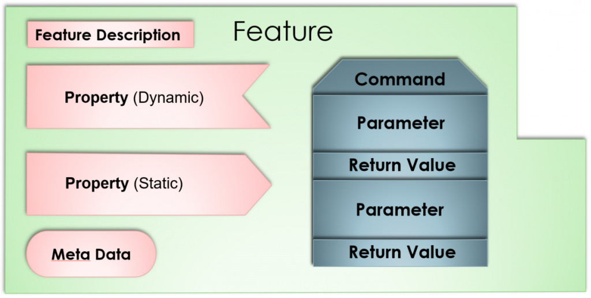

Commands and Properties
~~~~~~~~~~~~~~~~~~~~~~~

Properties and commands can be both **unobservable** and **observable**.

- **Unobservable properties** are static data of a server that do not
  change during the runtime of a server (e.g. the number of possible
  switching positions of a valve).

- **Observable properties** are dynamic data of a server that can change
  during the runtime of a server and about which clients should be
  informed (e.g. the current flow rate of a syringe pump). Clients can
  subscribe to observable properties so that they are notified of any
  changes to the property.

- **Unobservable commands** are actions that can be performed on a device
  and that take very little time (e.g., to change settings such as the
  syringe parameters of a pump).

- **Observable commands** are actions that can potentially take a long
  time to execute on the device (e.g., fluid dispensing). Here, a client
  can subscribe to the so-called *Execution Info* to be notified about the
  progress of the command execution.

.. tip::
   A comprehensive introduction to the SiLA        
   standard is available on the SiLA homepage:              
   https://sila-standard.com/standards/ or in this 
   `blog post <https://matthieu-croissant.medium.com/sila-2-hands-on-bringing-automation-to-the-laboratory-dacc12df7152>`_.

SiLA UI Overview
----------------

By clicking the :guilabel:`SiLA 2` button and selecting *Server Overview* :guinum:`❶` in the
sidebar, you switch to the SiLA 2 add-on (see figure below).

.. image:: Pictures/100000010000049200000191916BBBF1204CA308.png

.. rst-class:: guinums
 
1. :guilabel:`SiLA 2` button for display of *Server Overview* and connected SiLA 2
   servers.
2. Button to perform a network scan to find available SiLA 2 servers
3. Button to connect to all servers in the list
4. Display of all SiLA 2 servers found in the network or added manually
5. Selection box for allowing unencrypted connections.
6. Button for adding a SiLA 2 server manually
7. Button to connect or disconnect from a SiLA 2 server
8. Button to delete the server from the list

You can use the sidebar button :guinum:`❶` or the view tabs to switch between the
currently connected SiLA 2 servers and the *Server Overview*. A tab is
created for each server.

Connecting to a SiLA 2 server
-----------------------------

Connecting to automatically detected servers
~~~~~~~~~~~~~~~~~~~~~~~~~~~~~~~~~~~~~~~~~~~~

.. image:: Pictures/link.svg
   :width: 40
   :align: left

To connect to a SiLA 2 server that was found in the local network via
SiLA Server Discovery, simply click on the *Connect* icon :guinum:`❶` in the
corresponding row in the *Server Overview*. 

.. image:: Pictures/broken_link.svg
   :width: 40
   :align: left

After the connection has
been successfully established, the *Disconnect* icon :guinum:`❷` appears instead
of the *Connect* icon. By clicking on this icon you can disconnect from
this device again.

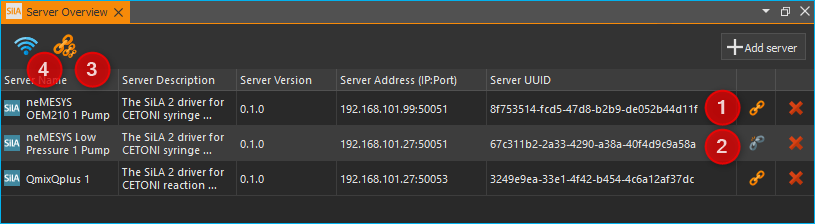

.. tip::
   .. image:: Pictures/link_multi.svg
      :width: 40
      :align: left

   The *Connect-To-All* :guinum:`❸` button allows you to    
   connect to all devices at once, rather than having to   
   connect to each device individually.

.. tip::
   .. image:: Pictures/wifi.svg
      :width: 40
      :align: left

   If the software did not find one or more of    
   your SiLA devices, it may help to restart the servers   
   and run a new network scan :guinum:`❹`. 

.. tip::
   If you close the software while still          
   connected to one or more SiLA servers, it will attempt  
   to restore those connections the next time you start    
   the software. 

.. admonition:: Important
   :class: note

   If you delete a server with an active    
   connection to the software from the *Server Overview*   
   list, then the connection is automatically              
   disconnected.

Normally, communication between SiLA server and client is encrypted.
However, if one of your devices does not provide encryption, the
connection attempt will fail with an error message in the event log. For
local testing, you can still connect to this device if you check 
:guilabel:`Allow insecure (unencrypted) connection` (see figure below).

.. image:: Pictures/allow_unsecure.png

.. admonition:: Attention
   :class: caution

   You should never establish an            
   unencrypted connection to a device that is outside your 
   local network, otherwise all communication between the  
   device and the software can be read by third parties. 

Manually add and connect to a server
~~~~~~~~~~~~~~~~~~~~~~~~~~~~~~~~~~~~

.. image:: Pictures/add_server.png

If a server in your local network is not found automatically, or if you
want to connect to a server outside your local network, you must add
this server manually. To do this, click the :guilabel:`Add server` :guinum:`❻` button (see
figure above). The following dialog box appears.

|image25|

Enter either the host name or the IP address of your device
and the port on which the SiLA server is running. Then click :guilabel:`OK`.

The software will now try to connect to this server. If this is
successful, the server will appear in the *Server Overview* list. If the
connection cannot be established, you will find an error message in the
*Event Log* with information about why the connection failed.

Accept untrusted certificates
~~~~~~~~~~~~~~~~~~~~~~~~~~~~~

SSL certificates are used to encrypt the communication between server
and client, which are also used to encrypt the communication on the
Internet. Usually, these certificates are signed by a trusted
certificate authority. If you try to connect to a server that uses a
self-signed certificate, the following dialog box appears:

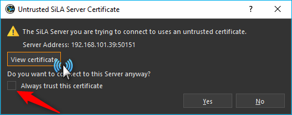

If you trust the certificate, click :guilabel:`Yes` in the dialog box to continue
the connection, otherwise click :guilabel:`No`. In this case, the connection will
be aborted.

By clicking :guilabel:`View Certificate` you get more
information about the certificate. There you can see, most importantly,
which institution created and signed the certificate.

.. image:: Pictures/untrusted_certificate2.png

Control of a SiLA 2 server
--------------------------

Overview of generic UI
~~~~~~~~~~~~~~~~~~~~~~~

After you have successfully connected to a SiLA server, you can control
it via a generic interface. This interface looks the same for any type
of SiLA server, that is, for any device regardless of the type or
manufacturer of the device. 

.. tip::
   While this interface allows you to control
   every aspect of a SiLA server, it cannot be used to create complex
   workflows. For this purpose, the script functions provided by the
   plugin, which are presented in Section `SiLA 2 Script Functions`_, are more
   suitable.

Open the generic interface by selecting the desired server with the 
:guilabel:`SiLA 2` button in the sidebar 
(see section `SiLA 2 Basics`_). 
You will first see all SiLA 2 features provided by the server :guinum:`❶`. If you move the
mouse pointer over one of the :guilabel:`i` icons, a tooltip with the
description of the feature :guinum:`❷` will appear. 

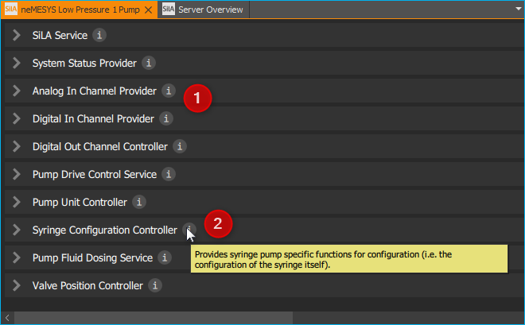

By clicking on the feature
name or the arrow to the left of the name, you can expand the feature (see figure below).
Now you can see all available commands and properties of this feature.
Commands can be found on the left side  :guinum:`❶`, properties on the right side
:guinum:`❷`. With the splitter  :guinum:`❸` you can resize the width that is
available to the commands or properties.

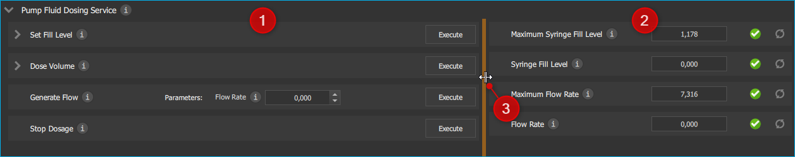

SiLA Commands UI
~~~~~~~~~~~~~~~~~~

If a command has parameters metadata or return values,
such as the :guilabel:`Set Fill Level` command :guinum:`❶` in the figure below, it can also be
expanded to enter the parameters :guinum:`❷` or metadata and display the return
values. The following picture shows all commands of the :guilabel:`Pump Fluid Dosing Service`
feature:

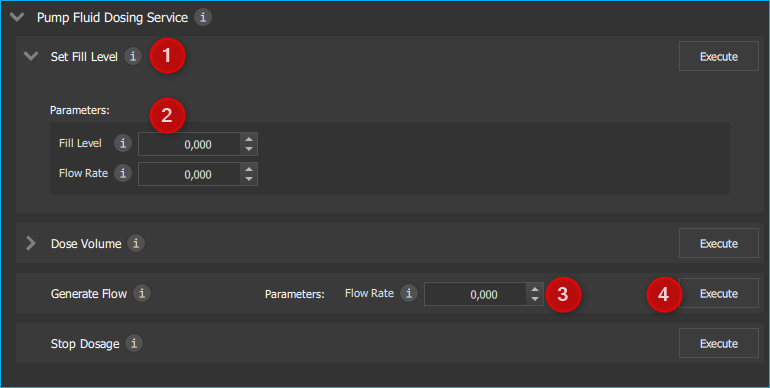

If a command has no parameters or only one, such as the :guilabel:`Generate Flow`
command in the figure above, then the command  cannot be expanded and at most one
input field is displayed directly next to the command name :guinum:`❸`. 
To execute the command, click the :guilabel:`Execute` button :guinum:`❹`.

SiLA Properties UI
~~~~~~~~~~~~~~~~~~

Normally, properties cannot be expanded. The picture below shows the SiLA properties
of the :guilabel:`Analog In Channel Provider` feature. Here, only a field with the
current value of the property is displayed :guinum:`❶`. To the right is a button for
re-polling the property :guinum:`❷`. 

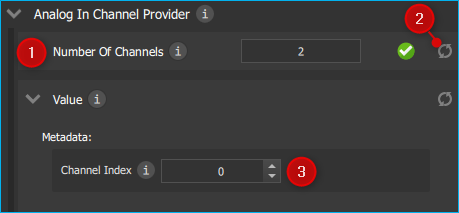

Clicking the re-polling button button :guinum:`❷` triggers one of the following two actions:

-  If the property is *Unobservable* (see Section `Commands and Properties`_),
   then it is simply queried again by the server.
-  If the property is *Observable*, the subscription running in the
   background is canceled and a new subscription is started. This may be
   necessary, for example, if the subscription was automatically
   canceled due to an error.

It is possible that a property requires metadata. In this case, the
property can be expanded like a command and the input fields for the
metadata :guinum:`❸` appear. After you have entered the metadata, you must query
the property again or start a new subscription so that this data is sent
to the server.

.. admonition:: Important
   :class: note

   When the generic interface is opened for 
   the first time, all unobservable properties are queried 
   once and subscriptions are automatically started in the 
   background for observable properties. However, this     
   only works if the property does not require metadata.   
   In this case you have to enter the metadata first and   
   then query the value yourself or start a subscription   
   yourself. 

Terminating a connection to a server
~~~~~~~~~~~~~~~~~~~~~~~~~~~~~~~~~~~~~~~

If you terminate the connection to a server or the connection is
automatically terminated, e.g. due to a network error, the interface
remains open, but all input fields and buttons are locked. If you then
want to close the tab for the affected server, the following dialog box
appears:

|image30|

Clicking on :guilabel:`Yes` will close the interface (*View*) for
this server and recreate it when the same server is reconnected later.
By clicking on :guilabel:`No`, the view is retained and is only hidden. This
allows you to reopen the view later, for example to see certain
parameters or command responses. Furthermore, this view is automatically
reused when the connection to the server is re-established.

SiLA 2 Script Functions
-----------------------

Introduction to SiLA Script Functions
~~~~~~~~~~~~~~~~~~~~~~~~~~~~~~~~~~~~~~~~~~~~

The SiLA 2 plugin contains various script functions for script-driven
execution of commands and querying of properties.

.. image:: Pictures/sila_script_functions.png

Execute SiLA Command
~~~~~~~~~~~~~~~~~~~~~~~~~~~~~~~

.. image:: Pictures/100002E8000035050000350510C5FE834025052E.svg
   :width: 60
   :height: 60
   :align: left

With this function you can execute a SiLA command and store
the result of the execution in a variable.

|image33|

|image34|

You can set the command to be executed :guinum:`❶`, as well
as the required parameters and metadata :guinum:`❷` in the configuration area.

In addition, you can enable or disable the :guilabel:`Run to completion` :guinum:`❸` option
for *Observable Commands*. If :guilabel:`Run to completion` is enabled, script
execution will not continue until the command has been fully executed.
If this option is not active, the command is only started and then the
next script function is processed immediately.

If the command has return values, you can also specify variables :guinum:`❹` in
which these values are to be stored.

.. tip::
   All SiLA script functions support the use of   
   variables. This means that you can enter variables in   
   all input fields marked with a colored **V** in the         
   configuration area.

Read SiLA Property
~~~~~~~~~~~~~~~~~~

.. image:: Pictures/100043500000350500003505BEBA0AAB65FAB614.svg
   :width: 60
   :height: 60
   :align: left

With this function you can query a property and store the
value into a variable.

|image39| 

You can set the property :guinum:`❶` to be queried and the possible
required metadata :guinum:`❷` in the configuration area.

Enter the name of the variable that is supposed to store the value of
the read property in the field below :guinum:`❸`. If the property returns a
structure of several values, corresponding fields will appear for each
element of the structure, in which you can enter the individual script
variables.

Wait For SiLA Property Value
~~~~~~~~~~~~~~~~~~~~~~~~~~~~

.. image:: Pictures/100041250000350500003505032351FB39BC478A.svg
   :width: 60
   :height: 60
   :align: left

This function allows you to make the script execution wait
for a specific property to meet a defined condition. The function will
not continue until the condition is met.

|image41|

In the configuration area, first select the property :guinum:`❶` you
want to check and the optionally required metadata, as described for the
`Read SiLA Property`_ function.

.. admonition:: Important
   :class: note

   The SiLA property must be Observable to  
   be used in this script function.   

In the *Condition* area, you configure the check condition. To do this,
first select a comparison operator :guinum:`❷` and then enter the value :guinum:`❸` to be
compared with. In the value field :guinum:`❸` you can also use variables to set
the check condition.

.. tip::
   To quickly find a specific feature, command or 
   property, you can enter the name or part of the name in 
   the filter input field. The selection boxes for the     
   feature, command or property will then only contain     
   entries that match the filter entered. 

Replace SiLA server
~~~~~~~~~~~~~~~~~~~

A SiLA server is always uniquely identified by its UUID (Universally
Unique Identifier). When you create a script function for a specific
server, this UUID is stored in the background. As a result, scripts are
always bound to the SiLA server for which they were written. Now it can
be possible that you want to use e.g. a script that you have written for
a Nemesys low pressure pump with another low pressure pump or that a
certain SiLA server had to be exchanged and therefore its UUID has
changed. In these cases, you can replace the configured SiLA servers in
your scripts with the new servers.

To do this, load the script in where you want to replace the servers
into the script editor. Then select a SiLA 2 function where you want to
change the server. The configuration interface of the function should be
grayed out because the corresponding SiLA server is not connected. In
addition, you will also see a warning message :guinum:`❶`.

|image48|

Now click on the icon for changing the SiLA server :guinum:`❷`. The
following dialog box opens:

.. image:: Pictures/10000001000001C600000172BBE267CD9A17CF31.png

Here you can now select one of the connected SiLA servers to be used
instead of the configured server.

.. admonition:: Important
   :class: note

   The new server must provide exactly the  
   same features as the previous server. The selection     
   dialog will inform you if this is not the case.

If you have selected a compatible server, click on 
:guilabel:`Assign selected Server`. Now the previous server will be replaced 
by the selected server in **all** script functions. Afterwards, the 
configuration areais no longer grayed out and you can edit the function again. 
When you save the script, the server you just selected will be saved and used the
next time you load the script.

Read SiLA properties via process data identifiers
-------------------------------------------------

Certain SiLA properties are automatically provided as process data. This
makes it possible, for example, to initialize script variables directly
via the respective process date or to use this data in the graphical
process data logger.

For this purpose, the SiLA Properties must fulfill the following
requirements:

-  the property must be observable.
-  the property must not require metadata.
-  the data type of the property must be a numeric (integer or real) or
   Boolean data type.

Use in other script functions
~~~~~~~~~~~~~~~~~~~~~~~~~~~~~

SiLA process data can be accessed in exactly the same way as other
process data from other devices:

|image52|

The selected process data identifier is now entered in the
input field. These also have a specific form based on the usual process
data identifier:

:code:`$$ServerName_ServerUUID.FeatureIdentifier_PropertyIdentifier`

Each identifier starts with two dollar signs and a dot separates the
unique device name from the unique process data name. The device name is
derived from the name of the SiLA server as well as its unique ID (UUID,
Universally Unique Identifier) and the name for the process data is
derived from the name of the feature and the respective property. The
entire process data identifier must not contain any spaces or other
special characters.

Use in graphical process data logger
~~~~~~~~~~~~~~~~~~~~~~~~~~~~~~~~~~~~

SiLA process data can be used in the graphical process data logger as
known from other devices:

|image53|

First, open the Plotlogger configuration :guinum:`❶`. There, drag and
drop the desired SiLA device into the list of plot curves :guinum:`❷`. Then
double-click on the device property cell to select the SiLA property to
be recorded :guinum:`❸`.

.. |image25| image:: Pictures/100000000000016F0000009E1716FA5C8D3B4E18.png

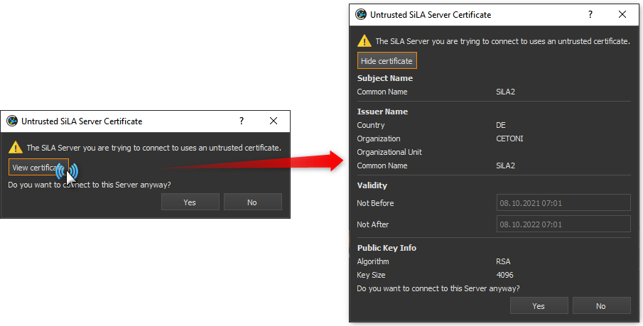

.. |image30| image:: Pictures/1000000100000214000000B01BBEEFCD43CEAC03.png

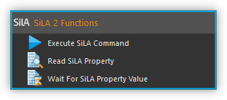

.. |image33| image:: Pictures/1000000100000345000001D7A7109FF96388C318.png

.. |image34| image:: Pictures/100000010000032D000000CB19F74944FFDAB71C.png

.. |image39| image:: Pictures/1000000100000345000001FD6EA9B6588936741F.png

.. |image41| image:: Pictures/100000010000034500000209E2A9E0C1D0F440CC.png

.. |image48| image:: Pictures/10000001000003B5000001C901728FB6CD47BE5B.png

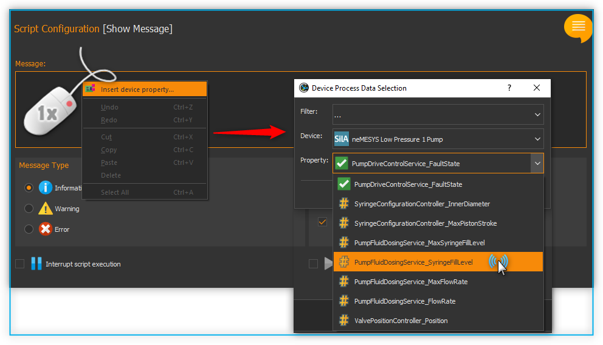

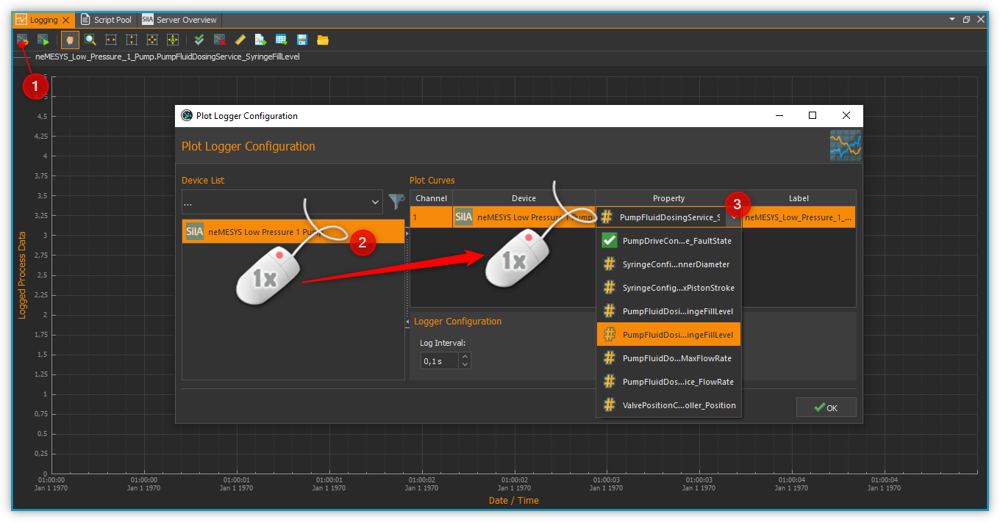

