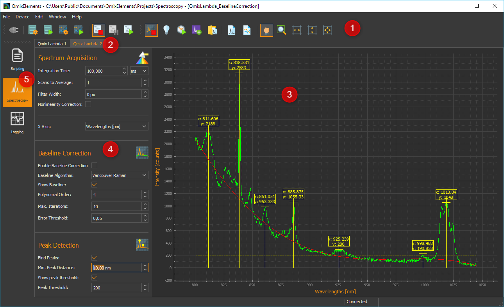
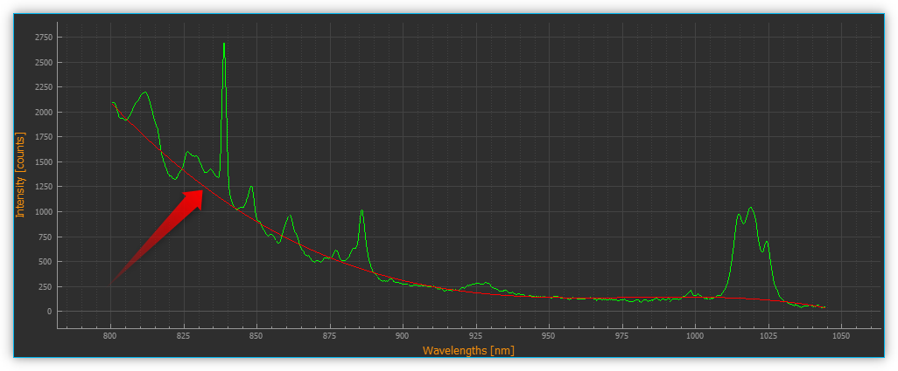
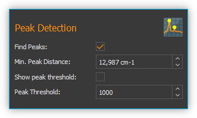
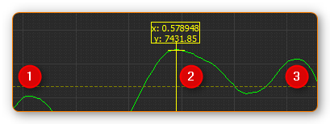
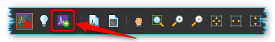
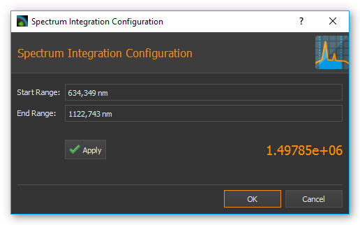
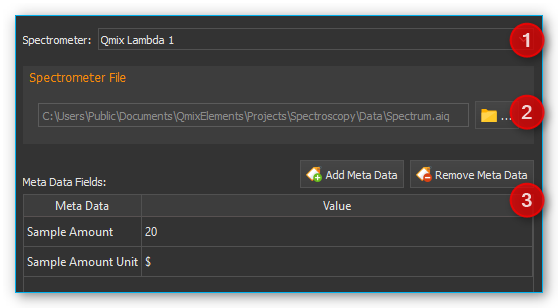
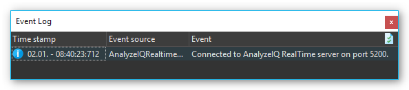
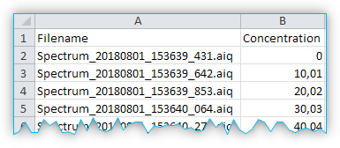

Spectroscopy Add-on
===================

Installation
------------

The spectroscopy plugin is not part of the standard installation package
and must be installed as add-on. The versions of the spectroscopy plugin
and the installed CETONI Elements software should match. For example, if
you want to install the spectroscopy add-on version 20180520, you should
have CETONI Elements version 20180520 installed.

.. admonition:: Important
   :class: note

   The version number of CETONI Elements and 
   the spectroscopy plugin should match. 

Please close all other programs before launching the installation.

.. admonition:: Important
   :class: note

   Install the spectroscopy plugin and the   
   device driver before connecting your spectrometer to     
   your PC through USB for the first time.   

Launch :file:`CETONI_Elements_Spectroscopy_Setup_64bit.exe` to begin
the installation. The installation assistant will guide you through the
installation of the software and hardware drivers.

.. admonition:: Important
   :class: note

   If you want to install the hardware       
   drivers on a windows system, you need to be logged in as 
   an administrator. 

.. admonition:: Important
   :class: note

   During the installation you can also     
   install the optional Analyze IQ add-on, for chemometric 
   (quantitative and qualitative) analysis of recorded     
   spectrums. For this add-on you will need a paid runtime 
   license.  

Introduction
------------

Clicking the :guilabel:`Spectroscopy` button :guinum:`❺` in the sidebar will take you to
the Spectroscopy Plugin (see image below).

.. rst-class:: guinums

1. Toolbar
2. Tabs for the selection of a spectrometer display. Using the tabs you
   can switch between the displays and control elements of individual
   spectrometers. One tab is created for each spectrometer.
3. Spectrum live display
4. Parameter control elements
5. :guilabel:`Spectroscopy button`

Toolbar
-------

+-----------------+---------------------------------------------------+
| |image39|       | Show/hide the sidebar with the spectrometer       |
|                 | settings                                          |
+-----------------+---------------------------------------------------+
| |image40|       | Start / Stop spectral data live display           |
+-----------------+---------------------------------------------------+
| |image41|       | Record / Delete a background spectrum             |
+-----------------+---------------------------------------------------+
| |image42|       | Start / Stop determination of integration time    |
+-----------------+---------------------------------------------------+
| |image43|       | Create a spectrum analysis channel                |
+-----------------+---------------------------------------------------+
| |image44|       | Load spectrometer settings from an \*.aiq file    |
+-----------------+---------------------------------------------------+
| |image45|       | Save spectral data in text format (*.txt) or as   |
|                 | Analyze IQ file (*.aiq)                           |
+-----------------+---------------------------------------------------+
| |image46|       | Save spectral data in PNG image file or PDF       |
|                 | document                                          |
+-----------------+---------------------------------------------------+
| |image47|       | Panorama tool to move the spectrum live display   |
+-----------------+---------------------------------------------------+
| |image48|       | Zoom area selection tool (enlargement)            |
+-----------------+---------------------------------------------------+
| |image49|       | Scale x-axis to fit the visible screen area       |
+-----------------+---------------------------------------------------+
| |image50|       | Scale y-axis to fit the visible screen area       |
+-----------------+---------------------------------------------------+
| |image51|       | Scales both axes to fit the visible screen area   |
+-----------------+---------------------------------------------------+

Spectrum Live Display
---------------------

The spectrum live display shows the
current, last recorded spectrum following all processing steps. 

.. image:: Pictures/100002010000029B00000177ABD966992CA135D7.png

The peak markers :guinum:`❶` show the x and y coordinates of a determined spectrum peak.
The line for the minimum peak intensity is shown in yellow :guinum:`❷`. Peaks
below this line are not detected and marked. If you have activated the
display of the calculated baseline in :guilabel:`Baseline Correction`, it is
displayed as a red curve :guinum:`❸`. The x-axis :guinum:`❺` shows the set unit (Wavelengths
in this example). The y-axis :guinum:`❹` shows the measured intensity in counts.

You can use the mouse wheel to zoom in and out of the spectrum display.

If the :guilabel:`Panorama tool` for moving the display area is activated, you can
display the values of the spectrum at a certain position by moving the
mouse pointer to the corresponding position over the curve :guinum:`❻`. A window
with the values will appear. If you move the mouse pointer over the
curve, the window follows the mouse pointer and the values inside are
continuously updated.

Parameter Control Elements
--------------------------

Overview
~~~~~~~~

The controls are used to set the parameters for acquisition and
pre-processing of spectra. They are arranged in the order in which
processing is carried out from top to bottom.

.. image:: Pictures/1000020100000149000002B3DCBA8B215B75CC36.png

.. rst-class:: guinums

#. **Spectrum Acquisition** - contains all settings of the spectrometer for the
   acquisition of a spectrum
#. **Baseline Correction** - here you can set the parameters for real-time baseline
   correction
#. **Peak Detection** - you configure the parameters for automatic peak
   detection here

The Spectrum Live Display lets you see and evaluate the effects of parameter 
changes right away.

Spectra Acquisition
-------------------

Overview of controls for spectra acquisition
~~~~~~~~~~~~~~~~~~~~~~~~~~~~~~~~~~~~~~~~~~~~

In the *Spectrum Acquisition* area you will find all controls for
setting the acquisition parameters.

.. image:: Pictures/100002010000014A00000119C9464256E497BB42.png

Setting the Integration Time
~~~~~~~~~~~~~~~~~~~~~~~~~~~~~~~~~

The integration time correlates with the exposure time of the
spectrometer's CCD. It is the time period in which the detector can
collect photons.

.. image:: Pictures/1000000000000156000000474167447199E62218.png

Enter the integration time into the input field :guinum:`❶`. Set the desired 
time unit in the selection field
:guinum:`❷`. As the integration time increases, the spectrums intensity values go
up as well, since the detector has more time to collect photons.

.. tip::
   The recording duration of a spectrum increases 
   along with the integration time.

If the recording duration is longer than 500 milliseconds, a progress
bar is displayed below the control elements, showing you the progress of
the current recording. If the product of integration time and scans to
average is 10 seconds or greater, a warning message is displayed showing
the future length of the integration time. You can then either confirm
the current parameter settings or retain the original values.

.. image:: Pictures/1000020100000214000000B9A90C45B25306261E.png

.. admonition:: Important
   :class: note

   Any parameter changes are executed after 
   ending the current spectrum recording operation. During 
   long integration periods this may cause the impression  
   that the software is no longer responsive. 

Automatically determining Integration Time
~~~~~~~~~~~~~~~~~~~~~~~~~~~~~~~~~~~~~~~~~~

.. image:: Pictures/100013ED000034EB000034EBCC5E333393A120A7.svg
   :width: 60
   :align: left

If you click the button for automatic integration time
determination in the toolbar, the software will attempt to control the
integration time automatically in such way that the maximum intensity of
the spectrum reaches 80% of the maximum sensor value (saturation).

You can stop the automatic integration time determination at any time by
clicking the button again.

Pre-processing the Spectrum 
~~~~~~~~~~~~~~~~~~~~~~~~~~~

Pre-processing live spectrums can contribute to an improved
signal-to-noise ratio (SNR). This reduces interference, while improving
spectrum quality. Spectral smoothing makes it possible to determine
distinctive peaks. The removal of non-linearities and spectral baseline
correction also helps improve quality.

.. image:: Pictures/1000000000000155000000858ACEEBB181F0436F.png

Scans To Average
^^^^^^^^^^^^^^^^^^^^^^^^

This is a time-based averaging feature. Time-based averaging increases
the amount of spectral information captured by calculating the average
outputs of individual pixels over multiple spectral scans. This process
takes more time than viewing the results of one scan but produces a
higher signal to noise ratio (SNR) and stabilizes fluctuating data. The
SNR will increase by the square root of the number of time-based
averages. For example, if 100 averages are used, the SNR will increase
by a factor of 10, but the measurement will take 100 times as long to
acquire than a single scan.

Filter Width
^^^^^^^^^^^^^^

This is a spatial averaging feature, visually smoothing the spectrum.
Spatially based averaging will visually smooth the results of a single
scan by averaging the values of adjacent pixels together. This process
improves the SNR at the expense of optical resolution. Spatial averaging
is useful when the spectrum is relatively flat and little variation is
expected between adjacent pixels, as the resultant loss of resolution
can make it difficult to distinguish sharp spectral features. When using
spatial averaging, the SNR will increase by the square root of the
number pixels averaged.

For each pixel an average value is determined using neighboring pixel.
The entered value defines the width of the filter in pixels on the left
and right side of the current pixel (for example: filter width = 3: the
average is derived from each data point and its 3 neighboring values to
the left and to the right).

Nonlinearity Correction
^^^^^^^^^^^^^^^^^^^^^^^^^

This feature corrects the non-linearity between the photon stream and
the CCD sensor's output signal.

Selecting the X-Axis Unit 
~~~~~~~~~~~~~~~~~~~~~~~~~

.. image:: Pictures/10000000000000A8000000859C4F5349C1A99934.png

You can choose from various units for the x-axis:

+---------------------+-----------------------------------------------+
| Unit                | MEANING                                       |
+=====================+===============================================+
| Wavelengths [nm]    | Wavelength of x-axis in nanometers            |
+---------------------+-----------------------------------------------+
| Pixels [px]         | Each pixel value corresponds with a CCD       |
|                     | sensor element                                |
|                     |                                               |
|                     |  Starting at 0, ending at n-1 (n = maximum    |
|                     | number of sensor elements)                    |
+---------------------+-----------------------------------------------+
| Wavelengths [µm]    | Wavelength of x-axis in micrometers           |
+---------------------+-----------------------------------------------+
| Frequency [GHz]     | X-axis frequency in Gigahertz (GHz)           |
+---------------------+-----------------------------------------------+
| Wave numbers [1/cm] | X-axis in inverse centimeters (1/cm)          |
+---------------------+-----------------------------------------------+
| Raman shift [Raman] | X-axis in 1/cm – depending on the excitation  |
|                     | wavelength of the laser                       |
+---------------------+-----------------------------------------------+

Baseline Correction
-------------------

Overview of baseline correction controls
~~~~~~~~~~~~~~~~~~~~~~~~~~~~~~~~~~~~~~~~

In the *Baseline Correction* section you will find all settings for
real-time baseline correction:

.. image:: Pictures/100002010000014B000000F9E97A1A85837E0B1C.png

Baseline
variation is a problem that occurs with many types of spectral data.
Typically, it is a linear or nonlinear addition to the spectra that
results in expected zero measurements reaching a positive value. This
can be caused, for example, by the fluorescence during the recording of
Raman spectra. A baseline can be described as the slowly varying curve
that runs through the lower part of the spectra without the jumps of the
peaks.

During baseline correction, a baseline is calculated by the selected
algorithm. This is then subtracted from the recorded spectrum to correct
its baseline variation.

Use the :guilabel:`Enable Baseline Correction` :guinum:`❶` check box to activate or
deactivate baseline correction. In the :guilabel:`Baseline Algorithm` :guinum:`❷` selection
list, select the algorithm for calculating the baseline. Using the
:guilabel:`Show Baseline` :guinum:`❸` check box, you can select whether the calculated
baseline is displayed in the *Live Spectrum Display* or not. Even if
baseline correction is switched off, you can display the calculated
baseline to visually check its quality (see figure below).

In the area below :guinum:`❹` you
will find the settings for the selected baseline algorithm :guinum:`❷`.

Baseline Algorithms
~~~~~~~~~~~~~~~~~~~

Vancouver Raman AlgorithM
^^^^^^^^^^^^^^^^^^^^^^^^^

The Vancouver Raman algorithm has been developed for automated
background removal of autofluorescence in the field of biomedical Raman
spectroscopy (see Zhao, J., Lui, H., McLean, D. I., & Zeng, H. (2007).
Automated Autofluorescence Background Subtraction Algorithm for
Biomedical Raman Spectroscopy. Applied Spectroscopy, 61(11), 1225-1232).
It is based on a modified multi-polynomial fitting, with the addition of
a peak-removal procedure during the first iteration, and a statistical
method to account for signal noise effects.

.. image:: Pictures/10000201000001460000007B1C98A8A89B024276.png

You can set the
following parameters for this algorithm:

.. rst-class:: guinums

#. **Polynomial Order** – Sets the order of the polynomial for the
   polynomial fit. Based on empirical experience, fourth to sixth-order
   polynomials provide the best fluorescence approximations.
#. **Max. Iterations** – Limits the maximum number of iterations for
   baseline calculation. This means that even if the error is still
   above the threshold value, the calculation is terminated after the
   maximum number of iterations.
#. **Error Threshold** – Defines the threshold value for the maximum
   error as a stop criterion. If the value falls below the threshold
   value, the calculation is terminated. For 0.95% confidence use 0.05.

Rolling Ball Algorithm
^^^^^^^^^^^^^^^^^^^^^^

Kneen and Annegarn (see M. Kneen and H. Annegarn, Nucl. Instrum. Methods
Phys. Res. 82, 59 (1996)) have described a baseline removal algorithm
where one imagines a large ball rolling on the underside of the
spectrum. The baseline is simply the trace of the topmost point of the
ball. The original algorithm was made for X-ray spectra. In three loops
the algorithm finds minimum points in local windows, finds maximum
points among the minimum points, and smooths by averaging over the
maximum points.

.. image:: Pictures/100002010000014800000062E976D673182661CF.png

You can set the following parameters for this algorithm:

.. rst-class:: guinums

#. **Min. / Max. Window** – Size of the local windows to calculate
   the minimum and maximum points to identify the baseline.
#. **Smoothing Window**– Width of local windows for smoothing

Peak-Detection
--------------

Overview of peak detection settings
~~~~~~~~~~~~~~~~~~~~~~~~~~~~~~~~~~~

The peaks of a spectrum can be viewed as its “unique fingerprint”. A
substance or mixture of substances can be identified by the horizontal
position of its peaks. In addition, the intensity of main and side peaks
can be used as an indication of the various concentrations of substances
within a mixture. The following functions allow you to mark and select
peaks.

-  **Find Peaks** – Toggles peak
   detection on or off
-  **Min. Peak Distance** – Minimum distance (in x-direction) between
   two peak markers
-  **Show peak threshold -**\ Shows the peak detection threshold as a
   yellow broken line in the spectrum display
-  **Peak Threshold –** Peak detection threshold – peaks are only marked
   if they are above the set threshold

.. tip::
   Since the entered minimal peak distance is not 
   transferred to the plot at 100% accuracy, feel free to  
   tweak the value to achieve an optimum result. 

.. tip::
   An excessive number of peak markings can       
   affect your PC’s computing power. Therefore, only a     
   limited number of peaks is displayed.           

Application example: a peak is not
marked if it is located below the minimum peak intensity line :guinum:`❶`. If
the peak is located above the line :guinum:`❷`, the marking is displayed. The last
peak remains unmarked :guinum:`❸` since the distance to its predecessor is
smaller than the minimum peak distance.

.. tip::
   If an excessive number of peak markings       
   affects your PC's computing power, reduce the number of 
   peak markings. Increase the minimum distance and        
   minimum peak intensity or smoothen the spectrum.

Removing Dark Spectrum / Background Spectrum
--------------------------------------------

Dark spectrum is the expected signal level in the absence of light.
Background spectrum is the expected signal level in the absence of a
sample. By deducting the dark / background spectrum from the currently
recorded spectrum, stray light influences and sensor noise of the
resulting spectrum are reduced.

Start by setting the parameters in the same way you would in your
measurements. Deactivate your light or laser source and record the
background spectrum by clicking on the bulb icon.

.. image:: Pictures/10000000000001A500000045E617BDA0A41B53BB.png

Now, the same background
spectrum is deducted from each newly recorded spectrum automatically.

.. image:: Pictures/10000000000001B1000000485C4904E43654367A.png

If you are not satisfied with
the result, click on the bulb icon with the red cross. This removes the
background spectrum and lets you repeat the recording of the background
spectrum.

Saving Spectrum Data and Spectrometer Settings
----------------------------------------------

.. image:: Pictures/100014960000350500003505735D254F89BBCCEB.svg
   :width: 60
   :align: left

Save your spectrum data as a text file by clicking the
respective symbol in the toolbar. You can save the recorded spectrum as
a text file :file:`*.txt` or as an Analyze IQ file :file:`*.aiq`. The advantage of
text files is that they can be opened easily in spreadsheet applications
like Excel. The advantage of Analyze IQ files is that they also contain
meta data on the recorded spectral data, such as the creation date,
units for x and y-axis, the user name and all current spectroscope
settings. If you want to use the Analyze IQ add-on for qualitative and
quantitative analysis at a later point in time, you should save your
spectrums as an Analyze IQ file.

.. tip::
   If you want to use the *Analyze IQ add-on*  
   later for qualitative and quantitative analysis, you    
   should save your spectra as Analyze IQ file :file:`*.aiq`. 

A dialog window will open in which you can select the file name and file
format.

The directory of the
current project is used as a target directory. However, you can also
select a different directory in the dialog window.

If you have selected the  :file:`*.aiq` format as file format, a dialog for
adding metadata is now displayed.

.. image:: Pictures/100002010000023A000001672761D4486A02C31D.png

Here you can add additional information
such as sample name or sample quantity to the \*.aiq file by clicking
:guilabel:`Add Meta Data`. After clicking :guilabel:`Add Meta Data`, the input 
window for selecting the metadata name and entering the value appears.

.. image:: Pictures/100002010000021D00000106AECCF1F0C5BD4297.png

Use the :guilabel:`Meta Data` :guinum:`❶` check box
to either select a predefined metadata field or to define a new custom
metadata field. You can define a new field by entering a name that is
not in the list, for example, *Concentration*. The predefined metadata
fields are defined in the file format for :file:`*.aiq` files and are partially
displayed in the external Analyze IQ software.

Once you have selected the metadata field, enter the value for the
metadata in the :guilabel:`Value` :guinum:`❷` field and click :guilabel:`OK` 
to complete the input.

If you want to delete a metadata field from the list, select it and
click the :guilabel:`Remove Meta Data` button. As soon as you click :guilabel:`OK`, 
the last recorded spectrum together with the current spectrometer settings and
the metadata is saved in a file with the extension aiq.

.. tip::
   If you save files in AIQ format, you can       
   convert them to CSV format at any time later using the  
   `Converting Analyze IQ files to CSV`_ feature. 

Loading Spectrometer Settings
-----------------------------

All spectrometer settings can be loaded from previously saved
.aiq files. Click on the icon for loading spectrometer settings :file:`*.aiq`
and select an :file:`*.aiq` file.

|

Saving a Spectrum Image
-----------------------

.. image:: Pictures/100014E3000034EB000034EBE5DD307BDB0E90BB.svg
   :width: 60
   :align: left

By clicking the respective button in the toolbar you can save
the current image of the spectrum live display as a PNG file or a vector
graphic in the form of a PDF-document.

In the file dialog coming up you can select whether you want to save a
PNG-image or a PDF-document :guinum:`❶`. The image directory of the current
project is used as a target directory. However, you can also select a
different directory in the dialog.

.. image:: Pictures/100000000000028100000169C85A15939B5E8B4B.png

Click on the save button :guinum:`❷` to save the image.

Converting Analyze IQ files to CSV
----------------------------------

If you have saved your spectral data in Analyze IQ format :file:`*.aiq`, you can
convert them to CVS format at any time later. In the main menu you will
find the menu item :menuselection:`Edit --> Convert AIQ to CSV file`.
Click on this menu item, select the Analyze IQ file and the software saves the 
file as a CSV file with the same file name and the file extension :file:`*.txt`.

.. image:: Pictures/100002010000016D0000010D5B651B135FBFA208.png

Loading and displaying spectral data with the Spectra Viewer
------------------------------------------------------------

The *Spectra Viewer* provides you with a tool for opening and viewing
stored spectral data in Analyze IQ format :file:`*.aiq` or in CSV format
:file:`*.txt`. To open the Spectra Viewer, select 
:menuselection:`Window → Show View → Spectroscopy → Spectra Viewer` from the main menu.
Alternatively, you can open the Spectra Viewer via the :guilabel:`Spectroscopy` 
button in the sidebar.

..  image:: Pictures/10000201000002AF0000014F5CF64A834AD822ED.png
   :width: 16.201cm
   :height: 7.899cm

In the
toolbar :guinum:`❶` at the top you will find the individual functions of the
Spectra Viewer. The functions are essentially the same as in the
`Spectrum Live Display`_. By right-clicking with
the mouse into the Viewer, you can open the context menu with all
functions.

Click the :guilabel:`Load Spectra Data` button to open spectrum files.
In the file selection dialog that appears, you can select one or
multiple files. The selected files will then be displayed in the Spectra
Viewer.

Just like in the Spectrum Live Display, you can also move the mouse over
a curve to display the value of the curve at the corresponding position
:guinum:`❷`.

If you want to load additional spectra, simply click the 
:guilabel:`Load Spectra Data` button again. The new spectra will then be 
added to the existing spectra in the viewer.

.. image:: Pictures/100019CB000035050000350509AD2B23340F765E.svg
   :width: 60
   :align: left

Click the :guilabel:`Clear Viewer`  button to delete all curves in the
Spectra Viewer.

|

.. image:: Pictures/10001855000034EB000034EBA6C6DA993124AA4C.svg
   :width: 60
   :align: left

The :guilabel:`Export Plot Image` button allows you to export the
current image in the Spectra Viewer as a PDF or image file.

|

Realtime Analysis using Analysis Channels
-----------------------------------------

Introduction to Realtime Analysis
~~~~~~~~~~~~~~~~~~~~~~~~~~~~~~~~~~~~

Analysis channels let you analyze recorded spectral data online and
integrate the results into QmixElements script programing. This gives
you a powerful tool to analyze spectral data online and use the results
to control other devices or trigger specific events.

For each analysis an “analog” input channel is created in the I/O
channel list (see image below). Like any other analog channel, these
input channels can be evaluated and integrated into the script system.

.. image:: Pictures/10000000000001F7000001142841551EFEB1EACB.png

To create an
analysis channel click on the :guilabel:`Create Spectrum Analysis Channel` button
in the toolbar.

A dialog will be displayed that lets you select the analysis
function:

.. image:: Pictures/10000000000001CE00000122F7C226839147E7EE.png

After you
configured the analysis function an analysis channel is inserted into
the I/O channel list. You can find details regarding the available
analysis functions in the following sections.

.. tip::
   You can create any number of analysis channels 
   for a spectrometer. This allows you to measure the      
   intensity at a certain wavelength, for example, or      
   determine the intensity of the overall signal by        
   integrating all values.   

Clicking the green LED in the ON-column (see image below) lets you
activate or deactivate the respective online analysis at any time. If
you want to change the configuration of an analysis channel or delete
the channel, perform a right mouse click on the channel to display the
context menu (see image below). Then select the desired action from the
context menu.

.. image:: Pictures/10000000000001DF000000D382294C592C92D8DB.png

Spectrum Integration
~~~~~~~~~~~~~~~~~~~~~~~

The integration function lets you measure the intensity of spectral data
within a certain bandwidth or the intensity of the signal at a certain
wavelength. Begin by setting the bandwidth in the configuration dialog
:guinum:`❶` in which the signal should be integrated. If you want to measure
the intensity at a specific wavelength, enter the same values for 
:guilabel:`Start Range` and :guilabel:`End Range`.

Click on the :guilabel:`Apply` button to accept the values. 
The software will correct the entered
values to the nearest values supported by the spectrometer. In the
current analysis display :guinum:`❸` you can see the effects caused by the
modified values immediately. If you click on :guilabel:`OK`, the set values are
applied and a new analysis channel is created or the currently selected
channel updated.

Chemometric Analysis
~~~~~~~~~~~~~~~~~~~~

Chemometric analysis allows the quantitative and qualitative
determination of concentrations of individual substances in a mixture of
substances. You will need a paid license for the Analyze IQ realtime
add-on to be able to use this function.

In this function's configuration dialog you simply have to select an
existing Analyze IQ model, which you want to use for spectral analysis
(see image below).

.. image:: Pictures/10000000000002B200000198351FAEE79E8F24F1.png

On the left side
you will find a list of all existing models :guinum:`❶`. On the right side you
will see additional details for the model you selected on the left. For
example, you are shown which substance :guinum:`❷` is being analyzed, whether
it's a quantitative or qualitative analysis :guinum:`❸` as well as a short
description of the selected model :guinum:`❹`.

Once you selected a model, an analysis channel is created. In case of a
quantitative analysis the channel shows you the substance concentration
in a range from 0 – 100% (see image below). If you run a qualitative
analysis the channel shows you the presence or absence of a substance in
a substance mixture using the value 0 (absent) or 1 (present).

.. image:: Pictures/100000000000019B000000BB706D21E0968AD54A.png

Spectroscopy Script Functions
-----------------------------

The spectroscopy plugin contains various script functions for
script-controlled spectrum recording.

.. image:: Pictures/10000000000001030000006529CA263118B37D56.png

Write Spectrum File
~~~~~~~~~~~~~~~~~~~~~

.. image:: Pictures/10001C570000350500003505E6F32F564847474D.svg
   :width: 60
   :align: left

This function lets you write the current spectrum to a text
file :file:`*.txt` or Analyze IQ file :file:`*.aiq`. First, select the 
spectrometer you want to use in the configuration
section :guinum:`❶`.

|

Then select
the file name and file type (:file:`*.txt` or :file:`*.aiq`) to save the files under.
Click on the file folder icon :guinum:`❷` and select the target directory as
well as the file name and file type.

When you start the function the current time stamp will be added to the
file name. In this way a file with a new and unique file name is created
every time the function in launched. For example, a file called
:file:`Spectrum.aiq` will be saved under the following file name:

.. centered:: Spectrum_20161223_135552_545.aiq

In addition to spectral data you can also save metadata regarding the
measurement, the sample or the device as part of the file :guinum:`❸`.

.. admonition:: Important
   :class: note

   Metadata are saved only if you select the Analyze IQ format :file:`*.aiq`.  

Click on the :guilabel:`Add Meta Data`` button to add a meta data field. Now select
the meta data field in the dialog box :guinum:`❶` and then go to the entry
field :guinum:`❷` and enter the value you want to assign to the meta data
field.

.. image:: Pictures/100000000000021D000000EA3D71D26FEE5C7A8B.png

You can also use simple script
variables as a value for a meta data field. They will be evaluated when
the script runs and the value of the script variables stored in the
respective meta data field (see image below).

.. image:: Pictures/100000000000022E000000B9C135A601DF289C38.png

Analyze IQ Add-on
------------------------------------------------------------

Introduction to Analyze IQ Add-on
~~~~~~~~~~~~~~~~~~~~~~~~~~~~~~~~~~~~

The Analyze IQ add-on allows you to integrate powerful chemometric
analysis functions of Analyze IQ into the QmixElements software.

In practical applications the analysis of substance mixtures or mixed
liquids leads to spectral data peaks which can overlap. This may lead to
non-linear relationships between spectral responses of the various
substances.

Analyze IQ offers a new, model-based paradigm for spectral analysis:

-  Create a series of known substance mixtures / material compositions
-  Record spectral data of these substance mixtures
-  Choose from a broad spectrum of chemometric analysis methods to build
   analytical models that summarize all spectral data in a compact
   format.
-  Unknown mixtures can be analyzed quickly and precisely using these
   analytical models.

This paradigm offers a number of advantages:

-  it separates model building from model use
-  expert knowledge for the analysis of spectral data can be packaged in
   models and passed on to users

Chemometric models can be created conveniently using the *Analyze IQ Lab*
graphical user interface (see image below).

.. image:: Pictures/10000000000004C5000002D59035C8FFB4E53AF3.png

The models can then also be used by non-experts to turn data
into results and decisions quickly. Through an interface to Analyze IQ
RealTime this analysis function is integrated into QmixElements. Through
analysis channels it can be used for realtime analysis of substance
mixtures.

Importing License Data
~~~~~~~~~~~~~~~~~~~~~~

.. image:: Pictures/100000000000015F000000AB601EAD6DCEE2D509.png

To be able to use the Analyze
IQ add-on you will need a valid license file. You will receive this
license file  :file:`*.ail` from CETONI when you order the Analyze IQ add-on.
To import the license file select the menu item 
:menuselection:`Edit --> Import Analyze IQ License`.

After you imported the license file the Analyze IQ RealTime server is
launched and the CETONI Elements software connects itself to the analysis
server.

Generating Spectral Data for Model Building
~~~~~~~~~~~~~~~~~~~~~~~~~~~~~~~~~~~~~~~~~~~~~~~~~~~

The software can store spectral data in aiq file format,
greatly simplifying model building in Analyze IQ software. For the
modelling of classification models (substance present yes/no) or
quantification models (concentration of a substance in percent), the
information whether a certain substance is contained or in which
concentration it is contained must be assigned to each spectrum
recorded. This task can be solved perfectly by using the metadata fields
of the aiq file format.

You can save the concentration of a substance in the metadata both for
:ref:`manual storage <Saving Spectrum Data and Spectrometer Settings>`
and for :ref:`script-controlled storage <Write Spectrum File>`
of spectral data. Use the same metadata field, e.g. concentration, for
all spectra from which you want to create an analysis model. If you
create script-controlled mixtures, you can automate the storage of the
spectral data together with the corresponding concentration value by
using variables (see figure below).

.. image:: Pictures/100002010000024D000000B90F9F029606118E9A.png

All spectra that you
want to use for building a certain model should be saved in the same
directory.

.. admonition:: Important
   :class: note

   Create a separate directory for each     
   analysis model and then use it to store all spectra     
   that you want to use for building this specific model. 

Preparing the Dataset
~~~~~~~~~~~~~~~~~~~~~

In the Analyze IQ User Manuel you will find the section *Preparing the
Dataset*. The subheading *Import from Multiple Spectrum Files* describes
how you can create a model from several individual spectrum files in a
folder. Analyze IQ creates a CSV file in which the spectrum is assigned
to the concentration value.

For each spectrum in the folder, a line is created in the CSV file in which the
user manually enters the concentration value in percent (quantification
model) or the presence of a substance (classification model) as "Yes" or
"No" selection (see figure).

This time-consuming process can be done in CETONI Elements with just a few
mouse clicks. To create a data set, select 
:menuselection:`Edit --> Create Analyze IQ Dataset` from the main menu.

.. image:: Pictures/1000020100000180000000FE07DD8DF3F775AAA6.png

A dialog is now
displayed for preparation of the data set for an analysis model. In the
:guilabel:`Folder Containing Spectra` :guinum:`❶` field, select the folder containing
the spectra. In the :guilabel:`Value Metadata` :guinum:`❷` field, enter or select the name
of the metadata field in which you wrote the concentration value when
saving the spectra.

.. image:: Pictures/100002010000022F000001778C1FCD60ED7C0F8F.png

Then click on the :guilabel:`Refresh` button :guinum:`❸` with the green
arrow symbol to automatically read in the concentration values from all
spectra and to update the column :guilabel:`Concentration` :guinum:`❹` with 
these values.

.. tip::
   If the expected values are not read in but    
   all fields in the :guilabel:`Concentration` column remain at the  
   value 0, then please check whether you have selected    
   the correct metadata field or whether you have a typing 
   error in the name of the metadata field.

Whenever you change the entry in the metadata field, you should re-read
the values using the :guilabel:`Refresh` button.

Then click the :guilabel:`Write Quantification File` :guinum:`❺` button if you 
want to create a quantification model, or click the :guilabel:`Write Classification File`
:guinum:`❻` button to create a classification model. When you click one of the
buttons, a file dialog opens for you to enter the file name. The dialog
opens in the folder containing the spectra. Enter the file name to save
the dataset as a CSV file.

The CSV file for a classification model contains a line with two entries
for each spectral file. The entry in the first column contains the file
name of the spectral file. The second column contains the text “Yes” or
“No”, indicating the presence or absence of the target substance in the
sample corresponding to that row.

.. image:: Pictures/1000020100000181000000AB5D346C54C08AFC47.png

The following
rules are used to generate the entries:

-  Value from metadata field = 0 → **No**
-  Value from metadata field ≠ 0 → **Yes**

You should take this into account when saving the metadata. If you use a
quantification model, the concentration values are written directly to
the CSV file. That means, the second column contains a value from 0 to
100 (inclusive), which indicates the percentage concentration of the
target substance in the sample corresponding to that row (see figure
below).

Import spectra into Analyze IQ
~~~~~~~~~~~~~~~~~~~~~~~~~~~~~~~~~~~~~~~~~~

When you create a new analysis model in Analyze IQ, all you need to do
is to import the recorded spectra and the created CSV file, and you are
ready to start modeling immediately:

.. image:: Pictures/100002010000035A0000020464AE09D436942582.png

To do this, click on the item :guilabel:`Import from Multiple Spectrum File`
:guinum:`❶` in the Analyze IQ software. Then select the folder
containing the spectra :guinum:`❷` and select the CSV dataset file :guinum:`❸`
that you have previously created with the QmixElements software. Then 
click :guilabel:`Next` :guinum:`❹` to import all data.

After the data import, you can start modeling, which is described in
detail in the Analyze IQ User Manual (see figure below).

.. image:: Pictures/100002010000034E0000020C478454CB59CB80E2.png

At the end of
modeling, you will get a complete analysis model :file:`*.aiqm`, which you can
then use again in the CETONI Elements software for automatic analyses. The
following section explains how this works.

Importing Analysis Models
~~~~~~~~~~~~~~~~~~~~~~~~~

You will need completed analysis models to perform chemometric analyses.
These models (:file:`*.aiqm` files) must be imported through CETONI Elements in
order to be added to the *Analyze IQ RealTime server*. To import these
model files go to :menuselection:`Edit --> Import Analyze IQ Model`.

.. image:: Pictures/1000000000000177000000B044D45C5DD87F2BF6.png

After the importing process the *Analyze IQ RealTime Server* is restarted and 
the imported model is ready for your analyses.

.. image:: Pictures/10000000000002B200000198351FAEE79E8F24F1.png

.. tip::
   To create analysis models yourself you will    
   need the Analyze IQ Lab software from Analyze IQ, which 
   is not part of the Analyze IQ add-on. 

.. admonition:: Important
   :class: note

   The analysis models need to have been    
   image100  created for the respective spectrometer, i.e. the       
   analysis models need to have been created with spectral 
   data recorded by the same spectrometer or type of       
   spectrometer as the spectrometer used for the current   
   spectral data recording.

.. |image38| image:: Pictures/10000D410000350500003505737D2F8FEABFA448.svg
   :width: 40
.. |image39| image:: Pictures/10000CF90000350500003505BA16671AF8897E57.svg
   :width: 40

.. |image41| image:: Pictures/100004AD000034EB000034EBDEC49DCAEF80199B.svg
   :width: 40
.. |image42| image:: Pictures/100013ED000034EB000034EBCC5E333393A120A7.svg
   :width: 40
.. |image43| image:: Pictures/100088BB000034EB000034EBF06C5A485FDD3915.svg
   :width: 40

.. |image45| image:: Pictures/100014960000350500003505735D254F89BBCCEB.svg
   :width: 40
.. |image46| image:: Pictures/10001855000034EB000034EBA6C6DA993124AA4C.svg
   :width: 40
.. |image47| image:: Pictures/100005C7000035050000350518807CBDF5FF2BAE.svg
   :width: 40
.. |image48| image:: Pictures/1000100A000034EB000034EBFC7CEEC6D6B20A4B.svg
   :width: 40
.. |image49| image:: Pictures/10000AAD0000350500003505B065E97D3266EBF3.svg
   :width: 40
.. |image50| image:: Pictures/10000AA70000350500003505B68BB28A6EC24106.svg
   :width: 40
.. |image51| image:: Pictures/10000D410000350500003505737D2F8FEABFA448.svg
   :width: 40
